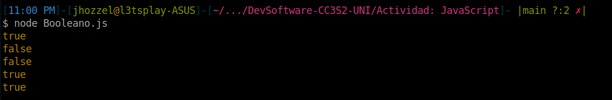
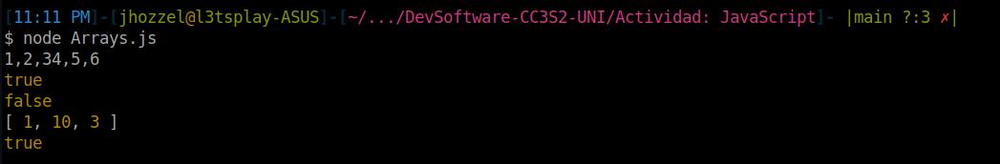

# Actividad: Java Script
- Chavez Chico Joel Jhotan 20210058J

## Booleano
```js
console.log(undefined == null);
console.log(NaN == NaN);
console.log(null == false);
console.log(0 == false);
console.log("" == false);
```


1. `undefined == null` => `true`: Ambas son consideradas como valor nulo.
2. `NaN == NaN` => `false`: `NaN` (*Not a number*) nunca es igual a otro ‘NaN’ en JavaScript.
3. `null == false` => `false`: Según JavaScript `null` no es igual a `false`.
4. `0 == false` => `true`: Ambos son considerados iguales ya que JavaScript al comparar valores numéricos con booleanos este evalúa como verdaderos a todos aquellos enteros distintos como `true` dejando únicamente al `0` como `false`.
5. `“ ” == false` => `true`: Similar al caso anterior JavaScript convierte `false` a `0` y la compara con la cadena vacía que se convierte a `0` como número.


## Array
```js
v1 = [1,2,3] + [4,5,6]
console.log(v1)

v2 = !![]
console.log(v2)
console.log([] == true)

v3 = [10,1,3].sort()
console.log(v3)
console.log([] == 0)
```




1. `[1, 2, 3] + [4, 5, 6]`: Esto no produce una concatenación de arrays, sino lo que hace JavaScript al sumar dos arrays con el operador `+`, es convertirlas a cadenas y concatenanarlas, resultando la cadena `”1, 2, 34, 5, 6”`.
2. `!![]` => `true`: Un array en JavaScript, aunque esté vacío, es un objeto y se toma como verdadero en un contexto booleano.
3. `[] == true`: `false`. Aunque `[]` se evalúa como verdadero, no es igual a `true` en una comparación de igualdad no estricta (`==`).
4. `[10, 1, 3].sort()`: Ordena el array en orden lexicográfico por defecto, lo que resultaría en `[1, 10, 3]` y no `[1, 3, 10]`.
5. `[] == 0` => `true`. En un acomparación JavaScript intenta convertir ambos lados a un tipo común y en este caso `[]` se convierte a `0` durante la comparación.


## Clausuras
