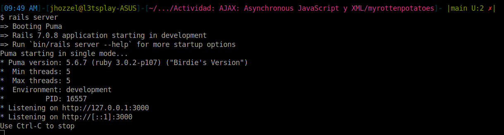
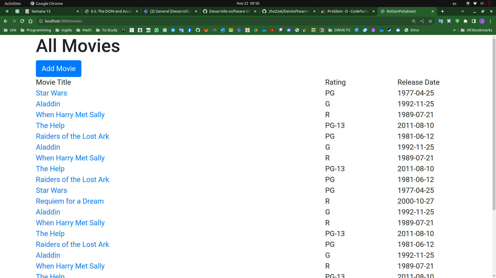
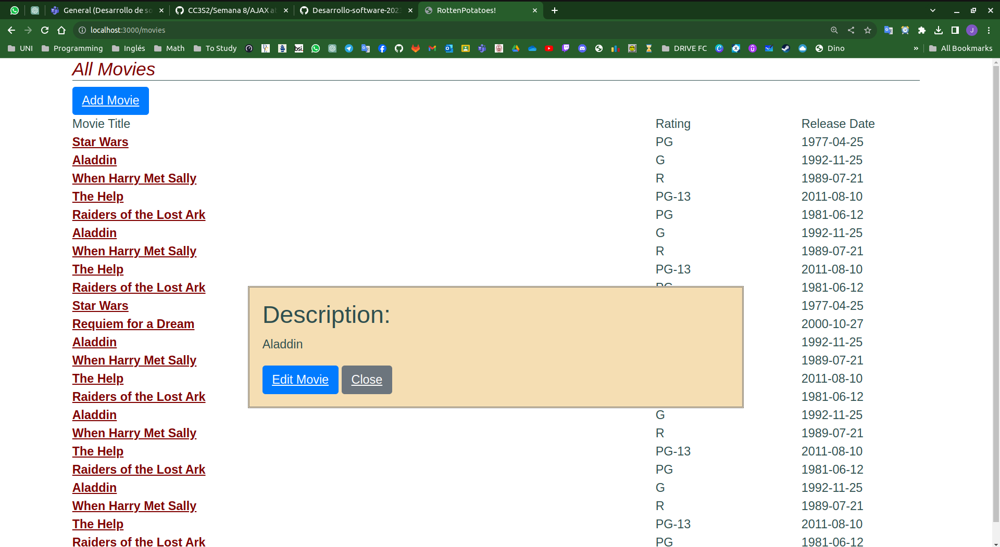

# Actividad: AJAX: Asynchronous JavaScript y XML
- Chavez Chico Joel Jhotan
## Configuración Inicial (Migración y dependencias)
Vamos primero a instalar las gemas correspondientes junto con sus dependencias usando el `$ bundle install`, asi mismo tenemos que realizar nuestra primera migración usando el comando `$ db:migrate`, además tendremos que crear la tabla `Moviegoers` con `$ rails generate migration CreateMoviegoers`. Una vez hecho esto podemos visualizar nuestra app en rails en nuestro navegador según el puerto especificado.



## Parte 01
Para este paso lo que se busca es identificar o crear una nueva acción a nuestro controlador quien será la encargada de gestionar la petición para ello nos dirigimos al archivo `app/controllers/movies_controller.rb` con el fin de aprovechar recursos ya existentes. De este modo procederemos a crear la vista parcial en `app/views/movies` bajo el nombre de `_movie.html.erb` cuyo contenido será el siguiente:
```rb
<p> <%= movie.description %> </p>
<%= link_to 'Edit Movie', edit_movie_path(movie), :class => 'btn btn-primary' %>
<%= link_to 'Close', '', :id => 'closeLink', :class => 'btn btn-secondary' %>
```

**Pregunta**: ¿Cómo sabe la acción de controlador si show fue llamada desde código JavaScript o mediante una petición HTTP normal iniciada por el usuario? Utiliza el código siguiente para mostrar la acción del controlador que renderizará la vista parcial.


La acción del controlador utiliza `request.xhr?` para verificar si la solicitud se realizó mediante AJAX (XMLHttpRequest) desde JavaScript. Si es una solicitud AJAX, se renderiza una vista parcial llamada 'movie' y se pasa el objeto `@movie`. Si no es una solicitud AJAX, se renderiza la vista predeterminada para la acción *show* del controlador.

```rb
class MoviesController < ApplicationController
  def show
    id = params[:id] # retrieve movie ID from URI route
    @movie = Movie.find(id) # look up movie by unique ID
    render(:partial => 'movie', :object => @movie) if request.xhr?
    # will render app/views/movies/show.<extension> by default
  end
end
```

## Parte 02
**Pregunta**: ¿Cómo debería construir y lanzar la petición XHR el código JavaScript? Queremos que la ventana flotante aparezca cuando pinchamos en el enlace que tiene el nombre de la película.

Para lograr esto, crearemos un archivo llamado `movie_popup.js` en el directorio `app/assets/javascripts` y emplearemos el siguiente conjunto de instrucciones:

```js
var MoviePopup = {
    // Método de configuración que prepara el entorno para la ventana emergente:
    setup: function() {
        // Agregar un 'div' oculto al final de la página para mostrar la ventana emergente:
        let popupDiv = $('<div id="movieInfo"></div>');
        popupDiv.hide().appendTo($('body'));
        $(document).on('click', '#movies a', MoviePopup.getMovieInfo);
    },

    // Método para obtener la información de la película mediante una solicitud AJAX:
    getMovieInfo: function() {
        $.ajax({
            type: 'GET',
            url: $(this).attr('href'),
            timeout: 5000,
            success: MoviePopup.showMovieInfo,
            error: function(xhrObj, textStatus, exception) { alert('¡Error!'); }
            // Las funciones 'success' y 'error' recibirán 3 argumentos
        });
        return false;
    },

    // Método para mostrar la información de la película en la ventana emergente:
    showMovieInfo: function(data, requestStatus, xhrObject) {
        // Centrar un flotador con la mitad de ancho y un cuarto de alto de la pantalla
        let oneFourth = Math.ceil($(window).width() / 4);
        $('#movieInfo').
            css({'left': oneFourth, 'width': 2 * oneFourth, 'top': 250}).
            html(data).
            show();
        // Hacer que el enlace 'Cerrar' en el elemento oculto funcione
        $('#closeLink').click(MoviePopup.hideMovieInfo);
        return false;  // Prevenir la acción predeterminada del enlace
    },

    // Método para ocultar la información de la película:
    hideMovieInfo: function() {
        $('#movieInfo').hide();
        return false;
    }
};

// Llamar al método 'setup' cuando el documento esté listo
$(MoviePopup.setup);    
```

Podemos observar que el código proporcionado en la guía de la actividad implementa un mecanismo para mostrar información de películas en una ventana emergente mediante una solicitud AJAX:

1. **`setup` (Configuración)**:
   - Este método se encarga de configurar el entorno para la ventana emergente.
   - Crea un elemento `div` oculto con el id "movieInfo" y lo añade al final del cuerpo del documento.
   - Configura un evento de clic para los enlaces dentro de los elementos con id "movies". Cuando se hace clic en un enlace, se llama al método `getMovieInfo`.

2. **`getMovieInfo` (Obtener información de la película)**:
   - Este método se ejecuta cuando se hace clic en un enlace de película.
   - Realiza una solicitud AJAX (`$.ajax`) al URL especificado en el atributo `href` del enlace que se hizo clic.
   - Si la solicitud es exitosa, llama al método `showMovieInfo` con los datos recibidos.
   - Si hay un error en la solicitud, muestra una alerta de error.

3. **`showMovieInfo` (Mostrar información de la película)**:
   - Este método se ejecuta cuando la solicitud AJAX es exitosa.
   - Calcula las dimensiones y la posición para centrar la ventana emergente en la pantalla.
   - Actualiza el contenido del elemento con id "movieInfo" con los datos recibidos.
   - Muestra la ventana emergente.
   - Configura un evento de clic para el enlace con id "closeLink" que llama al método `hideMovieInfo` cuando se hace clic.

4. **`hideMovieInfo` (Ocultar información de la película)**:
   - Este método oculta la ventana emergente al hacer clic en el enlace con id "closeLink".

5. **Llamada a `setup` cuando el documento está listo**:
   - Se utiliza `$(MoviePopup.setup)` para llamar al método `setup` cuando el documento HTML ha cargado completamente.

Asimismo vamos a implmentar el siguiente codigo en CSS que se nos brinda para especificar la posicion de nuestro popup.
```css
#movieInfo {
  padding: 2ex;
  position: absolute;
  border: 2px double grey;
  background: wheat;
}
```

**Pregunta**: ¿Cuáles son tus resultados?
Podemos mencionar los resultados mas resaltantes a continuación: 
- Se ha logrado implementar una estructura modular en JavaScript utilizando un objeto MoviePopup con métodos para configurar, obtener información de la película, mostrar la información y ocultar la ventana emergente.
- Utilizamos jQuery para simplificar el manejo de eventos y realizar solicitudes AJAX.
- Se ha creado un archivo de estilo CSS para dar formato a la ventana emergente, con un diseño centrado, bordes y fondo estilizado.

En la siguiente captura podemos ver el resultado final, tras seleccionar la pelicula `Aladdin`:




## Parte 03

En esta parte se menciona que cuando se crea dinámicamente elementos con JavaScript, es importante tener en cuenta una advertencia. Si se utiliza `$(.myClass).on(click,func)`, se registra `func` como el manejador de clics para los elementos actuales que coinciden con la clase CSS myClass. Sin embargo, si se crean nuevos elementos con JavaScript después de la carga inicial y la llamada inicial a `on`, estos nuevos elementos no tendrán el manejador asociado, ya que `on` solo puede asociar manejadores a elementos existentes.

**Pregunta**: ¿Cuál es solución que brinda jQuery a este problema?


Para abordar este problema en jQuery, puedes hacer uso de la delegación de eventos utilizando el método `on` de la siguiente manera:

```javascript
$(document).on('click', '.myClass', function() {
    // ...
});
```

Este enfoque permite que los eventos sean manejados por elementos descendientes que coincidan con el selector `.myClass`, incluso si se crean dinámicamente después de la carga inicial de la página. Al asociar el manejador al documento (`$(document)`), se garantiza que cualquier elemento descendiente de `document` con la clase `.myClass` será manejado correctamente, incluso si se crea más tarde.