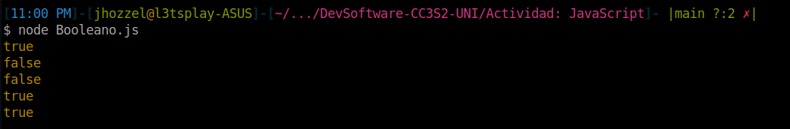
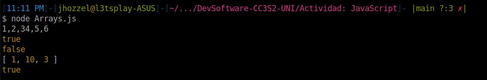
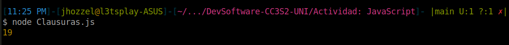
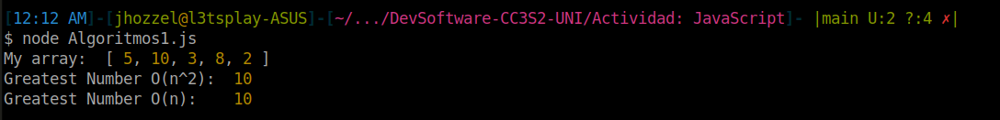
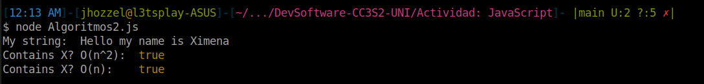
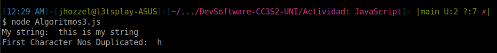

# Actividad: Java Script
- Chavez Chico Joel Jhotan 20210058J

## Booleano
```js
console.log(undefined == null);
console.log(NaN == NaN);
console.log(null == false);
console.log(0 == false);
console.log("" == false);
```


1. `undefined == null` => `true`: Ambas son consideradas como valor nulo.
2. `NaN == NaN` => `false`: `NaN` (*Not a number*) nunca es igual a otro ‘NaN’ en JavaScript.
3. `null == false` => `false`: Según JavaScript `null` no es igual a `false`.
4. `0 == false` => `true`: Ambos son considerados iguales ya que JavaScript al comparar valores numéricos con booleanos este evalúa como verdaderos a todos aquellos enteros distintos como `true` dejando únicamente al `0` como `false`.
5. `“ ” == false` => `true`: Similar al caso anterior JavaScript convierte `false` a `0` y la compara con la cadena vacía que se convierte a `0` como número.


## Array
```js
v1 = [1,2,3] + [4,5,6]
console.log(v1)

v2 = !![]
console.log(v2)
console.log([] == true)

v3 = [10,1,3].sort()
console.log(v3)
console.log([] == 0)
```




1. `[1, 2, 3] + [4, 5, 6]`: Esto no produce una concatenación de arrays, sino lo que hace JavaScript al sumar dos arrays con el operador `+`, es convertirlas a cadenas y concatenanarlas, resultando la cadena `”1, 2, 34, 5, 6”`.
2. `!![]` => `true`: Un array en JavaScript, aunque esté vacío, es un objeto y se toma como verdadero en un contexto booleano.
3. `[] == true`: `false`. Aunque `[]` se evalúa como verdadero, no es igual a `true` en una comparación de igualdad no estricta (`==`).
4. `[10, 1, 3].sort()`: Ordena el array en orden lexicográfico por defecto, lo que resultaría en `[1, 10, 3]` y no `[1, 3, 10]`.
5. `[] == 0` => `true`. En un acomparación JavaScript intenta convertir ambos lados a un tipo común y en este caso `[]` se convierte a `0` durante la comparación.


## Clausuras

```js
function f1(x) {
  var baz = 3;
  return function (y) {
    console.log(x + y + (baz++));
    }
}
var bar = f1(5);
bar(11);
```


Vamos a analizar el código anteriro, primero vemos que se crea una función `f1` que toma un argumento una variable `x`, luego se inicializa `baz = 3`, y se retorna la función anónima que toma un parámetro `y` y retorna la expresión `x + y + (baz++)`, es importante resaltar que luego de la llamada de esta función la variable `baz` incrementará en uno su valor, dado que se hace uso del operador post-incremento. Des este modo ya podemos determinar la salida de nuestro código, se tiene `x = 5`, luego `baz = 3` ya que es nuestra primera llamada y se evalúa para `y = 11`, lo que nos resulta el valor de `5 + 11 + 3 = 19`.

 


## Algoritmos
El primer algoritmo que analizaremos busca el elemento mas grande en un array, para ello lo que propone es iterar sobre cada elemento del array y verificar si este es mayor sobre cada uno de los demás lo que produce una iteración más generando una complejidad de $O(n^2)$.

Podemos mejorar el algoritmo si fijamos una variable `v_max` que debería estar inicializada con el valor mínimo posible, pero basta con tomar el primer elemento del arreglo $a_0$ y a medida que recorremos el array actualizamos dicha variable con el $max(v_{max},a_i)$ para cada $i \in [1,n]$, de este modo podemos reducir nuestra complejidad a $O(n)$.

```js
function greatestNumber(array) {
    for (let i of array) {
        let isIValTheGreatest = true;
        for (let j of array) {
            if (j > i) {
                isIValTheGreatest = false;
            }
        }
        if (isIValTheGreatest) {
            return i;
        }
    }
}

function optimizedGreatestNumber(array) {
    var v_max = array[0];
    for (let number of array) {
        if (number > v_max) {
            v_max = number;
        }
    }
    return v_max;
}

const a = [5, 10, 3, 8, 2];
console.log("My array: ", a);
console.log("Greatest Number O(n^2): ", greatestNumber(a));
console.log("Greatest Number O(n):   ", optimizedGreatestNumber(a));
```


Para el siguiente caso tenemos un algoritmo que busca en un string si es que este contine el caracter `X`, para poder mejorar su complejidad a $O(n)$ lo que podriamos a hacer es en simplemente iterar sobre todo el string y consultar si para el caracter actual se tiene que es igual a `X` lo que nos retornaría un `true`, en caso de que se finalizo la iteración y no se encontró ninguna coincidencia retornamos `false`.

```js
function containsX(string) {
    foundX = false;
    for(let i = 0; i < string.length; i++) {
        if (string[i] === "X") {
            foundX = true;
         }
   }
    return foundX;
}

function optimizedContainsX(string) {
    for (let c of string) {
        if (c == 'X') {
            return true;
        }
    }
    return false;
}

var s = "Hello my name is Ximena"
console.log("My string: ", s);
console.log("Contains X? O(n^2): ", containsX(s));
console.log("Contains X? O(n):   ", optimizedContainsX(s));
```



Por último se nos pide diseñar un algorimto que nos retorne el primer caracter no duplicado en un string con una complejidad $O(n)$. Muy bien para este caso lo que podriamos hacer es mantener un mapeo cada caracter a su respectiva frecuencia en el string, para poder construirlo basta con iterar una vez sobre el string e ir incrementando cada frecuencia. Una vez hecho esto solo tendriamos que iterar otra vez y encontrar el primer caracter que tenga frecuencia igual a 1. 

```js
function firstCharNotDuplicated(string) {
    var freq = {};
    for (let c of string) {
        if (freq[c]) freq[c]++;
        else freq[c] = 1;
    }
    for (let c of string) {
        if (freq[c] == 1) {
            return c;
        }
    }
    return '';
}

var s = "this is my string"
console.log("My string: ", s);
console.log(firstCharNotDuplicated(s));
```



## Clases
Para esta sección, se nos pide diseñar la clase Pokémon según las siguientes condiciones:

1. El constructor debe tomar tres parámetros (HP, ataque, defensa).
2. El constructor debe crear seis campos (HP, ataque, defensa, movimiento, nivel, tipo). Los valores de (movimiento, nivel, tipo) deben inicializarse en ("", 1, "").
3. Implementar un método `flight` que arroje un error indicando que no se especifica ningún movimiento.
4. Implementar un método `canFly` que verifique si se especifica un tipo. Si no, arrojar un error. Si sí, verificar si el tipo incluye "volar". Devolver verdadero si es así; si no, devolver falso.

Una vez logrado esto, vamos a crear una clase hija Charizard que extiende la anterior con los siguientes cambios:

1. El constructor de Charizard debe tomar cuatro parámetros (HP, ataque, defensa, movimiento).
2. El constructor de Charizard debe configurar el movimiento y el tipo (para "disparar/volar") además de establecer HP, ataque y defensa usando el constructor de la superclase.
3. Sobreescribir el método `fight`: Si se especifica un movimiento, imprimir una declaración indicando que se está utilizando el movimiento y devolver el campo de ataque. Si no se especifica ningún movimiento, arrojar un error.

A continuación, mostramos el siguiente código ya completado:

```js
class Pokemon {
  constructor(HP, ataque, defensa) {
    this.HP = HP;
    this.ataque = ataque;
    this.defensa = defensa;
    this.movimiento = "";
    this.nivel = 1;
    this.tipo = "";
  }

  flight() {
    throw new Error("No se especificó ningún movimiento.");
  }

  canFly() {
    if (!this.tipo) {
      throw new Error("No se especificó ningún tipo.");
    }

    return this.tipo.includes("volar");
  }
}

class Charizard extends Pokemon {
  constructor(HP, ataque, defensa, movimiento) {
    super(HP, ataque, defensa);
    this.movimiento = movimiento;
    this.tipo = "disparar/volar";
  }

  fight() {
    if (this.movimiento) {
      console.log(`Se está utilizando el movimiento ${this.movimiento}.`);
      return this.ataque;
    } else {
      throw new Error("No se especificó ningún movimiento.");
    }
  }
}
```