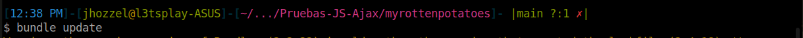
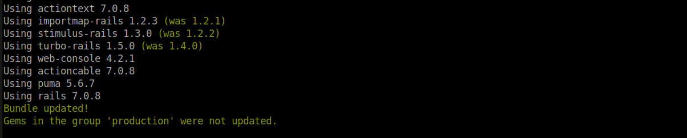
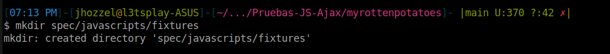
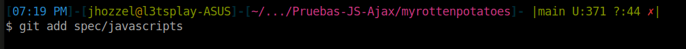

# Testing Java Script y Ajax
- Chavez Chico Joel Jhotan 20210058J

Primero lo que vamos a realizar, será instalar la gema `Jasmine`, para ello vamos a añadir en nuestro archivo `Gemfile` la siguiente línea de código:

```
gem jasmine
```
Luego, realizamos un `bundle update` para poder actualizar nuestras gemas junto con sus dependencias



Luego vamos a proceder a ejecutar la línea de código `rails generate jasmine_rails:install`, la cual instala y configura la herramienta de pruebas Jasmine en nuestro proyecto Ruby on Rails. Esta instalación incluye la creación de la estructura necesaria para las pruebas Jasmine, como directorios y archivos. El propósito principal de esta acción es habilitar la escritura y ejecución de pruebas de JavaScript, especialmente útiles para validar funciones Ajax y otros aspectos interactivos de la aplicación web.


A continuación se nos solicita crear la carpeta `spec/javascripts/fixtures`, para la cual usamos la siguiente linea de codigo:



Posteriormente, procedemos a ejecutar `git add spec/javascripts`, lo que agrega el directorio `spec/javascripts` al control de versiones de Git. Esta acción asegura que los archivos de prueba de Jasmine sean rastreados y gestionados por Git, permitiendo un seguimiento y control efectivo de los cambios realizados en las pruebas de JavaScript durante el desarrollo del proyecto.



Se menciona mas adelante que no podemos ejecutar un conjunto de pruebas Jasmine completamente vacío, así que crearemos el fichero `spec/javascripts/basic_check_spec.js` con el siguiente código:

```js
describe ('Jasmine basic check', function() { 
    it('works', function() { expect(true).toBe(true); }); 
}); 
```


**Pregunta 1: Experimenta el siguiente código de especificaciones (specs) de Jasmine del camino feliz del código AJAX llamado movie_popup_spec.js.**

```JS
describe('MoviePopup', function() {
  describe('setup', function() {
    it('adds popup Div to main page', function() {
      expect($('#movieInfo')).toExist();
    });
    it('hides the popup Div', function() {
      expect($('#movieInfo')).toBeHidden();
    });
  });
  describe('clicking on movie link', function() {
    beforeEach(function() { loadFixtures('movie_row.html'); });
    it('calls correct URL', function() {
      spyOn($, 'ajax');
      $('#movies a').trigger('click');
      expect($.ajax.calls.mostRecent().args[0]['url']).toEqual('/movies/1');
    });
    describe('when successful server call', function() {
      beforeEach(function() {
        let htmlResponse = readFixtures('movie_info.html');
        spyOn($, 'ajax').and.callFake(function(ajaxArgs) { 
          ajaxArgs.success(htmlResponse, '200');
        });
        $('#movies a').trigger('click');
      });
      it('makes #movieInfo visible', function() {
        expect($('#movieInfo')).toBeVisible();
      });
      it('places movie title in #movieInfo', function() {
        expect($('#movieInfo').text()).toContain('Casablanca');
      });
    });
  });
});
```

Este código de Jasmine se centra en probar la funcionalidad relacionada con AJAX en una aplicación web. Aquí se verifican aspectos como la configuración del popup, la realización de una solicitud AJAX al hacer clic en un enlace de película, y la manipulación del DOM después de una llamada exitosa al servidor.

---

**Pregunta 2: ¿Qué hacen las siguientes líneas del código anterior?. ¿Cuál es el papel de spyOn de Jasmine y los stubs en el código dado.**

```js
it('calls correct URL', function() {
      spyOn($, 'ajax');
      $('#movies a').trigger('click');
      expect($.ajax.calls.mostRecent().args[0]['url']).toEqual('/movies/1');
    });
```
Estas líneas de código están verificando que al hacer clic en un enlace de película, se realice correctamente una solicitud AJAX con la URL esperada (`'/movies/1'`). `spyOn` de Jasmine se utiliza para espiar la función `$.ajax`, permitiendo rastrear si y cómo se llama durante la prueba. Esto simula y verifica la interacción con el servidor sin realizar realmente la llamada.

---

**Pregunta 3: ¿Qué hacen las siguientes líneas del código anterior?.**

```js
 let htmlResponse = readFixtures('movie_info.html');
        spyOn($, 'ajax').and.callFake(function(ajaxArgs) { 
          ajaxArgs.success(htmlResponse, '200');
        });
        $('#movies a').trigger('click');
      });
      it('makes #movieInfo visible', function() {
        expect($('#movieInfo')).toBeVisible();
      });
      it('places movie title in #movieInfo', function() {
        expect($('#movieInfo').text()).toContain('Casablanca');
```

Estas líneas simulan una llamada AJAX exitosa al hacer clic en un enlace de película. Se carga un fixture (`movie_info.html`) que simula la respuesta del servidor, se espía la función `$.ajax` para simular una llamada exitosa, y luego se verifica que, después del clic, el elemento `#movieInfo` sea visible y contenga el título de la película 'Casablanca'.

---

**Pregunta 4: Dado que Jasmine carga todos los ficheros JavaScript antes de ejecutar ningún ejemplo, la llamada a setup (línea 34 del código siguiente llamado movie_popup.js) ocurre antes de que se ejecuten nuestras pruebas, comprueba que dicha función hace su trabajo y muestra los resultados.**
```js
var MoviePopup = {
  setup: function() {
    // add hidden 'div' to end of page to display popup:
    let popupDiv = $('<div id="movieInfo"></div>');
    popupDiv.hide().appendTo($('body'));
    $(document).on('click', '#movies a', MoviePopup.getMovieInfo);
  }
  ,getMovieInfo: function() {
    $.ajax({type: 'GET',
            url: $(this).attr('href'),
            timeout: 5000,
            success: MoviePopup.showMovieInfo,
            error: function(xhrObj, textStatus, exception) { alert('Error!'); }
            // 'success' and 'error' functions will be passed 3 args
           });
    return(false);
  }
  ,showMovieInfo: function(data, requestStatus, xhrObject) {
    // center a floater 1/2 as wide and 1/4 as tall as screen
    let oneFourth = Math.ceil($(window).width() / 4);
    $('#movieInfo').
      css({'left': oneFourth,  'width': 2*oneFourth, 'top': 250}).
      html(data).
      show();
    // make the Close link in the hidden element work
    $('#closeLink').click(MoviePopup.hideMovieInfo);
    return(false);  // prevent default link action
  }
  ,hideMovieInfo: function() {
    $('#movieInfo').hide();
    return(false);
  }
};
$(MoviePopup.setup);
```
La función `setup` en el archivo `movie_popup.js` se encarga de configurar el entorno para la funcionalidad de popup. Añade un elemento `#movieInfo` al final de la página, lo oculta y establece un manejador de clic en los enlaces de películas (`#movies a`). La función `getMovieInfo` hace una solicitud AJAX al hacer clic en un enlace. Para verificar su funcionamiento, observa el DOM después de la carga para asegurarte de que el elemento `#movieInfo` y los manejadores de eventos se establezcan correctamente.

---

**Pregunta 5: Indica cuales son los stubs y fixtures disponibles en Jasmine y Jasmine-jQuery.**

En Jasmine, los **fixtures** son archivos de datos simulados o elementos HTML utilizados en las pruebas para imitar el entorno de la aplicación. **Jasmine-jQuery** proporciona funcionalidades adicionales para trabajar con fixtures y manipular el DOM durante las pruebas.

Los **stubs** en Jasmine se utilizan para reemplazar funciones reales con versiones falsas controladas durante las pruebas. En el contexto de Jasmine, el uso de `spyOn` es similar a un stub, ya que permite espiar y controlar el comportamiento de funciones existentes.

---

**Pregunta 6: Como en RSpec, Jasmine permite ejecutar código de inicialización y desmantelamiento de pruebas utilizando `beforeEach` y `afterEach`. El código de inicialización carga el fixture HTML mostrado en el código siguiente, para imitar el entorno que el manejador `getMovieInfo` vería si fuera llamado después de mostrar la lista de películas.**

```js
<div id="movies">
  <div class="row">
    <div class="col-8"><a href="/movies/1">Casablanca</a></div>
    <div class="col-2">PG</div>
    <div class="col-2">1943-01-23</div>
  </div>
</div>
```

En Jasmine, el código de inicialización se coloca dentro de `beforeEach` y se utiliza para configurar el entorno necesario antes de cada prueba. En este caso, carga un fixture HTML simulado que representa la lista de películas. Después de cada prueba, `afterEach` se puede utilizar para realizar acciones de limpieza si es necesario, manteniendo la independencia entre las pruebas. Este enfoque permite imitar el entorno que el manejador `getMovieInfo` vería al hacer clic en un enlace después de mostrar la lista de películas.

---

### Ejercicios

**Ejercicio 1: Identifica el inconveniente de la herencia de prototipos y propone una solución.**

El inconveniente es que todos los atributos de los objetos son públicos en la herencia de prototipos. Para solucionarlo, podemos aprovechar las clausuras para obtener atributos privados. Se propone crear un constructor para objetos `User` que acepte un nombre de usuario y una contraseña. Además, se proporciona un método `checkPassword` que indica si la contraseña proporcionada es correcta, pero no permite la inspección directa de la contraseña.

---

**Ejercicio 2: Identifica cómo identificar las filas ocultas de la tabla `movies` con código JavaScript del lado cliente, sin modificar el código del servidor.**

Puedes identificar las filas ocultas de la tabla `movies` utilizando JavaScript del lado cliente mediante la propiedad `style` de los elementos HTML. Verifica si la propiedad `display` es igual a "none" para determinar si la fila está oculta. Puedes lograr esto con algo como:

```javascript
const filasOcultas = document.querySelectorAll('#movies tr[style*="display: none"]');
```

Esto seleccionará todas las filas ocultas en la tabla `movies`.

---

**Ejercicio 3: Escribe el código AJAX necesario para crear menús en cascada basados en una asociación has_many entre los modelos A y B.**

Suponiendo que tienes dos modelos A y B con una asociación has_many en Rails, el código AJAX podría ser algo así:

```javascript
// Código para el primer menú que lista las opciones de A
$.ajax({
  url: '/model_a_options',
  method: 'GET',
  success: function(optionsA) {
    // Rellenar el primer menú con opcionesA
    // Agregar un manejador de eventos para el cambio en el primer menú
    $('#menuA').change(function() {
      const selectedOptionA = $(this).val();
      // Hacer otra solicitud AJAX para obtener las opciones correspondientes de B
      $.ajax({
        url: '/model_a_options/' + selectedOptionA + '/model_b_options',
        method: 'GET',
        success: function(optionsB) {
          // Rellenar el segundo menú con opcionesB
        },
        error: function() {
          // Manejar errores si es necesario
        }
      });
    });
  },
  error: function() {
    // Manejar errores si es necesario
  }
});
```

Este código supone que tienes rutas en tu servidor para manejar las solicitudes AJAX y devolver las opciones correspondientes.

---

**Ejercicio 4:Extiende la función de validación en ActiveModel para generar código JavaScript que valide las entradas del formulario antes de ser enviado.**

Extender la función de validación en ActiveModel para generar código JavaScript podría implicar generar dinámicamente scripts que utilicen las validaciones del modelo. Por ejemplo:

```javascript
class Movie < ApplicationRecord
  validates :title, presence: true, uniqueness: true
  validates :release_date, numericality: { only_integer: true, greater_than: 1900 }

end
```

El código JavaScript generado podría incluir validaciones como:

```javascript
document.getElementById('formMovie').addEventListener('submit', function(event) {
  if (document.getElementById('movie_title').value === '') {
    alert('El título no puede estar vacío.');
    event.preventDefault();
    return;
  }

  const releaseDateValue = parseInt(document.getElementById('movie_release_date').value);
  if (isNaN(releaseDateValue) || releaseDateValue < 1900) {
    alert('La fecha de lanzamiento debe ser un número mayor a 1900.');
    event.preventDefault();
    return;
  }
  // Validaciones adicionales
});
```

Este código utiliza las validaciones definidas en el modelo para generar validaciones correspondientes en JavaScript antes de enviar el formulario.

---