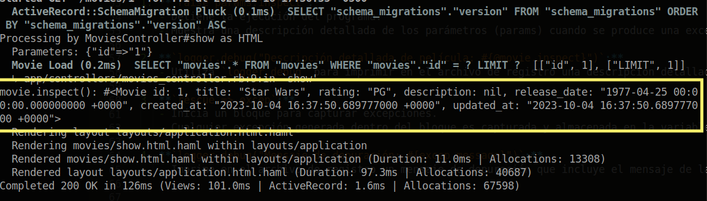
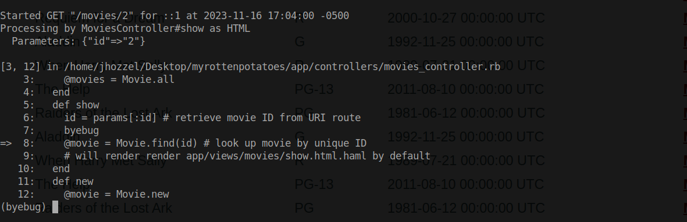

# Depuración SaaS que usan Rails

En las aplicaciones SaaS que usan Rails, esta confusión se puede agravar si la operación que falló ocurre en una acción del controlador, pero el objeto inválido se pasó como una variable de instancia y luego fue dereferenciada en la vista, como se muestra en los siguientes extractos de un controlador y una vista:

```rb
# in controller action:
def show
  @movie = Movie.find_by_id(params[:id]) # what if this movie not in DB?
  # BUG: we should check @movie for validity here!
end
-# ...later, in the Haml view:

%h1= @movie.title
-# will give "undefined method 'title' for nil:NilClass" if @movie is nil
```

## Depuración usando `logger.debug()`

Para empezar vamos a modificar la vista `show.html.haml` como se muestra a continuación añadiento la variable `@movie.inspect` para poder visualizar en pantalla los datos de la película actual.
```rb
%h2 Details about #{@movie.title}

%ul#details
  %li
    Rating:
    = @movie.rating
  %li
    Released on:
    = @movie.release_date.strftime("%B %d, %Y")

%h3 Description:

= @movie.inspect
= link_to 'Edit info', edit_movie_path(@movie)
= link_to 'Back to movie list', movies_path
```

Ahora nos dirigimos al archivo `/app/controllers/movies_controller.rb` y realizamos las siguientes modificaciones que se explican a continuación.
```rb
def show
    id = params[:id] # retrieve movie ID from URI route
    raise.params.inspect
    
    @movie = Movie.find(id) # look up movie by unique ID
    logger.debug("movie.inspect(): #{@movie.inspect}")
    
    rescue => excep
      logger.debug("exception : #{excep.message}")
end
```

1. **`raise params.inspect`:**
   - Detiene la ejecución del programa.
   - Muestra una descripción detallada de los parámetros (params) cuando se produce una excepción.

2. **`logger.debug("Descripción detallada de película: #{@movie.inspect}")`:**
   - Utiliza `logger.debug` para imprimir en el archivo de registro una descripción detallada de la variable `@movie`.

3. **`rescue => excep`:**
   - Inicia un bloque para capturar excepciones.
   - Cualquier excepción generada dentro del bloque es capturada y almacenada en la variable `excep`.

4. **`logger.debug("Mensaje de depuración: #{excep.message}")`:**
   - Imprime en el archivo de registro un mensaje de depuración que incluye el mensaje de la excepción capturada.


Ahora inicializamos el server para poder ver la depuración en la consola de las líneas que hemos modificado.

Como se puede observar a continuación para la película de Star Wars hemos podido mostrar en la pantalla la toda la información recibida de `@movie.inspect` esto ya que el archivo `show.html.haml`. 


Por otro lado si volvemos a la consola nos encontramos con el mensaje que imprimimos al hacer la depuración sobre el método show.



## Depuración usando gemas de depuración
Para este caso usaremos la gema `byebug` la cual es una herramienta de depuración que nos permite detener la ejecución del código y explorar su estado en tiempo de ejecución. Al insertar la instrucción byebug en nuestro código, podemos pausar la ejecución en ese punto y examinar variables, evaluar expresiones y comprender el flujo de ejecución paso a paso.
Primero agregamos a nuestro archivo `Gemfile` la siguiente línea de código, para posteriormete ejecutar un `bundle update` para actualizar las gemas que estamos usando asi como sus dependencias.
```rb
gem `byebug`
```

Una vez hecho esto nos dirigiremos al archivo `/app/controllers/movies_controller.rb` y en el método `show` agregaremos la sentencia `byebug` el cual será el punto en el cual queremos detener la ejecución del código para estudiar su comportamiento.

```rb
class MoviesController < ApplicationController
  def index
    @movies = Movie.all
  end
  def show
    id = params[:id] # retrieve movie ID from URI route
    byebug
    @movie = Movie.find(id) # look up movie by unique ID
    # will render render app/views/movies/show.html.haml by default
  end
  def new
    @movie = Movie.new
  end 
  ..
  ....
```
Inicializamos el server y luego interactuamos sobre la página con el fin de que el método `show` pueda ejecutarse.

Ahora bien, notemos que la página se encuentra en espera mientras que por otro lado en la consola se nos muestra el promp del debugger (byebug).



Nuestra página seguirá en espera hasta que el depurador haya finalizado por completo y seguirá ejecutadose las demás líneas de código.
