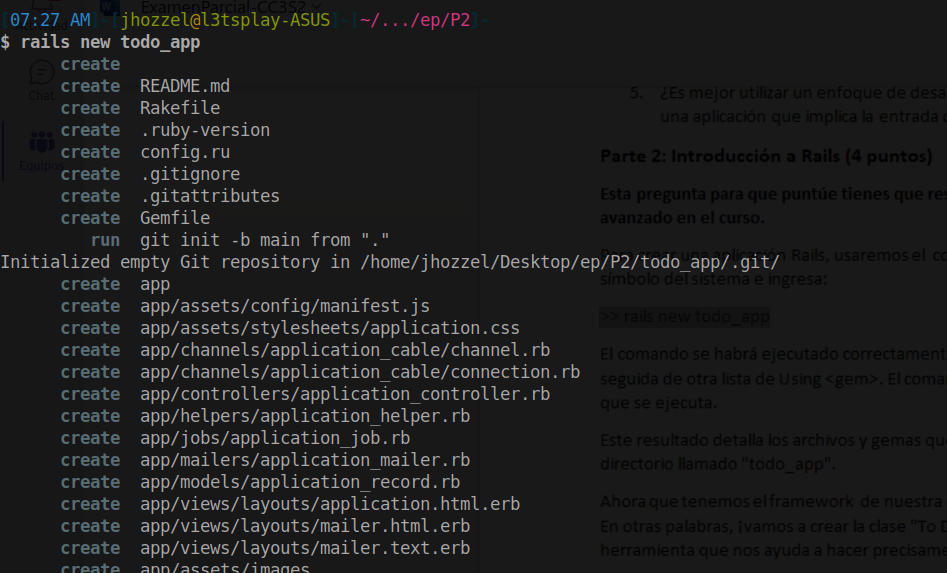
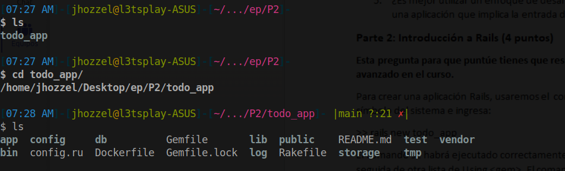
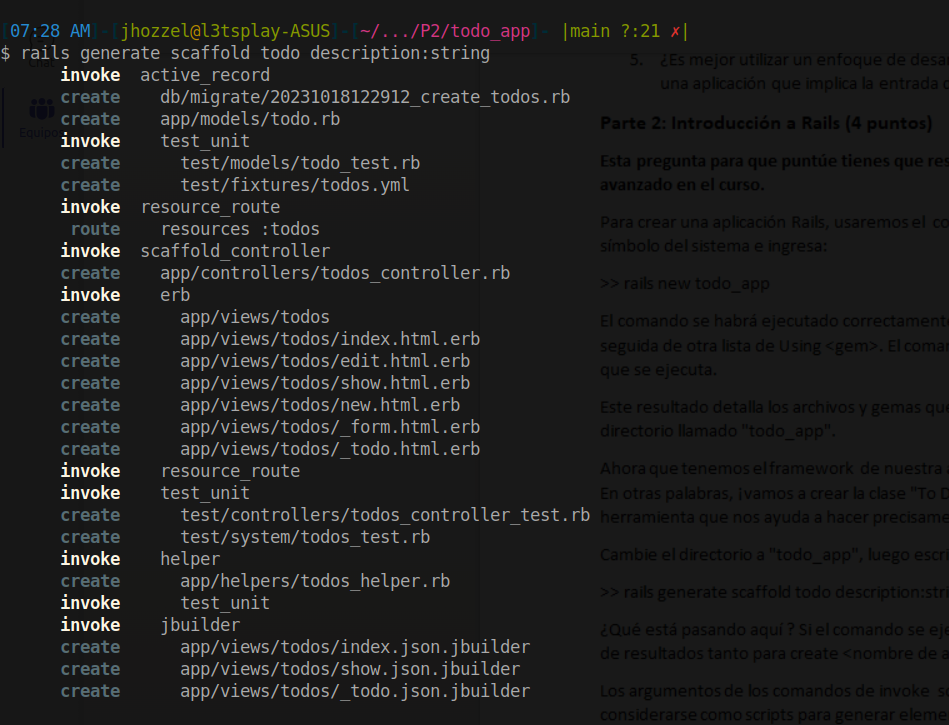

# Parte 2: Introducción a Rails (4 puntos)
Primero ejecutaremos el comando `>> rails new todo_app`

Verificamos que todos los archivos han sido generados correctamente

`>> rails generate scaffold todo description:string`

## Base de Datos
`>> bundle exec rake db:migrate`
¿Que está pasando aqui? 

El comando `bundle exec rake db:migrate` es una instrucción que se usa comúnmente en proyectos de Ruby on Rails para aplicar las migraciones de base de datos.

Aquí está lo que está sucediendo:

- `bundle`: Es un gestor de dependencias para Ruby que se utiliza para instalar y administrar gemas (bibliotecas) específicas de un proyecto. El comando `bundle` se usa para ejecutar comandos con las gemas definidas en el archivo `Gemfile` del proyecto.

- `exec`: Es un comando de Bundler que ejecuta un comando específico utilizando las gemas del proyecto.

- `rake`: Es una herramienta de automatización de tareas en Ruby. En proyectos de Ruby on Rails, se utiliza para ejecutar tareas específicas del proyecto.

- `db:migrate`: Es una tarea específica de Ruby on Rails que se utiliza para aplicar las migraciones de base de datos. Las migraciones son scripts que describen los cambios en la estructura de la base de datos, como agregar o modificar tablas y columnas.

Por lo tanto, cuando ejecutas `bundle exec rake db:migrate`, estás utilizando Bundler para asegurarte de que se estén utilizando las gemas correctas para tu proyecto, y luego estás ejecutando la tarea `db:migrate` de Ruby on Rails para aplicar cualquier cambio en la base de datos que haya sido definido en las migraciones. Esto es esencial para mantener la integridad y la coherencia de la base de datos con respecto a la evolución del código de la aplicación.

## Más migraciones

- **La primera migración nos permitió crear la base de datos. Digamos que el cliente quiere que cada "tareas pendientes" tenga una fecha de vencimiento asociada. ¿Cómo hacemos que eso suceda? ¿Qué archivos nuevos o cambios en los archivos existentes han ocurrido?**

## Nuevas rutas
- **1- Agrega una ruta en config/routes.rb y asígnela a una acción del controlador. (Coloca esta línea dentro del cuerpo de route.draw).**

- **2. Añade una nueva vista correspondiente a la ruta. Si alguien navega a la página "hello" de tu aplicación (es decir, `http://localhost:<número de puerto>/hello/`), se mostrará una página web.**

## Más ejercicios

- **Agrega un nuevo atributo al modelo Todo y actualiza las vistas para mostrar y editar el nuevo campo. Para propósitos de práctica digamos que queremos agregar un nuevo campo booleano llamado "done" con un valor predeterminado de falso.**

- **Cambia el esquema de enrutamiento. Debes suponer que queremos una nueva ruta new_todo para ir a una página que crea un nuevo ítem Todo**

- **Establece todos#index como la página de inicio de la aplicación.**

- **Enumera todas las migraciones. ¿Cuál es el comando para volver a una versión anterior de la base de datos?. Muestra los resultados.**
