# Examen Final
- Chavez Chico Joel Jhotan 20210058J
## Parte 01
**Pregunta 01: Produce un conflicto de fusión (merge) en algún repositorio de tus actividades realizadas. Establece los pasos y comandos que usas para resolver un conflicto de fusión en Git. Si intentas git push y falla con un mensaje como : Non-fast-forward (error): failed to push some refs esto significa que algún archivo contiene un conflicto de fusión entre la versión de tu repositorio y la versión del repositorio origen. Para este ejercicio debes presentar el conflicto dado, los pasos y comandos para resolver el problema y las solución.**

Vamos a trabajar sobre la actividad `Depuracion-Rails`, y vamos a crear una nueva rama llamada `test_branch`. Para crearla podemos usar el `git branch test_branch`.
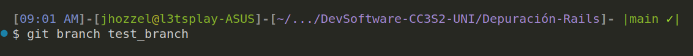
Luego para poder identificar las ramas que tenemos usamos simplemente `git branch`
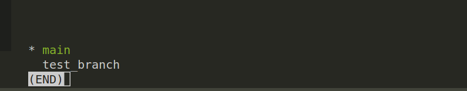
Hacemos el cambio con `git checkout test_branch`
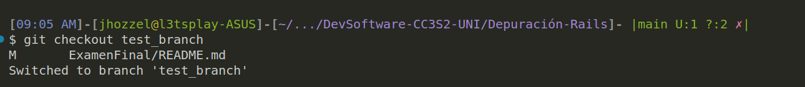
El cambio que haremos será eliminar el archivo agregar unas lineas de imprsion en la consola en el archivo `app/controllers/movies_controller.rb`, tanto en la rama `main` como en la rama `test_branch`. Los cambios son los siguientes:
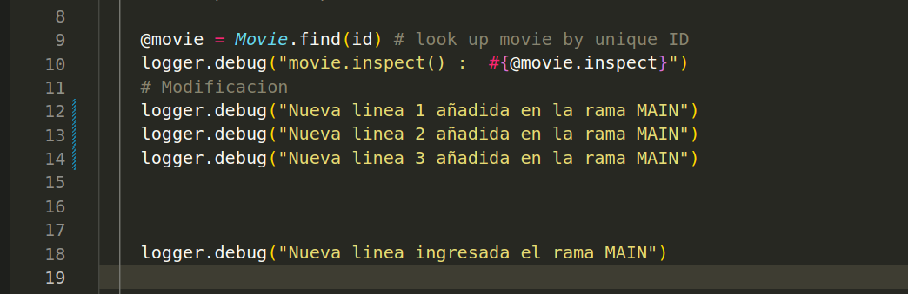
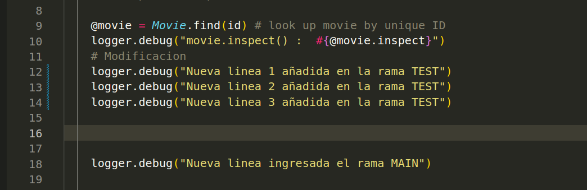
Una vez hecho estos cambios y hacer los commits en las ramas
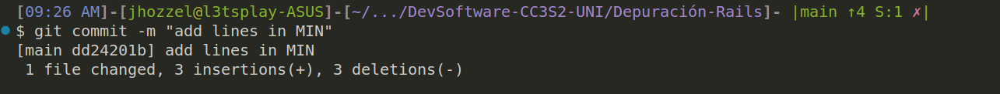
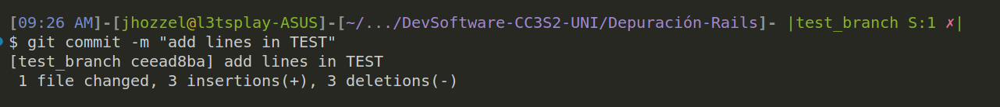
Lo que vamos a hacer será un `git merge`, aqui el conflicto se presenta ya que se busca modificar el mismo archivo para ambas ramas, de modo que al hacer un merge, git no sabría que modificación mantener y que otra descartar. Asi que ejecutamos a continuación dicho comando:
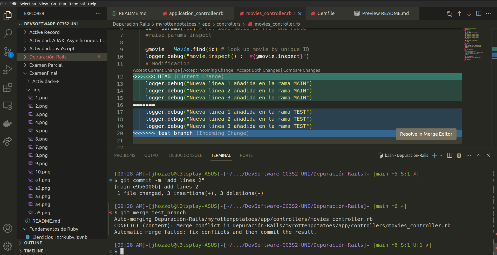
Vemos que el conflicto esta presente, y para nuestro caso mantendremos los cambios para la rama `main` mientras que la otra será ignorada.

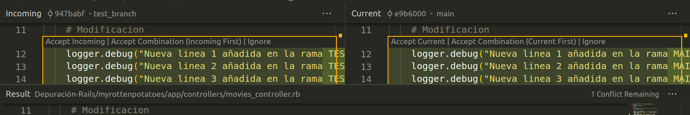
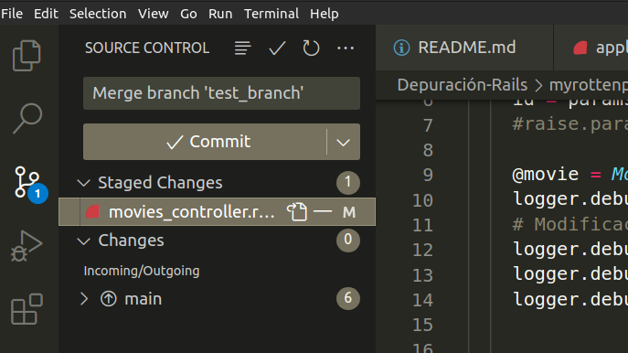
Vemos finalmente que los cambios hechos en el main se han mantenido exitosamente.
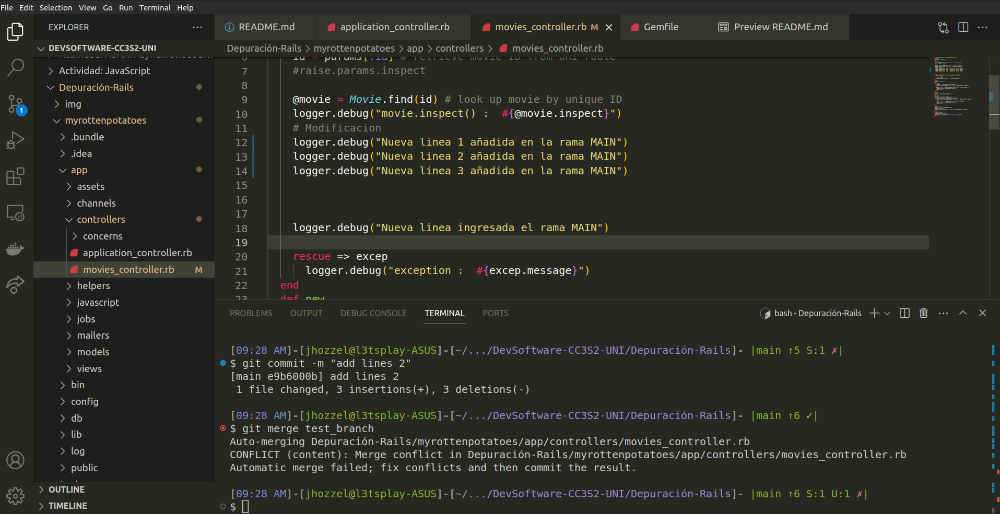


**Pregunta 02: Digamos que nos dan el modelo de User de la siguiente manera:**
```rb
class User < ActiveRecord::Base
    validates :username, :presence => true
    validate :username_format
end
```
**1) ¿Qué pasa si tenemos @user sin nombre de usuario y llamamos a @user.valid? ¿Qué guardará @user.save**


Si `@user` no tiene un nombre de usuario y se llama al método `valid?` en un modelo de Rails, la validación de presencia que se especifica con `validates :username, :presence => true` hará que la validación falle. Esto significa que `@user.valid?` devolverá `false`.

Por otro  lado si se intenta guardar `@user` después de haber llamado a `@user.valid?`, la llamada a `@user.save` también devolverá `false`. En este caso, `@user` no se guardará en la base de datos porque no cumple con las validaciones especificadas.

Podriamos verlo con el siguiente ejemplo de codigo:

```ruby
@user = User.new
@user.valid?  # Devolverá false debido a la validación de presencia en el campo username
@user.save    # Devolverá false y no guardará el usuario en la base de datos
```

**2) Implementa username_format. Para los propósitos, un nombre de usuario comienza con una letra y tiene como máximo 10 caracteres de largo. Recuerda, las validaciones personalizadas agregan un mensaje a la colección de errores.**

**Implementación de `username_format`:**

```ruby
class User < ActiveRecord::Base
  validates :username, presence: true
  validate :username_format

  private

  def username_format
    if username.present? && (username.length > 10 || username !~ /\A[A-Za-z]/)
      errors.add(:username, "debe comenzar con una letra y tener como máximo 10 caracteres de largo.")
    end
  end
end
```

En esta implementación, el método `username_format` se encarga de realizar la validación personalizada. Primero, verifica si el nombre de usuario está presente y luego comprueba si cumple con las condiciones especificadas: debe comenzar con una letra y tener como máximo 10 caracteres de longitud. Si no cumple con estas condiciones, se agrega un mensaje de error a la colección de errores asociada al atributo `:username`.

Esta validación personalizada asegura que los nombres de usuario en el modelo `User` cumplan con los requisitos establecidos antes de ser almacenados en la base de datos.

**Pregunta 03: Recuerda, los filtros nos ayudan a verificar si ciertas condiciones se cumplen antes de permitir que se ejecute una acción del controlador. Para el modelo de User, digamos que queremos verificar si @user era administrador de todos los métodos en AdminController. Completa el método before_filter:check_admin a continuación que verifica si el campo de administrador en @user es verdadero. De lo contrario, redirija a la página admin_login con un mensaje que indica acceso restringido. Completa el codigo**

Bien, para poder verficar lo solicitado vamos a plantear lo siguiente, usando el filtro (`before_filter`) en el controlador `AdminController` verficaremos si el usuario actual (`@user`) es un administrador antes de permitir la ejecución de cualquier método en el controlador. Si el usuario no es un administrador, se deberá redirigir a la página de inicio de sesión de administrador con un mensaje de acceso restringido.

Para la implementacion del codigo usamos el método `check_admin` para verificar si `@user` existe y si es un administrador. En caso contrario, establece un mensaje de alerta y redirige al usuario a la página de inicio de sesión de administrador.

```rb
class AdminController < ApplicationController
  before_filter :check_admin

  private

  def check_admin
    unless @user && @user.admin?
      flash[:alert] = "Acceso restringido. Debes ser un administrador."
      redirect_to admin_login_path
    end
  end
end
```

**Pregunta 04: AJAX (JavaScript y XML asíncronos) es un grupo de herramientas y técnicas para el desarrollo de aplicaciones web asíncronas. El objetivo de AJAX es que la comunicación entre una aplicación y el servidor de datos (es decir, solicitudes HTTP) no interfiera con la experiencia, la visualización y el comportamiento de la aplicación. A continuación, se te proporciona un formulario que simula el inicio de sesión. Comprueba si la combinación de nombre de usuario y contraseña funciona junto con la cuenta, si la hay. Para hacer eso, queremos que se realice una solicitud HTTP POST cuando se envíe este formulario. Escribe tu solución con jQuery y comenta dónde debe ubicarse la función de devolución de llamada (callback). Comprueba tus resultados.**

```html
<form method="POST" id="foo">
<input type="text" class="user" />
<input type="password" class="pass" />
<input type="button" value="Log␣in" id="onSubmit" />
</form>
$("#onSubmit").click(function() {
# Tu codigo
})
```

**Solución con jQuery:**

```html
<form method="POST" id="foo">
  <input type="text" class="user" />
  <input type="password" class="pass" />
  <input type="button" value="Log in" id="onSubmit" />
</form>

<script src="https://code.jquery.com/jquery-3.6.4.min.js"></script>
<script>
  $(document).ready(function () {
    $("#onSubmit").click(function () {
      var username = $(".user").val();
      var password = $(".pass").val();

      // Realizar solicitud AJAX con método POST
      $.ajax({
        type: "POST",
        url: "/login", // Reemplaza con la URL correcta para la autenticación
        data: { username: username, password: password },
        success: function (response) {
          // Función de devolución de llamada (callback) en caso de éxito
          console.log("Autenticación exitosa:", response);
        },
        error: function (error) {
          // Función de devolución de llamada (callback) en caso de error
          console.error("Error de autenticación:", error);
        }
      });
    });
  });
</script>
```
La función de devolución de llamada (`callback`) en caso de éxito (`success`) y en caso de error (`error`) está dentro de la función `$.ajax`. En estas funciones, puedes manejar la respuesta exitosa o el error de la solicitud AJAX. Asegúrate de reemplazar la URL en `url: "/login"` con la ruta correcta para el punto final de autenticación en tu servidor. Esta solución utiliza jQuery y realiza una solicitud POST para autenticar el usuario al hacer clic en el botón "Log in".


**Pregunta 05: ¿Cuándo deberías utilizar la metaprogramación basada en eval en lugar de la metaprogramación basada en bloques?.**

Al elegir entre el uso de `eval` y bloques en Ruby, se debe considerar la simplicidad y claridad de la tarea en cuestión. Cuando se trata de tareas simples, como la creación de métodos básicos o el manejo de atributos, los bloques emergen como una opción más sencilla y legible, proporcionando además un mayor control sobre la ejecución y una mayor seguridad. Por otro lado, cuando la flexibilidad extrema y la ejecución dinámica de código son requisitos esenciales, `eval` se revela como una herramienta más potente, aunque su uso indiscriminado puede plantear riesgos en términos de seguridad.

## Parte 02
### Configurando dependencias del proyecto
Lo primero que haremos será solucionar los problemas de compatibilidad de nuestra app ya que se hace uso de unas versiones de rails y ruby distintas, para ello primero ejecutemos un `bundle update` para cargar las gemas y dependencias necesarias (se esta manejando la version de ruby 2.6.6):

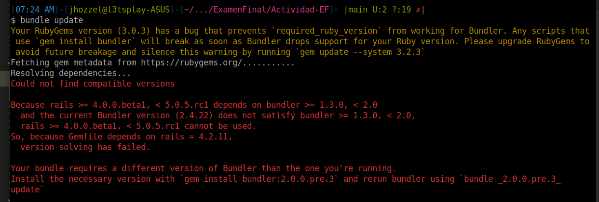
Nos indica que existe un problema con la version de `bundle` que tenemos, asi que vamos a instalar la version que se indica con el comando:
```bash
gem install bundler:2.0.0.pre.3
bundle _2.0.0.pre.3_ update
```
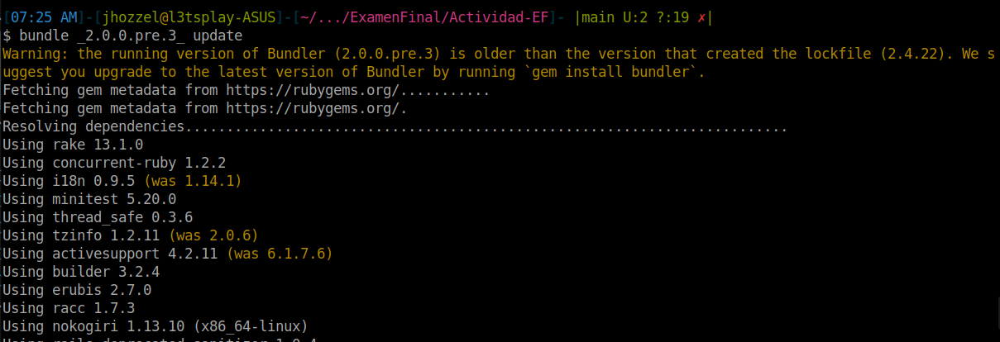
)
Observamos que se lograron instalar exitosamente todas las dependencias, asi que ahora migraremos la base de datos que se tiene con `rake db:migrate`
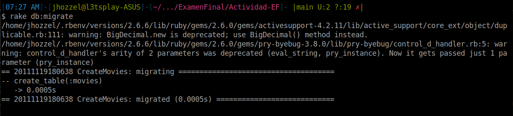
Y ahora incializamos el server con el comando `rails server`
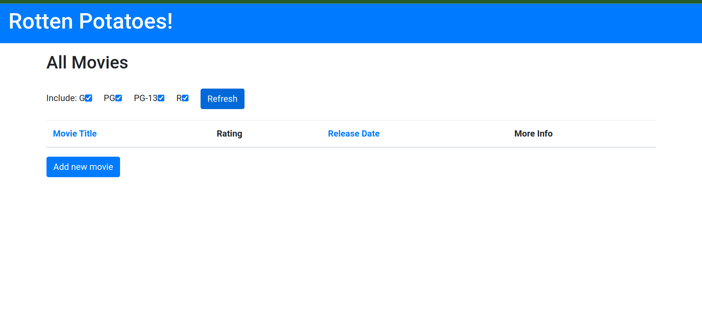
Podemos visualizar la página localmente, pero no se muestra ninguna pelicula es debido a que aun no hemos plantado la semilla q generará las demas peliculas, que podemos hacer con el comando `rake db:seed`
 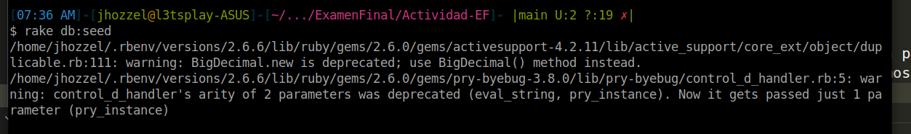

Con este ultimo paso ya deberia estar configurado todo para poder avanzar con las siguientes preguntas. Se muestra a continuacion la pagina ya cargada con todas las peliculas.
 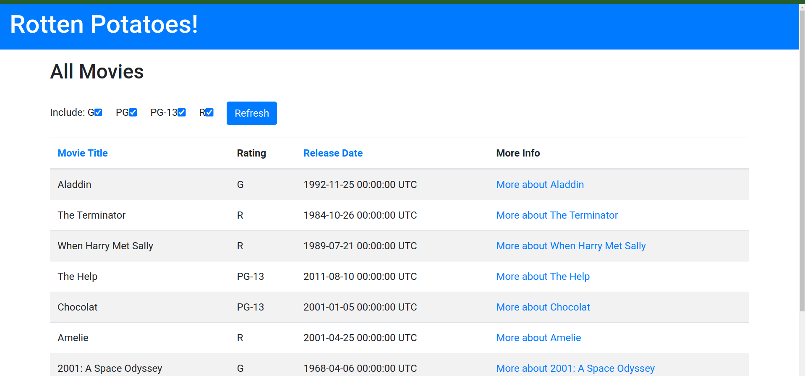

### Configuraciones adicionales
Vamos a incluir la gema Faraday en nuestro archivo Gemfile, asi que agregaremos las siguientes lineas en dicho archivo:

```rb
gem 'faraday'  
group :test do
  gem 'rails-controller-testing'
  gem 'guard-rspec'                 
end
```
 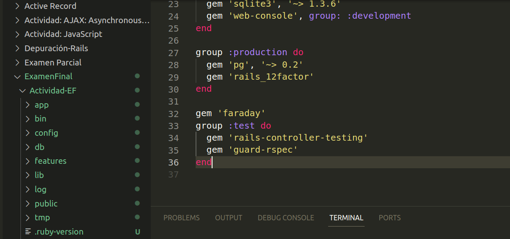

Ahora se indica que tenemos que generar los archivos rspec con el comando `rails generate rspec:install`
 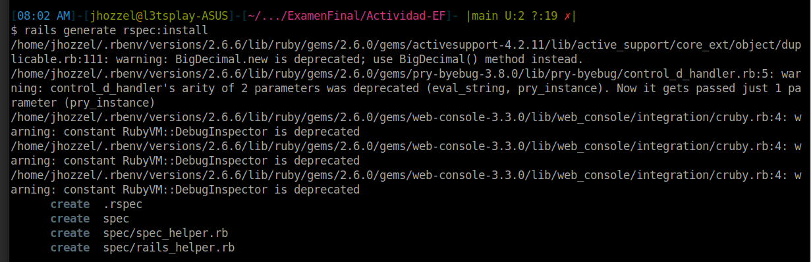

Luego modificamos el archivo `spec/rails_helper.rb` indicando el `require 'buebug'`. Finalmente desplegamos la pagina y vemos que funciona correctamente.

 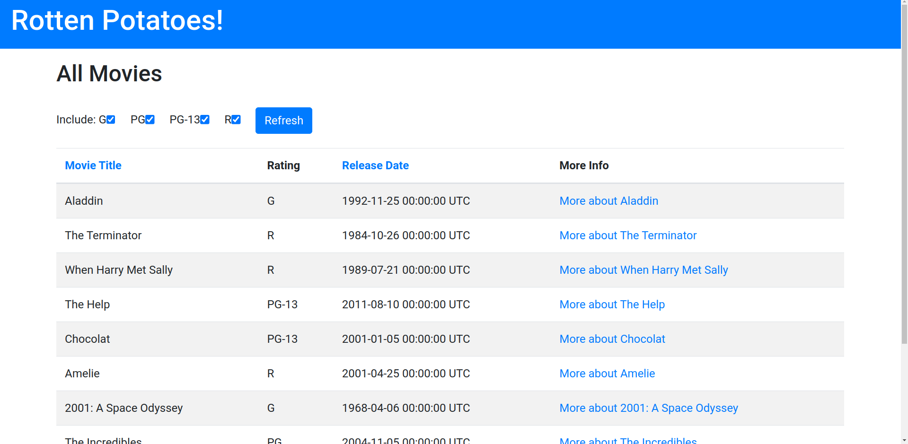


### Paso 1: Escribiendo una nueva vista (2 puntos)


### Paso 2: Lograr que se apruebe la primera especificación  (2 puntos)

### Paso 3: Más comportamientos de controlador (3 puntos)

### Paso 4: TDD para el modelo (3 puntos)

### Paso 5: Paso final (5 puntos)