# Examen Final
- Chavez Chico Joel Jhotan 20210058J
## Parte 01
***Pregunta 01: Produce un conflicto de fusión (merge) en algún repositorio de tus actividades realizadas. Establece los pasos y comandos que usas para resolver un conflicto de fusión en Git. Si intentas git push y falla con un mensaje como : Non-fast-forward (error): failed to push some refs esto significa que algún archivo contiene un conflicto de fusión entre la versión de tu repositorio y la versión del repositorio origen. Para este ejercicio debes presentar el conflicto dado, los pasos y comandos para resolver el problema y las solución.**

Vamos a trabajar sobre la actividad `Depuracion-Rails`, y vamos a crear una nueva rama llamada `test_branch`. Para crearla podemos usar el `git branch test_branch`.
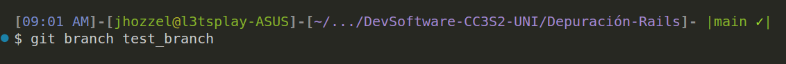
Luego para poder identificar las ramas que tenemos usamos simplemente `git branch`
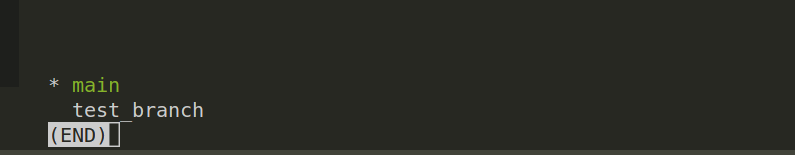
Hacemos el cambio con `git checkout test_branch`
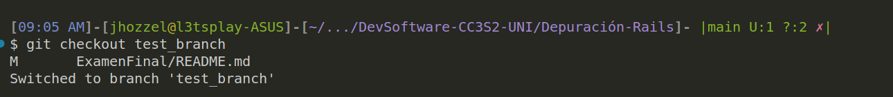
El cambio que haremos será eliminar el archivo `app/controllers/application_controller.rb`.
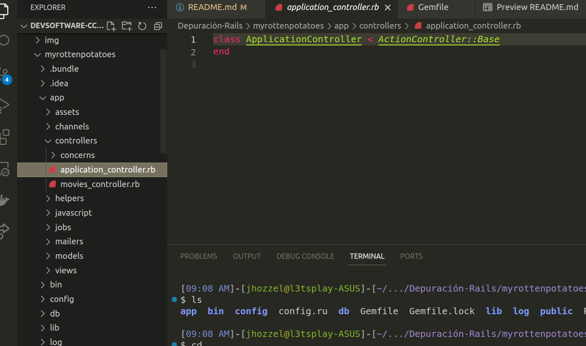
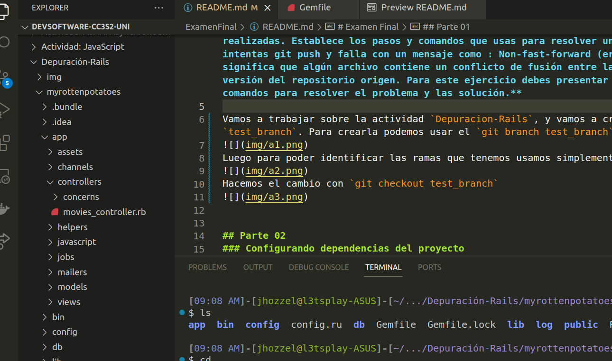


## Parte 02
### Configurando dependencias del proyecto
Lo primero que haremos será solucionar los problemas de compatibilidad de nuestra app ya que se hace uso de unas versiones de rails y ruby distintas, para ello primero ejecutemos un `bundle update` para cargar las gemas y dependencias necesarias (se esta manejando la version de ruby 2.6.6):

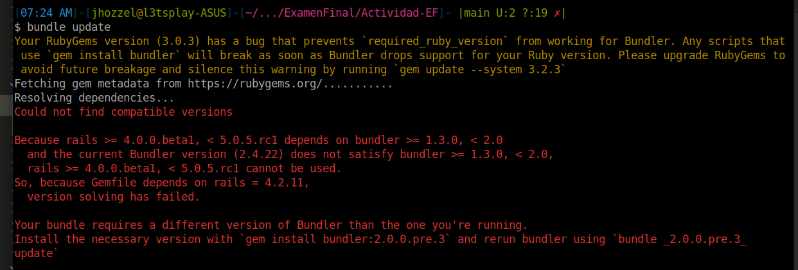
Nos indica que existe un problema con la version de `bundle` que tenemos, asi que vamos a instalar la version que se indica con el comando:
```bash
gem install bundler:2.0.0.pre.3
bundle _2.0.0.pre.3_ update
```
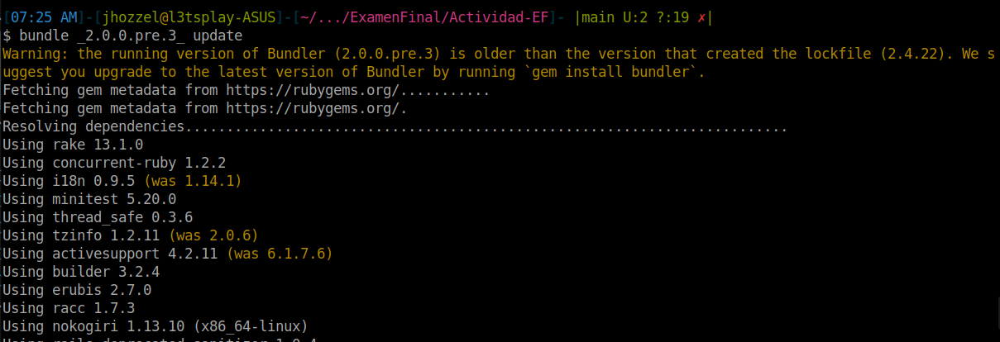
)
Observamos que se lograron instalar exitosamente todas las dependencias, asi que ahora migraremos la base de datos que se tiene con `rake db:migrate`
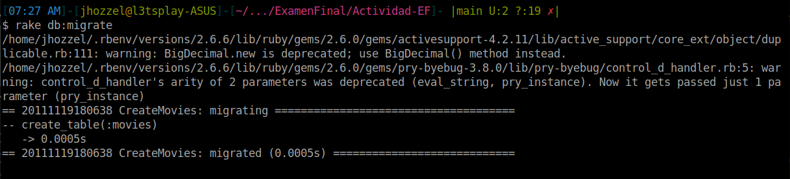
Y ahora incializamos el server con el comando `rails server`
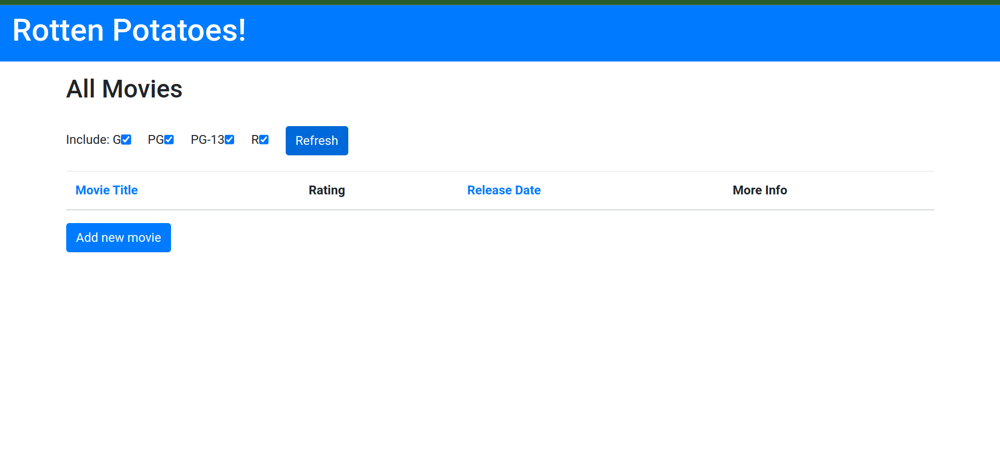
Podemos visualizar la página localmente, pero no se muestra ninguna pelicula es debido a que aun no hemos plantado la semilla q generará las demas peliculas, que podemos hacer con el comando `rake db:seed`
 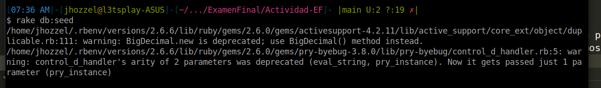

Con este ultimo paso ya deberia estar configurado todo para poder avanzar con las siguientes preguntas. Se muestra a continuacion la pagina ya cargada con todas las peliculas.
 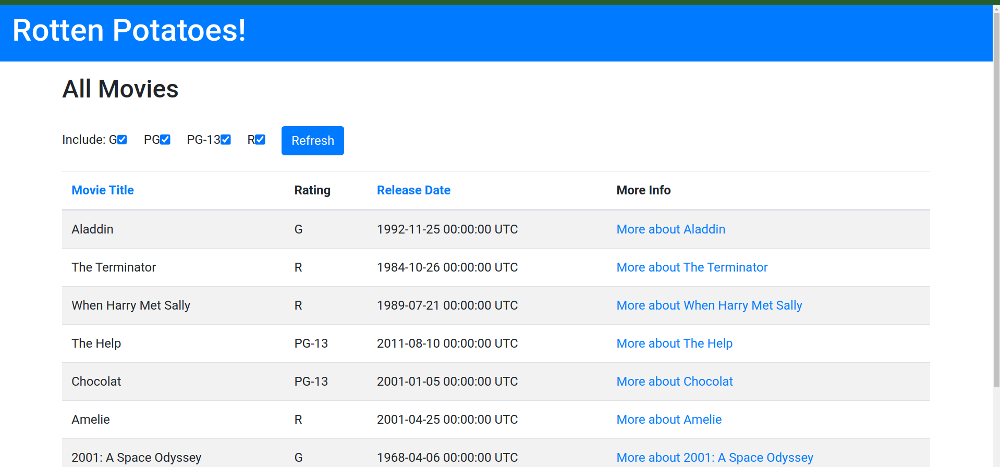

### Configuraciones adicionales
Vamos a incluir la gema Faraday en nuestro archivo Gemfile, asi que agregaremos las siguientes lineas en dicho archivo:

```rb
gem 'faraday'  
group :test do
  gem 'rails-controller-testing'
  gem 'guard-rspec'                 
end
```
 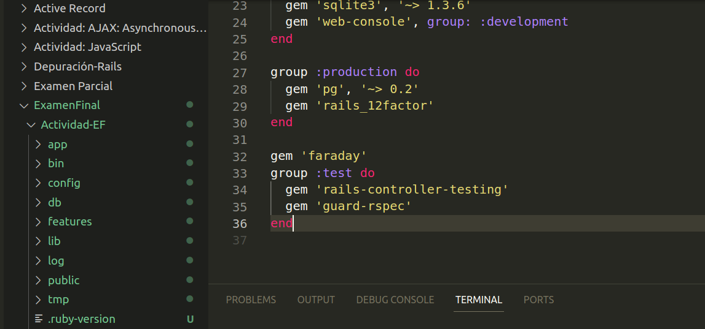

Ahora se indica que tenemos que generar los archivos rspec con el comando `rails generate rspec:install`
 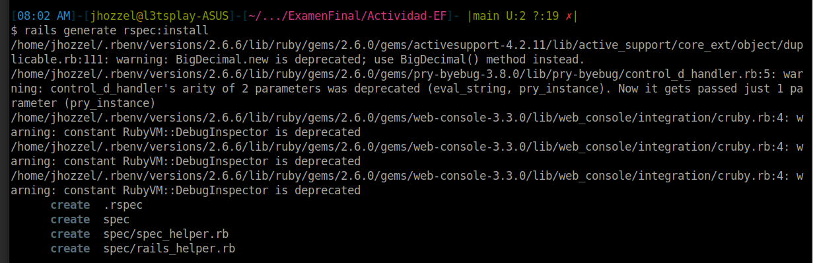

Luego modificamos el archivo `spec/rails_helper.rb` indicando el `require 'buebug'`. Finalmente desplegamos la pagina y vemos que funciona correctamente.

 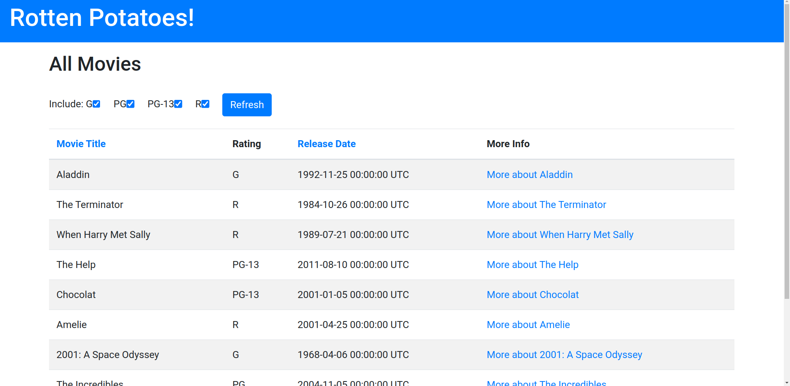


### Paso 1: Escribiendo una nueva vista (2 puntos)


### Paso 2: Lograr que se apruebe la primera especificación  (2 puntos)

### Paso 3: Más comportamientos de controlador (3 puntos)

### Paso 4: TDD para el modelo (3 puntos)

### Paso 5: Paso final (5 puntos)