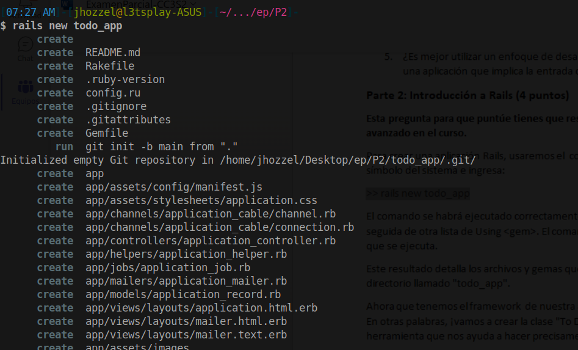
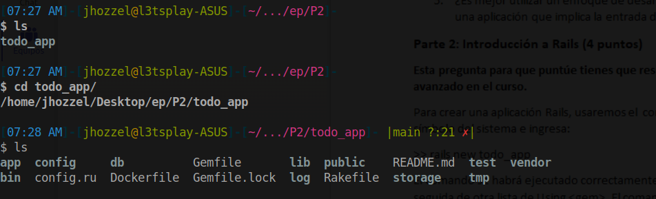
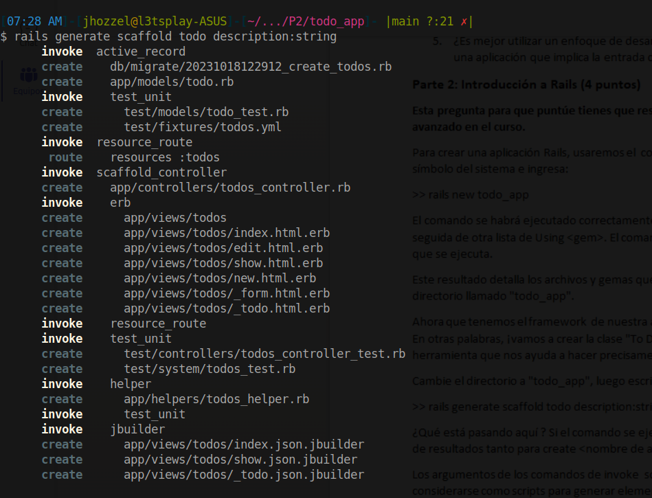

# Parte 2: Introducción a Rails (4 puntos)
Primero ejecutaremos el comando `>> rails new todo_app`

Verificamos que todos los archivos han sido generados correctamente

`>> rails generate scaffold todo description:string`

## Base de Datos
`>> bundle exec rake db:migrate`

## Más migraciones

- **La primera migración nos permitió crear la base de datos. Digamos que el cliente quiere que cada "tareas pendientes" tenga una fecha de vencimiento asociada. ¿Cómo hacemos que eso suceda? ¿Qué archivos nuevos o cambios en los archivos existentes han ocurrido?**

## Nuevas rutas
- **1- Agrega una ruta en config/routes.rb y asígnela a una acción del controlador. (Coloca esta línea dentro del cuerpo de route.draw).**

- **2. Añade una nueva vista correspondiente a la ruta. Si alguien navega a la página "hello" de tu aplicación (es decir, `http://localhost:<número de puerto>/hello/`), se mostrará una página web.**

## Más ejercicios

- **Agrega un nuevo atributo al modelo Todo y actualiza las vistas para mostrar y editar el nuevo campo. Para propósitos de práctica digamos que queremos agregar un nuevo campo booleano llamado "done" con un valor predeterminado de falso.**

- **Cambia el esquema de enrutamiento. Debes suponer que queremos una nueva ruta new_todo para ir a una página que crea un nuevo ítem Todo**

- **Establece todos#index como la página de inicio de la aplicación.**

- **Enumera todas las migraciones. ¿Cuál es el comando para volver a una versión anterior de la base de datos?. Muestra los resultados.**
