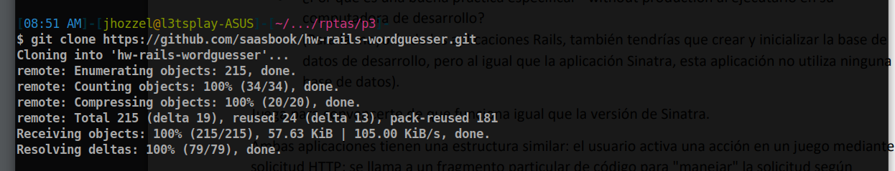
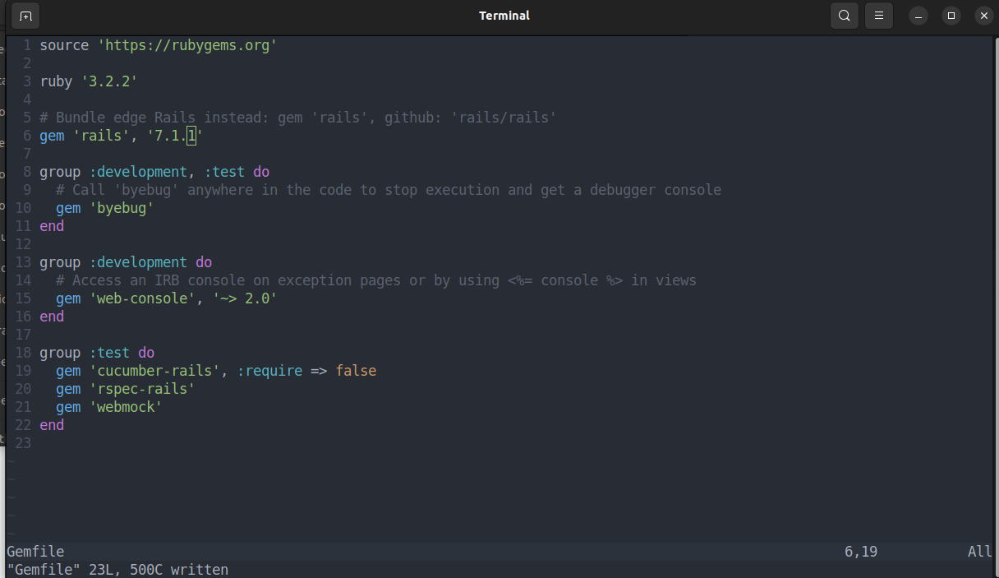
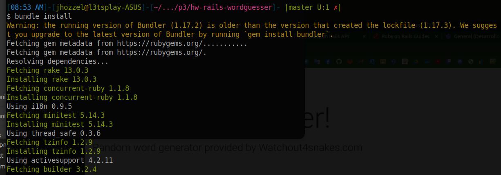
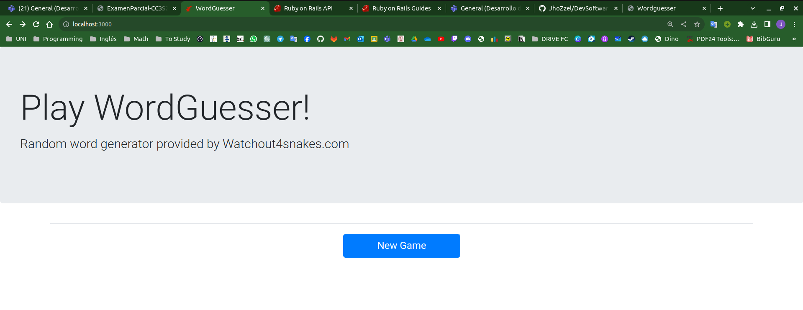
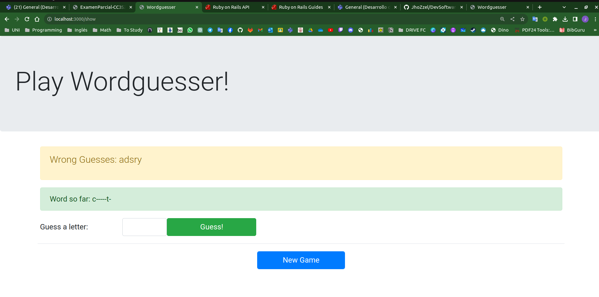
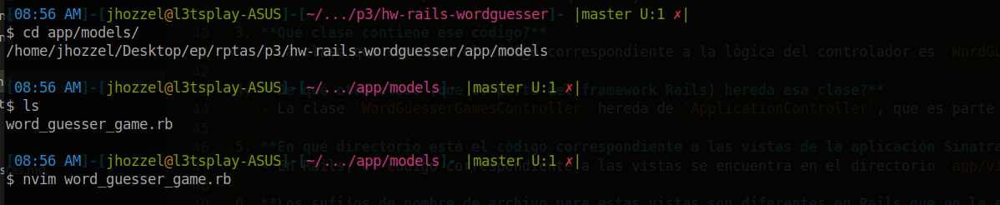
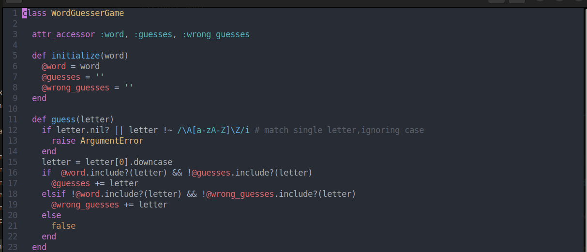
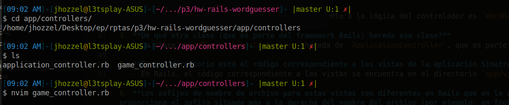
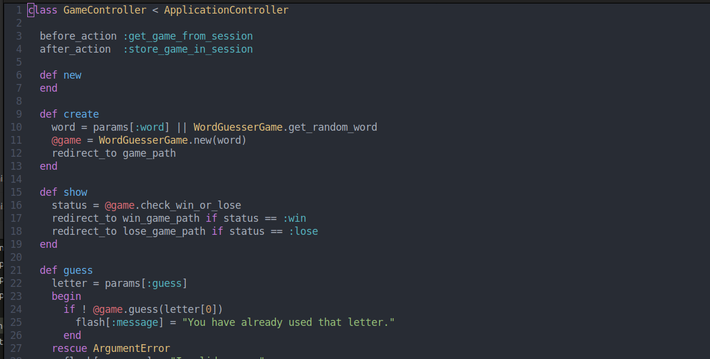

# Parte 3: Ruby on Rails (8 puntos)
## Correr la aplicación 
Primero clonamos el repositorio como se muestra a continuacion

*Preguntas (1 punto)*:
1. **¿Cuál es el objetivo de ejecutar `bundle install`?** 

    Usualmente cuando trabajamos en un proyecto de ruby, existen muchas dependencias que aun no estan instaladas en nuestro equipo, es así que `bundle` especifica en el archivo `Gemfile` todas aquellas gemas que nosotros vamos a necesitar para que el proyecto pueda ser ejecutado correctamente.

2. **¿Por qué es una buena práctica especificar `--without production` al ejecutarlo en su computadora de desarrollo?** 

    Se considera una buena práctica debido a que muchas veces existirán gemas en nuestro proyecto que no serán durante todo el entorno de desarrollo, es asi que que especificamos el `--without production` para que estas gemas se usen exclusivamente durante el entorno de producción, manteniendo un un entorno mucho más limpio y ordenado

3. **(Para la mayoría de las aplicaciones Rails, también tendrías que crear y inicializar la base de datos de desarrollo, pero al igual que la aplicación Sinatra, esta aplicación no utiliza ninguna base de datos).** 

   Esta afirmación confirma que la aplicación en cuestión no hace uso de una base de datos en su estructura, lo que significa que no se requiere crear ni inicializar una base de datos de desarrollo para el funcionamiento del proyecto. Esto es común en aplicaciones más simples o ejemplos educativos que no necesitan almacenar datos de manera persistente.

## Inicializacion del servidor usando Rails
Antes de inicializar el servidor vamos a modificar el archivo Gemfile con el fin de especficar correctamente nuestras versiones de ruby y rails.

Instalamos las dependencias que son necesarias con el `bundle install`

Iniciamos el servidor usando rails con el comando `rails server`.

**Preguntas (3 puntos):**

- **¿En qué parte de la estructura del directorio de la aplicación Rails está el código correspondiente al modelo WordGuesserGame?** 

   En una aplicación Rails, el modelo `WordGuesserGame` según su estructura ya definida se ubica en el directorio `app/models`.

   
   

- **¿En qué archivo está el código que más se corresponde con la lógica del archivo app.rb de las aplicaciones Sinatra que maneja las acciones entrantes del usuario?** 

   El código que corresponde a la lógica del archivo `app.rb` en las aplicaciones Sinatra se encuentra en los controladores de Rails. En este caso, el controlador que maneja las acciones entrantes del usuario será `game_controller.rb`.
   
   

- **¿Qué clase contiene ese código?** 

   La clase que contiene el código correspondiente a la lógica del controlador es `GameController`.

- **¿De qué otra clase (que es parte del framework Rails) hereda esa clase?** 

   La clase `GameController` hereda de `ApplicationController`, que es parte del framework Rails.

- **¿En qué directorio está el código correspondiente a las vistas de la aplicación Sinatra (new.erb, show.erb, etc.)?** 

   En Rails, el código correspondiente a las vistas se encuentra en el directorio `app/views`.

- **Los sufijos de nombre de archivo para estas vistas son diferentes en Rails que en la aplicación Sinatra. ¿Qué información proporciona el sufijo situado más a la derecha del nombre del archivo (por ejemplo: en foobar.abc.xyz, el sufijo .xyz) sobre el contenido del archivo?** 

   Los sufijos nos brindan información sobre el formato o tipo de archivo asi que, nos indica el tipo de contenido que se espera encontrar dentro del archivo, según el ejemplo presentado para el archivo `foobar.abc.xyz`, el sufijo `.abc.xyz` nos indica que la vista está escrita el el formato `.xyz`. 

- **¿Qué información te brinda el otro sufijo sobre lo que se le pide a Rails que haga con el archivo?** 

   Rails usa el otro sufijo para poder saber como es que debe de procesar dicho archivo.

- **¿En qué archivo está la información de la aplicación Rails que asigna rutas (por ejemplo, GET/new) a las acciones del controlador?** 

   La información de las rutas se encuentra en el archivo `config/routes.rb`, dicho archivo define cómo las distintas solicitudes HTTP (como GET, POST, PUT, DELETE, etc.) deben ser manejadas por la aplicación.

- **¿Cuál es el papel de la opción :as => 'name' en las declaraciones de ruta de config/routes.rb?** 

   Esta opción permite a los desarrolaldores asignar un nombre personalizado a una ruta, de modo que si quiseramos referenciar una ruta en específico lo hariamos de una forma mas legible y limpia.

**Preguntas (1 punto):**

- **En la versión de Sinatra, los bloques before do...end y after do...end se utilizan para la gestión de sesiones. ¿Cuál es el equivalente más cercano en esta aplicación Rails y en qué archivo encontramos el código que lo hace?** 

    En Rails podemos usar los filtros `before_action` y `after_action`, que son muy similares a lo que realizan los bloques `before do...end` y `after do...end` de Sinatra. De igual modo sirven para gestionar las sesiones y se encuentran en los controladores, además se especifican antes o después de las acciones.

- **Un formato de serialización popular para intercambiar datos entre aplicaciones web es JSON. ¿Por qué no funcionaría utilizar JSON en lugar de YAML?** 

    Hay que tener en cuenta que no podemos modificar el formato YAML que maneja Rails, no podemos simplemente cambiarlo por otro como JSOn y esperar que Rails pueda interpretarlo, ya que tendría conflictos durante la serializacion.

**Preguntas (2 puntos):**

- **En la versión de Sinatra, cada acción del controlador termina con redirect (que, como puedes ver, se convierte en redirección_to en Rails) para redirigir al jugador a otra acción, o con erb para representar una vista. ¿Por qué no hay llamadas explícitas correspondientes a erb en la versión Rails?** 

    A diferencia de Sinatra, cuando trabajamos con Rails no exsiten llamadas explícitas a `erb` porque Rails sigue el código establecido en sus archivos de configuración, asimismo Rails automatiza las vistas si es que encuentra que el nombre de la acción del controlador coincide con alguna del directorio `app/views`.

- **En la versión de Sinatra, codificamos directamente un formulario HTML usando la etiqueta <form>, mientras que en la versión de Rails usamos un método Rails form_tag, aunque sería perfectamente legal usar etiquetas HTML <form> sin formato en Rails. ¿Se te ocurre alguna razón por la que Rails podría introducir este "nivel de direccionamiento indirecto"?** 

    Según lo elaborado en actividades pasadas y el proyecto elaborado con Sinatra, pienso que Rails usa este "nivel de direccionamiento indirecto" con el fin de poder brindar un interfaz más sencilla y rápida. Esto debido a que se busca tener un mayor nivel de abstracción y eficiencia durante la elaboracion del proyecto.

- **¿Cómo se manejan los elementos del formulario, como campos de texto y botones, en Rails?** 

    Estos se manejan utilizan una serie de métodos y etiquetas de Ruby que generan automaticamente el codigo HTML necesario para poder crear formularios, este es el caso de `text_field_tag` que se utiliza para crear campos de texto.

- **En la versión de Sinatra, las vistas de show, win y lose reutilizan el código en la vista new que ofrece un botón para iniciar un nuevo juego. ¿Qué mecanismo de Rails permite reutilizar esas vistas en la versión de Rails?** 

    En Rails, tenemos un grandioso mecanismo que que permite la "reutilizacion de codigo" en difrentes partes de la aplicacion, esto funciona debido a que se manejan fragmentos de codigo de vista que pueden ser accedidas y renderizadas desde otras diferentes vistas externas.

### Cucumber
- **¿Cuál es una explicación cualitativa de por qué no fue necesario modificar los escenarios de Cucumber y las definiciones de pasos para que funcionaran igualmente bien con las versiones de la aplicación Sinatra o Rails? (1 punto)**
