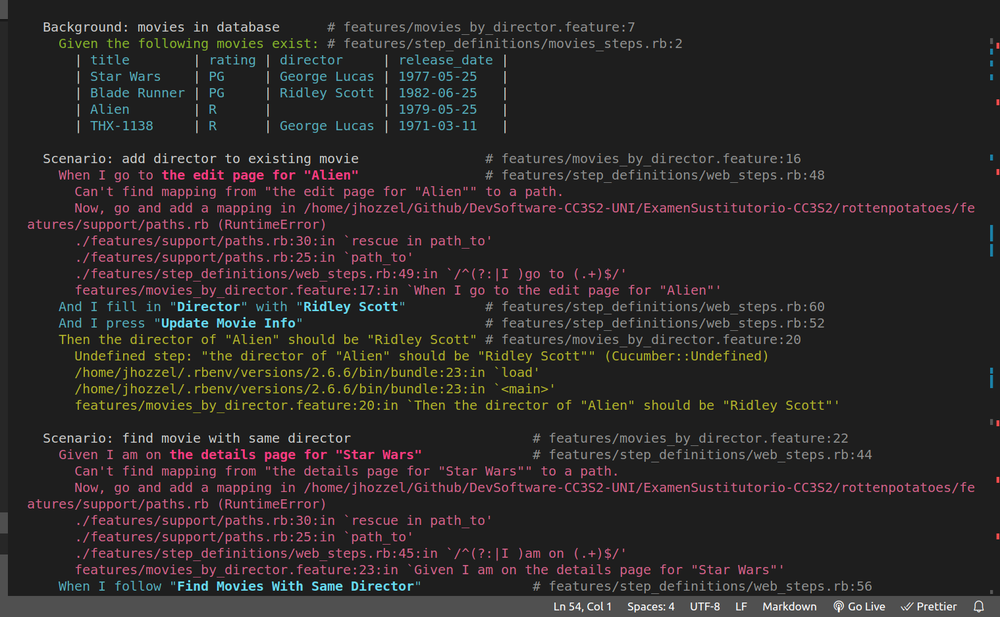

# Examen Sustitutorio
- Chavez Chico Joel Jhotan 20210058J

## Parte 1: El ciclo de prueba de aceptación- prueba unitaria

### Corre y prepara rottenpotatoes
Primero cambiamos al directorio rottenpotatoes donde trabajaremos e instalamos las gemas

Migramos la base de datos y configuramos la semilla para mostrar los primeros datos


Vemos que ya se esta desplegando en nuestro navegador.


### Agrega un campo Director a Movies
Ahora vamos a ejecutar las pruebas de cucumber del archivo `features/movies_by_director.feature`. Para ello hacemos un `bundle exec cucumber` y vemos que aparece en consola.


Se buscar agregar un nuevo campo a la tabla para ello crearemos un archivo de migraciones, con el siguiente comando, y luego hacemos la migracion.


Si nos dirigimos a la consola de rails, y seleccionamos cualquier fila de la tabla vemos que el campo director ha sido creado y para esta movie ha sido colocada como `nil`.


Luego para el modelo agregamos estas lineas de codigo con el fin de hacer una validadcion en nuestro modelo para que pueda reconocer el nuevo campo directo
```rb
class Movie < ActiveRecord::Base
  validates :director, presence: true
  def others_by_same_director
    # Your code here #
  end
end
```
Ahora vamos a modificar nuestras vistas para que este campo se visualice en pantalla, para ello nos diririgimos al archivo `index.html.erb` y hacemos estos cambios, para que pueda ser incluida en la vista.

```html
...
<tr>
    <th>Movie Title</th>
    <th>Director</th>
    <th>Rating</th>
    <th>Release Date</th>
    <th>More Info</th>
</tr>
...
 <td>
    <%= movie.director %>
</td>
```

Realizamos la prueba cucumber una vez mas y vemos que ahora se muestra los siguientes mensajes:



### Utiliza pruebas de aceptación para aprobar nuevos escenarios (2 puntos)

## Parte 2: Ruby on Rails
### Pregunta 1: ¿Por qué la abstracción de un objeto de formulario pertenece a la capa de presentación y no a la capa de servicios (o inferior)?
La abstracción de un objeto de formulario pertenece a la capa de presentación porque es responsable de la interacción del usuario con la aplicación y la manipulación de los datos de entrada del usuario antes de ser enviados al servidor. La capa de servicios no tiene conocimiento de la interfaz de usuario y no está diseñada para manejar la entrada del usuario.

### Pregunta 2: ¿Cuál es la diferencia entre autenticación y autorización?
Para empezar la autenticación es el proceso de verificar la identidad de un usuario, es decir, asegurarse de que el usuario es quien dice ser. Por otro lado, la autorización es el proceso de verificar si un usuario tiene permiso para acceder a un recurso o realizar una acción específica, es por ello que mientras que la autenticación se enfoca en la identidad del usuario, la autorización se enfoca en los permisos que este posee.

### Pregunta 3:


### Pregunta 4:
Para realizar esto nos dirigiremos a nuestra actividad de `Rails-Avanzado` y sobre este repositorio vamos a ejecutar los comandos, para empezar inciamos ejecutando lo siguiente:

Esto lo que hace es buscar todos los archivos con extensión .rb en la carpeta app/models y sus subdirectorios para ello itera sobre cada archivo encontrado y ejecuta el siguiente bloque de código, luego cuenta el número de commits de Git que han modificado el archivo actual, se calcula la complejidad del archivo actual utilizando Flog y awk. Flog mide la complejidad de un archivo en términos de la complejidad de sus métodos, y awk suma las complejidades de todos los métodos del archivo.
Vamos a usar la gema Flog que se menciona, ya q ofrece una interfaz 

Si revisamos la documentacion en guthub de dicha gema nos ofrece el siguiente comando para poder visualizar una grafica de `Churn VS Complexity`
Lamentablemente no se puede ver la grafica debido a la limitada cantidad de commits que se hizo, pero se pudo usar la gema correctamente.


## Parte 3: JavaScript
### Pregunta 01:
Se nos pide configurar una pagina web con el fin de poder interactuar con las cookies, asi que podemos hacer lo siguiente, crear un archivo html y dentro manejar codigo JS con las funcion de get, set y delete, la implementacion se muestra a continuacion, se encuentra en este repositorio bajo el nombre `cookie_operations`.
```html
<!DOCTYPE html>
<html lang="en">
<head>
  <meta charset="UTF-8">
  <meta name="viewport" content="width=device-width, initial-scale=1.0">
  <title>Cookie Operations</title>
  <script>
    function getCookie(name) {
      const cookies = document.cookie.split(';');
      console.log(cookies)
      for (const cookie of cookies) {
        const [cookieName, cookieValue] = cookie.trim().split('=');
        if (cookieName === name) {
          return decodeURIComponent(cookieValue);
        }
      }
      return null;
    }

    function setCookie(name, value, days) {
      var date = new Date();
      date.setTime(date.getTime() + (days * 24 * 60 * 60 * 1000));
      var expires = "expires=" + date.toUTCString();
      var ret = name + "=" + value + ";" + expires + ";path=/";
      return ret
    }

    function deleteCookie(name) {
      document.cookie = name + '=; expires=Thu, 01 Jan 1970 00:00:00 UTC; path=/;';
    }

    window.onload = function() {
      console.log('document.cookie (vacio): ', document.cookie);
    };  
  </script>
</head>
<body>
  <h1>Cookie Operations</h1>
</body>
</html>
```
Mostramos los resultados a continuacion, junto con la consola donde se hacen las interacciones, primero asignamos la cookie que queramos, luego el metodo delete es el encargado de eliminarlo y se muestra que el `document.cookie` esta vacio ya que este fue eliminado.


### Pregunta 02:
Usamos el codigo proporcionado y creamos nuestro archivo `index.html`, vemos que se visualiza en el navegador, pero aun falta el codigo en JS.

Para ello agregamos una etiqueta script dentro del index y agregamos el siguiente codigo
```html
 <script>
    document.addEventListener('DOMContentLoaded', function () {
      const form = document.forms['myform'];
      const emailInput = form.elements['email'];
      const passwordInput = form.elements['password'];
      const userNameInput = form.elements['userName'];
      const emailError = document.getElementById('emailError');
      const passwordError = document.getElementById('passwordError');
      const userNameError = document.getElementById('userNameError');
      let hasError = false;

      form.addEventListener('submit', function (event) {
        event.preventDefault();
        emailError.classList.add('hide');
        passwordError.classList.add('hide');
        userNameError.classList.add('hide');
        hasError = false;

        const emailRegex = /^[^\s@]+@[^\s@]+\.[^\s@]+$/;
        if (!emailRegex.test(emailInput.value)) {
          handleError(emailError, 'Invalid email address');
        }

        const passwordRegex = /^[a-zA-Z0-9]{3,8}$/;
        if (!passwordRegex.test(passwordInput.value)) {
          handleError(passwordError, 'Invalid password');
        }


        if (!hasError) {
          const formData = {};
          for (const input of form.elements) {
            if (input.name) {
              formData[input.name] = input.value;
            }
          }
          console.log('Form data:', formData);
        }
      });

      function handleError(errorElement, errorMessage) {
        errorElement.textContent = errorMessage;
        errorElement.classList.remove('hide');
        hasError = true;
      }
    });
  </script>
```
Primero implemtamos `document.addEventListener('DOMContentLoaded', function () {...}`, luego se selecciona elementos del formulario, y se obtiene referencias a campos de entrada y mensajes de error mediante `document.forms`, `form.elements` y `document.getElementById`. Agregamos un listener con `form.addEventListener('submit', function (event) {...}`. Se previene el comportamiento predeterminado del formulario con `event.preventDefault()`.
Ahora segun como se menciona en el enunciado validamos el correo electrónico y la contraseña, para ello se utiliza expresiones regulares con `test()` para verificar el formato del correo y la contraseña. Manejamos errores con la función `handleError` actualiza el contenido y visibilidad de mensajes de error. Finalmente se recopila datos del formulario y se crea un objeto `formData` con los valores de los campos del formulario. Luego se imprime los datos en la consola con `console.log('Form data:', formData)`.

Vamos a mostrar los resultados en las siguientes capturas, primero vamos a ingresar datos incorrectos con el fin de que el validate este funcionando correctamente.


Como se muestra en la figura anterior, vemos que hemos ingresado un correo invalida y se ha logrado mostrar el mensaje de `Invalid email address`, asimismo lo mismo ocurre con el campo de contraseña ya que hemos ingresado mas caracteres de lo debido `Invalid password`. 

Ahora bien vamos a ingresar los datos correctamente, y observemos la consola del navegador para ver si ha podido registar los datos.


Vemos que ahora si no se ha mostrado ningun error y la consola imprime los resultados como `Form-tag`


## Parte 4: Pruebas y Rspec (3 puntos)
Para esta parte se nos solicita realizar pruebas sobre el sistema de puntuación de un juego de tennis, para ello vamos a trabajar sobre un nuevo repositorio llamado `tennis_test`, y vamos a instalarle la gema de Rspec y hacer un `rspec init` como ya es habitual, creamos la carpeta `/spec/my_tests` y agregaremos la clase `TennisScorer` que vamos a usar donde estará la lógica del sistema y por otro lado las pruebas que haremos que serán las siguientes que se mencionan:


Vamos a ejecutar el Rspec para verificar que todo este marchando correctamente.

Vemos que se pueden reconocer las pruebas y se marcan como pendientes, ahora bien vamos a completar nuestra clase `TennisSoccer` y agregaremos los metodos necesarios. A continuación se adjunta el codigo ya resuelto con los metodos necesarios, y con esto ya estamos listos para realizar las pruebas, pero antes se hará una breve explicación de como funciona.

```rb
class TennisScorer
    PLAYER_RELATION = { server: :receiver, receiver: :server }
    SCORE_TRANSLATION = { 0 => 0, 1 => 15, 2 => 30, 3 => 40 }
  
    def initialize
        @default_player = :server
        @score = { server: 0, receiver: 0 }
    end
  
    def score(player = :server) 
        other = PLAYER_RELATION[player]
        if @score[player] <= 3 and @score[other] <= 3
            if @score[player] == @score[other] and @score[player] == 3
                'DEUCE'
            else
                "#{SCORE_TRANSLATION[@score[:server]]}-#{SCORE_TRANSLATION[@score[:receiver]]}"
            end
        elsif @score[player] - @score[other] >= 2
            "W-L"
        elsif @score[other] - @score[player] >= 2
            "L-W"
        elsif @score[other] >= 3 and @score[player] >= 3
            if @score[player] == @score[other]
                "DEUCE"
            elsif @score[player] > @score[other]
                "El sacador tiene ventaja"
            else
                "El receptor tiene ventaja"
            end
        end
    end
  
    def give_point_to(player)
      @score[player] += 1
    end  
  end
```

Para empezar veamos nuestras variables constantes:
   - `PLAYER_RELATION`: Un hash que define la relación entre el servidor y el receptor. 
   - `SCORE_TRANSLATION`: Un hash que traduce los puntajes numéricos a la terminología utilizada en el tenis. 
Luego tenemos los siguientes metodos:
   - `initialize`: Un método que se llama al crear una nueva instancia de la clase. Establece el jugador por defecto como el servidor (`:server`) y crea un hash `@score` para rastrear los puntajes de ambos jugadores.

   - `score(player = :server)`: Un método que devuelve el marcador actual del juego para el jugador especificado (o el jugador por defecto si no se proporciona uno). Realiza la lógica para determinar si el juego está en deuce, si hay ventaja para alguno de los jugadores, o si uno de los jugadores ha ganado el juego.

   - `give_point_to(player)`: Un método que incrementa el puntaje del jugador especificado en un punto.

   - El método `score` compara los puntajes y devuelve una cadena que representa el estado del juego. Aquí hay una descripción de los casos clave manejados:
      - **Deuce:** Si ambos jugadores tienen 3 puntos (40-40), se muestra "DEUCE".
      - **Ganar el juego:** Si un jugador tiene al menos 4 puntos y tiene al menos 2 puntos más que el oponente, se muestra "W-L" o "L-W" según el jugador que haya ganado.
      - **Ventaja:** Si ambos jugadores tienen al menos 3 puntos y hay una diferencia de un punto, se muestra "El sacador tiene ventaja" o "El receptor tiene ventaja" según el jugador con la ventaja.

Ahora completemos nuestras pruebas con el siguiente contenido, como se indica en la descripcion del codigo adjuntado en el examen

```rb
# PRUEBAS INICIALES
  it "empieza con un marcador de 0-0" do
    expect(@ts.score).to eq("0-0")
  end

  it "hace que el marcador sea 15-0 si el sacador gana un punto" do
    @ts.give_point_to(:server)
    expect(@ts.score).to eq("15-0")
  end

  it "hace que el marcador sea 0-15 si el receptor gana un punto" do
    @ts.give_point_to(:receiver)
    expect(@ts.score).to eq("0-15")
  end

  it "hace que el marcador sea 15-15 después de que ambos ganen un punto" do
    @ts.give_point_to(:receiver)
    @ts.give_point_to(:server)
    expect(@ts.score).to eq("15-15")
  end
```
Se hace uso de los metodos explicados anteriormente para simular los escenarios facilmente en pocas lineas de codigo, ahora ejecutaremos el rspec y veamos los resultados.


Como se esperaba ha superado todas las pruebas exitosamente. Por otro lado se menciona algunas pruebas adicionales que podemos hacer, ya que nuestra clase `TennisScorer` ha sido bien diseñada y preparada para cualquier posible escenario, asi que podriamos ejecutar todas las pruebas que han sido implementadas a continuacion.

```rb
 # PRUEBAS ADICIONALES
  it "40-0 después de que el sacador gane tres puntos" do
    3.times { @ts.give_point_to(:server) }
    expect(@ts.score).to eq("40-0")
  end
  
  it "W-L después de que el sacador gana cuatro puntos" do
    3.times { @ts.give_point_to(:server) }
    @ts.give_point_to(:server)
    expect(@ts.score).to eq("W-L")
  end

  it "L-W después de que el receptor gane cuatro puntos" do
    3.times { @ts.give_point_to(:receiver) }
    expect(@ts.score).to eq("0-40")
  end
  
  it "Deuce después de cada uno gana tres puntos" do
    3.times { @ts.give_point_to(:server) }
    3.times { @ts.give_point_to(:receiver) }
    expect(@ts.score).to eq("DEUCE")
  end
  
  it "El sacador con ventaja después de cada uno gana tres puntos y el sacador obtiene uno más" do
    3.times { @ts.give_point_to(:server) }
    3.times { @ts.give_point_to(:receiver) }
    @ts.give_point_to(:server)
    expect(@ts.score).to eq("El sacador tiene ventaja")
  end
```

Veamos como nos va tras ejecutar el Rspec

Finalmente se han superado todas las pruebas correctamente!