# Actividad: "Hola Ruby"
- Chavez Chico Joel Jhotan 20210058J
## Ejecución de la actividad
Para empezar vamos a crear los directorios `lib/` y `spec/` donde colocaremos los archivos de código y de prueba respectivamente. Se crea en la raíz el archivo `Gemfile` con el siguiente contenido:
```
source 'https://rubygems.org'
gem 'rspec'
gem 'autotest', '~> 5.0'
group :development do
  gem 'guard'
end
```
Ejecutaremos el comando `bundle install` pa instalar las dependencias y copiamos los archivos de prueba `parte[123]_spec.rb` en la carpeta `spec`. A continuación mostraremos los códigos solicitados para cada Parte junto con la ejecución exitosa de los casos de prueba.

## Parte 1: Arreglos, hashes y enumerables

### Ejercicio 01: 
Define un método `sum(array)` que tome un arreglo de números enteros como argumento y devuelva la suma de sus elementos. Para una matriz vacía, debería devolver cero. Ejecuta las pruebas asociadas a través de:

```rb
def sum(arr)
  suma = 0
  arr.each { |x| suma += x }
  suma
end
```
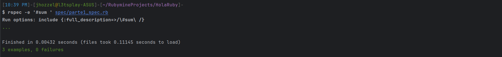

***
### Ejercicio 02: 
Define un método `max_2_sum(array)` que tome un arreglo de números enteros como argumento y devuelva la suma de sus dos elementos más grandes. Para un arreglo vacío, debería devolver cero. Para un arreglo con solo un elemento, debería devolver ese elemento (considera si los dos elementos más grandes también tienen el mismo valor). Ejecuta las pruebas asociadas a través de:

```rb
def max_2_sum(arr)
  return 0 if arr.empty?
  return arr[0] if arr.length == 1
  arr.sort! { |a,b| b <=> a }
  arr[0] + arr[1]
end
```
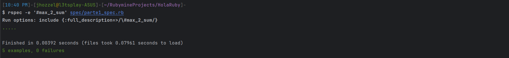

***
### Ejercicio 03: 
Define un método `sum_to_n?(array, n)` que toma un arreglo de números enteros y un número entero adicional n, como argumentos y devuelva verdadero si dos elementos cualesquiera en el arreglo de enteros suman n. sum_to_n?([], n) debería devolver false para cualquier valor de n, por definición. Ejecuta las pruebas asociadas a través de:

```rb
def sum_to_n?(arr, n) # O(n log n)
  return false if arr.empty?
  v = arr.sort! # arreglo sobre el cual se hara el BS
  arr.each do |x|
    v.shift
    target = n - x # valor a buscar
    result = v.bsearch { |y| y >= target }
    return true if target == result
  end
  false
end
```
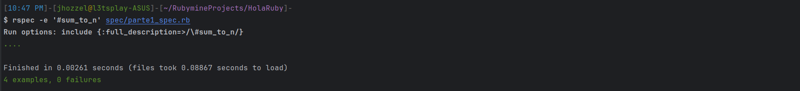

***
Verificamos la ejecución de todo lo anterior usando: `$ rspec spec/parte1_spec.rb.`.

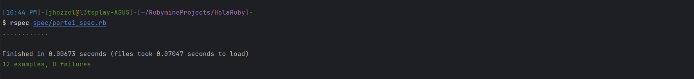

## Parte 2: Cadenas y expresiones regulares

### Ejercicio 01: 
Define un método `hello(name)` que tome una cadena que represente un nombre y devuelva la cadena "Hello", concatenada con el nombre. Ejecuta las pruebas asociadas a través de:

```rb
def hello(name)
  "Hello, " + name
end
```
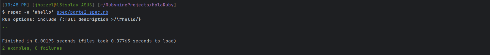

***

### Ejercicio 02: 
Define un método `start_with_consonant?(s)` que tome una cadena y devuelva verdadero si comienza con una consonante y falso en caso contrario. Asegúrate de que funcione tanto para mayúsculas como para minúsculas y para otras letras. Ejecuta las pruebas asociadas a través de:

```rb
def starts_with_consonant?(s)
  return false if s.empty?
  regexp = /[bcdfghjklmnñpqrstvwxyz]/i
  s[0].match?(regexp)
end
```


***

### Ejercicio 03: 
Define un método `binary_multiple_de_4?(s)` que tome una cadena y devuelva verdadero si la cadena representa un número binario que es múltiplo de 4, como '1000'. Asegúrate de que devuelva falso si la cadena no es un número binario válido. Ejecuta las pruebas asociadas a través de:

```rb
def binary_multiple_of_4?(s)
  return false unless s =~ /^[01]+/
  s =~ /00\z/ || s == '0'
end
```
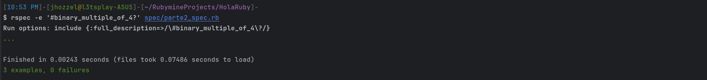

***

Verificamos la ejecución de todo lo anterior usando: `$ rspec spec/parte2_spec.rb.`.

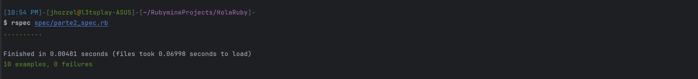


## Parte 3: Conceptos básicos de orientación a objetos

Define una clase `BookInStock` que representa un libro con un número ISBN, isbn y el precio del libro como número de punto flotante, precio, como atributos.

```rb
class BookInStock
  attr_accessor :isbn, :price
end
```
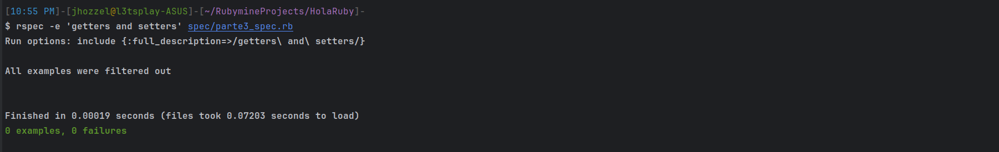

***

El constructor debe aceptar el número ISBN (una cadena, ya que en la vida real los números ISBN pueden comenzar con cero e incluir guiones) como primer argumento y el precio como segundo argumento y debe generar ArgumentError (una de los tipos de excepciones integradas de Ruby) si el número ISBN es la cadena vacía o si el precio es menor o igual a cero. Incluye los getters y setters adecuados para estos atributos. Ejecuta las pruebas asociadas a través de:

```rb
class BookInStock
  attr_accessor :isbn, :price
  def initialize(isbn, price)
    return raise ArgumentError if isbn.empty? || price <= 0
    @isbn = isbn
    @price = price
  end
end
```
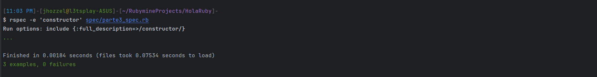

***

Define un método `binary_multiple_de_4?(s)` que tome una cadena y devuelva verdadero si la cadena representa un número binario que es múltiplo de 4, como '1000'. Asegúrate de que devuelva falso si la cadena no es un número binario válido. Ejecuta las pruebas asociadas a través de:

```rb
class BookInStock
  attr_accessor :isbn, :price
  def initialize(isbn, price)
    return raise ArgumentError if isbn.empty? || price <= 0
    @isbn = isbn
    @price = price
  end
  def price_as_string
    format("$%.2f", @price)
  end
end
```
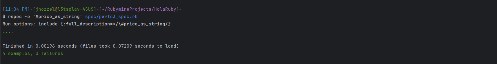

***

Verificamos la ejecución de todo lo anterior usando: `$ rspec spec/parte3_spec.rb`.

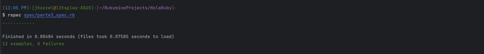
