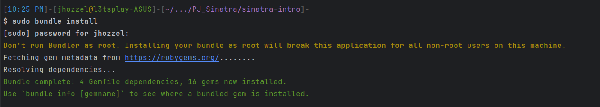

# Actividad: Demostración de MVC, rutas RESTful y CRUD con Sinatra

- Chavez Chico Joel Jhotan 20210058J

## Ejecución de la actividad
Para empezar abriremos nuestro IDE de RubyMine y crearemos un nuevo proyecto bajo el nombre `MVC_Resful`, y copiamos la carpeta `sinatra-intro` dentro de esta, accedemos a dicha carpeta y ejecutamos el comando `sudo bundle install`.

```bash
[11:22 PM]-[jhozzel@l3tsplay-ASUS]-[~/.../MVC_Resful/sinatra-intro]-
$ sudo bundle install
[sudo] password for jhozzel: 
Don't run Bundler as root. Installing your bundle as root will break this application for all non-root users on this machine.
Fetching gem metadata from https://rubygems.org/........
Resolving dependencies...
Fetching json 2.6.3
Fetching ruby2_keywords 0.0.5

...

Installing activemodel 7.0.8
Fetching activerecord 7.0.8
Installing activerecord 7.0.8
Bundle complete! 4 Gemfile dependencies, 16 gems now installed.
Use `bundle info [gemname]` to see where a bundled gem is installed.

```

Ahora bien, una vez que se ha logrado instalar exitosamente vamos a iniciar el servidor web Sinatra para acceder a la aplicación a través de nuestro navegador, para ello ejecutamos el comando: `ruby template.rb # O: bundle exec ruby template.rb`.

```bash
[11:23 PM]-[jhozzel@l3tsplay-ASUS]-[~/.../MVC_Resful/sinatra-intro]-
$ ruby template.rb # O: bundle exec ruby template.rb
-- create_table(:todos, {:id=>:integer})
   -> 0.0066s
[2023-09-26 23:23:27] INFO  WEBrick 1.7.0
[2023-09-26 23:23:27] INFO  ruby 3.0.2 (2021-07-07) [x86_64-linux-gnu]
== Sinatra (v3.1.0) has taken the stage on 4567 for development with backup from WEBrick
[2023-09-26 23:23:27] INFO  WEBrick::HTTPServer#start: pid=35660 port=4567
127.0.0.1 - - [26/Sep/2023:23:23:31 -0500] "GET /todos HTTP/1.1" 200 97 0.0092
127.0.0.1 - - [26/Sep/2023:23:23:31 -05] "GET /todos HTTP/1.1" 200 97
- -> /todos
127.0.0.1 - - [26/Sep/2023:23:23:31 -0500] "GET /favicon.ico HTTP/1.1" 404 469 0.0004
127.0.0.1 - - [26/Sep/2023:23:23:31 -05] "GET /favicon.ico HTTP/1.1" 404 469
http://localhost:4567/todos -> /favicon.ico
```

Luego abriremos el navegador web de nuestra preferencia y colocaremos el siguiente enlace:
```
http://localhost:4567/todos
```
Observamos que en nuestro navegador se muestra lo siguiente:



Para verificar que la aplicacion se esta ejecutando localmente y responde normalmente, hacemos un `curl` que activará una solicitud `GET` con el fin de recibir la respuesta del servidor.
```bash
[11:39 PM]-[jhozzel@l3tsplay-ASUS]-[~]-
$ curl http://localhost:4567/todos
[{"id":1,"description":"prepare for discussion section"},{"id":2,"description":"release cc 3s2"}]
```


