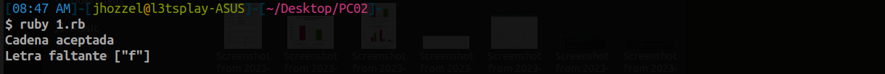
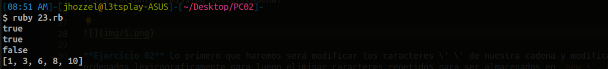
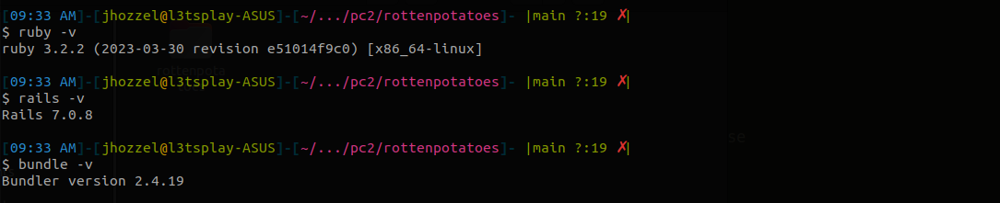
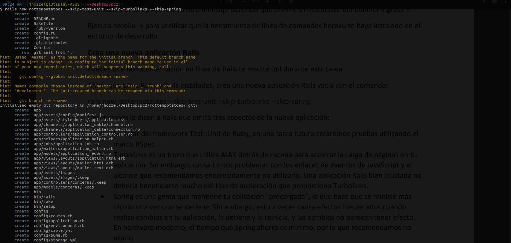
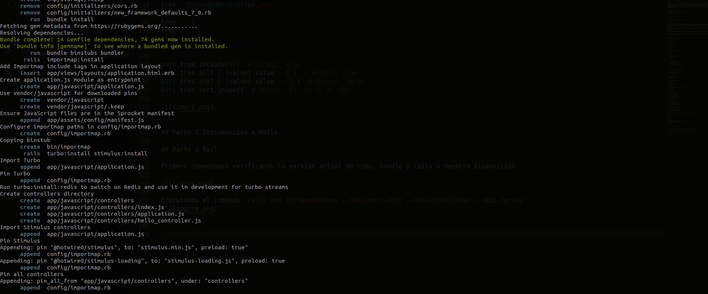
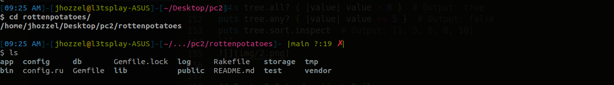
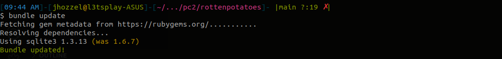
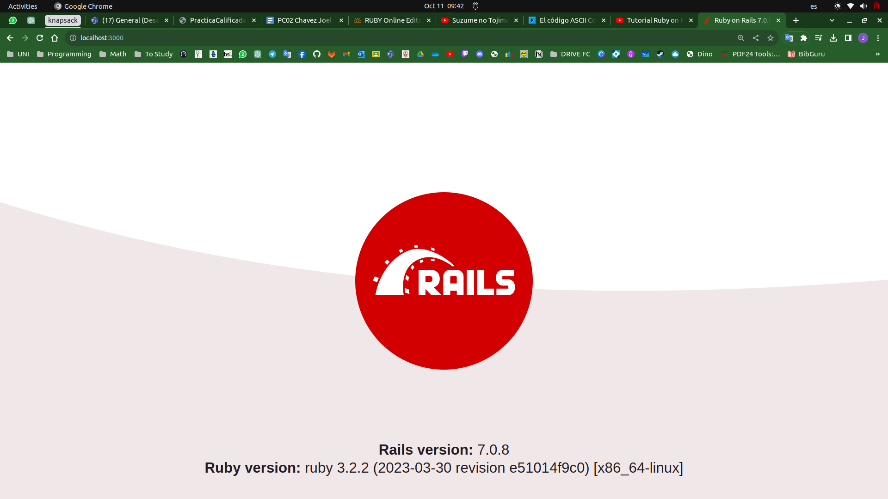

# Practica Calificada 02
- Chavez Chico Joel Jhotan 20210058J
***
## Parte 1 Algoritmos, Programación Orientada a Objetos

**Ejercicio 01** Lo primero que haremos será modificar los caracteres \' \' de nuestra cadena y modificarlos a \'\', luego serán ordenados lexicograficamente para luego eliminar caracteres repetidos para ser almacenados en `new_s`, ahora bien por otro lado generamos la cadena `alfabeto` con el fin de poder saber que caracteres nos faltan. Para poder identificar dichos caracteres aprovechamos el operador `-` que actua similar a una diferencia de conjuntos, (que para nuestro caso serian conjuntos de caracteres) y lo guardamos en `ans`. Ahora el problema indica que las cadenas aceptada serán solo aquellas que poseen todo el alfabeto excepto una, es asi que si encontre mas caracteres faltantes la cadena NO sería aceptada, de otro modo SI es aceptada e imprime dicho caracter faltante. 


```ruby
def missing_letter(s)
  new_s = s.gsub(' ', '').chars.sort.join('').squeeze
  alfabeto = ('a'..'z').to_a
  ans = alfabeto - new_s.chars
  if (ans.size > 1) 
      puts "Cadena NO aceptada"
      exit
  end
  puts "Cadena aceptada"
  puts "Letra faltante #{ans}"
end

cadena = "the quick brown box jumps over a lazy dog"
letra_faltante = missing_letter(cadena)
```



**Ejercicio 02** En este problema, se debe implementar una clase BinaryTree que represente un árbol binario ordenado. Un árbol binario ordenado es aquel en el que cada nodo tiene un valor y hasta dos hijos, cada uno de los cuales también es un árbol binario ordenado. Además, el valor de cualquier elemento en el subárbol izquierdo de un nodo es menor que el valor de cualquier elemento en el subárbol derecho del nodo.

Se definen dos clases: Node y BinaryTree. La clase Node representa un nodo del árbol y tiene tres atributos: value para almacenar el valor del nodo, left para apuntar al hijo izquierdo y right para apuntar al hijo derecho. La clase BinaryTree tiene un atributo root que apunta al nodo raíz.

Se implementan métodos para insertar elementos (<<), verificar si el árbol está vacío (empty?), y un iterador (each) que devuelve los elementos en el orden deseado (en este caso, se utiliza un recorrido en orden).


**Ejercicio 03** En este ejercicio se extiende la clase BinaryTree para agregar funcionalidades adicionales según lo indicado en el enunciado del problema.


```rb
class Node
  attr_accessor :value, :left, :right

  def initialize(value)
    @value = value
    @left = nil
    @right = nil
  end
end

class BinaryTree
  attr_accessor :root

  def initialize
    @root = nil
  end

  def <<(value)
    @root = insert(@root, value)
  end

  def empty?
    @root.nil?
  end

  def each(&block)
    inorder_traversal(@root, &block) if block_given?
  end

  private

  def insert(node, value)
    return Node.new(value) if node.nil?

    if value < node.value
      node.left = insert(node.left, value)
    elsif value > node.value
      node.right = insert(node.right, value)
    end

    node
  end

  def inorder_traversal(node, &block)
    return unless node

    inorder_traversal(node.left, &block)
    yield(node.value)
    inorder_traversal(node.right, &block)
  end
end

class ExtendedBinaryTree < BinaryTree
  def include?(value)
    search(@root, value)
  end

  def all?(&block)
    all_recursive(@root, &block)
  end

  def any?(&block)
    any_recursive(@root, &block)
  end

  def sort
    sorted_values = []
    inorder_traversal(@root) { |value| sorted_values << value }
    sorted_values
  end

  private

  def search(node, value)
    return false if node.nil?

    if value == node.value
      true
    elsif value < node.value
      search(node.left, value)
    else
      search(node.right, value)
    end
  end

  def all_recursive(node, &block)
    return true unless node

    all_recursive(node.left, &block) &&
    yield(node.value) &&
    all_recursive(node.right, &block)
  end

  def any_recursive(node, &block)
    return false unless node

    any_recursive(node.left, &block) ||
    yield(node.value) ||
    any_recursive(node.right, &block)
  end
end

##################################################################################

tree = ExtendedBinaryTree.new
tree << 8
tree << 3
tree << 10
tree << 1
tree << 6

puts tree.include?(6)  # Output: true
puts tree.all? { |value| value > 0 }  # Output: true
puts tree.any? { |value| value == 5 }  # Output: false
puts tree.sort.inspect  # Output: [1, 3, 6, 8, 10]
```



## Parte 2 Introducción a Rails

## Parte 3 Rail

Primero comenzamso verificando la version actual de ruby, bundle y rails a nuestra disposicion



Ejecutamos el comando `rails new rottenpotatoes --skip-test-unit --skip-turbolinks --skip-spring` 






Nos dirigimos al diectorio `rottenpotatoes` que se acaba de crear y modificamos el archivo `Gemfile` con el fin de corregir la version de sqlite3 adecuada.




Una vez hecho los cambios, lo guardamos y actualizamos con `bundle update`



Ejecutamos la aplicacion localmente para verificar que todo este funcionando bien, y nos dirigimos al `http://localhost:3000/`, para visualizar la página.

