# Practica Calificada 05
- Chavez Chico Joel Jhotan 20210058J

## Preguntas (Parte 01):
1) En las actividades relacionados a la Introducción de Rails los métodos actuales del controlador no son muy robustos: si el usuario introduce de manera manual un URI para ver (Show) una película que no existe (por ejemplo /movies/99999), verás un mensaje de excepción horrible. Modifica el método show del controlador para que, si se pide una película que no existe, el usuario sea redirigido a la vista Index con un mensaje más amigable explicando que no existe ninguna película con ese

Primero identifiquemos el error accediendo a `http://localhost:3000/movies/9999`, para poder ver analizar el mensaje que nos proporciona:

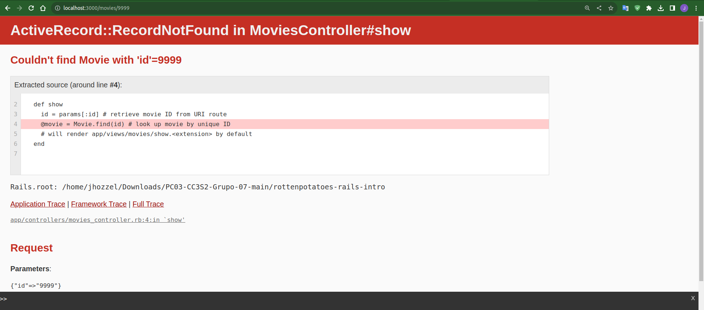

Bien lo que haremos será modificar el método Show para poder capturar dicha excepción en el que el `find()` no logra encontrar dicho ID y luego redirigirnos a la vista Index. Para ello añadiremos el siguiente codigo:

```rb
 def show
    id = params[:id]
    begin
      @movie = Movie.find(id) 
    rescue ActiveRecord::RecordNotFound
      redirect_to movies_path, :notice => "El ID #{id} no existe."
    end
 end
```

De este modo podemos ver ahora el siguiente mensaje
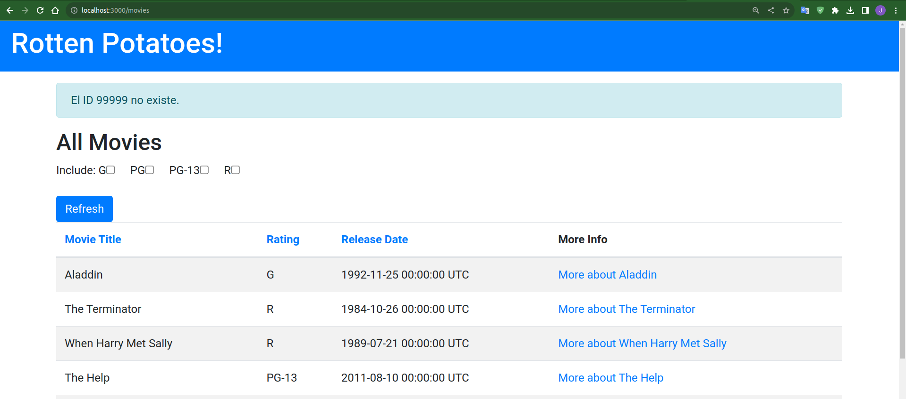


2) En las actividades relacionados a Rails Avanzado, si tenemos el siguiente ejemplo de código que muestra cómo se integra OmniAuth en una aplicación Rails:
```rb
class SessionsController < ApplicationController
    def create
        @user = User.find_or_create_from_auth_hash(auth_hash)
        self.current_user = @user
        redirect_to '/'
        end
    protected
    def auth_hash
        request.env['omniauth.auth']
        end
    end
```

**El método auth_hash  tiene la sencilla tarea de devolver lo que devuelva OmniAuth como resultado de intentar autenticar a un usuario. ¿Por qué piensa que se colocó esta funcionalidad  en su propio método en vez de simplemente referenciar request.env[’omniauth.auth’] directamente? Muestra el uso del script.**

Desde mi punto de vista me parece que el fin del porqué se halla decidido colocar dicha funcionalidad es por que se busca mantener un código mas limpio y legible, ya que no sería necesario escribir toda la sentencia `request.env['omniauth.auth']` sino con un simple `auth_hash` podemos obtener lo mismo. Por otro lado ahora que ya se tiene el método `auth_hash` creado, podriamos hacer ciertas modificaciones si es que se necesitarán, como podria ser el caso de hacer ligeras variaciones de código por motivos de trabajo.

Al hacer las modificaciones en nuestro proyecto de "Rails Avanzado" notamos que la app funciona correctamente sin ningún tipo de error como se esperaba.


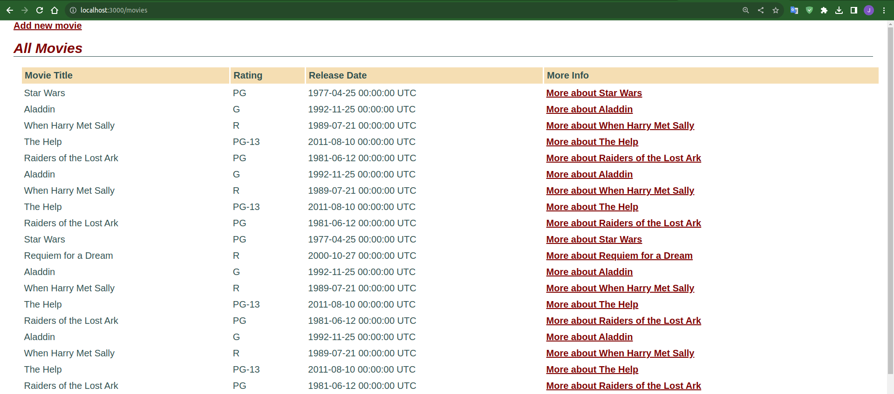

3) En las actividades relacionados a JavaScript, Siguiendo la estrategia del ejemplo de jQuery utiliza JavaScript para implementar un conjunto de casillas de verificación (checkboxes) para la página que muestra la lista de películas, una por cada calificación (G, PG, etcétera), que permitan que las películas correspondientes permanezcan en la lista cuando están marcadas. Cuando se carga la página por primera vez, deben estar marcadas todas; desmarcar alguna de ellas debe esconder las películas con la clasificación a la que haga referencia la casilla desactivada.


4) De la actividad relacionada a BDD e historias de usuario crea definiciones de pasos que te permitan escribir los siguientes pasos en un escenario de RottenPotatoes:

```
Given the movie "Inception" exists
And it has 5 reviews
And its average review score is 3.5
```

5) De la actividad relacionadas a BDD e historias de usuario, supongamos que en RottenPotatoes, en lugar de utilizar seleccionar la calificación y la fecha de estreno, se opta por rellenar el formulario en blanco. Primero, realiza los cambios apropiados al escenario. Enumera las definiciones de pasos a partir que Cucumber invocaría al pasar las pruebas de estos nuevos pasos. (Recuerda: rails generate cucumber:install)

6) De la actividad relacionadas a BDD e historias de usuario indica una lista de pasos como los de la siguiente figura
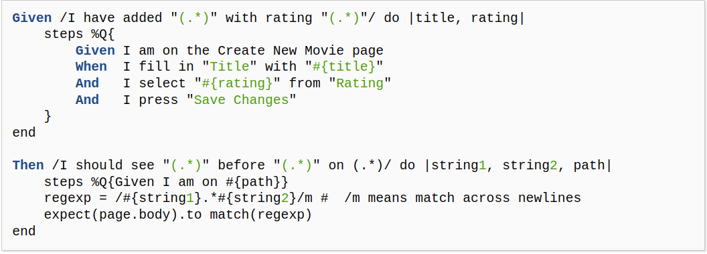

Para implementar el siguiente paso:
```
When / I delete the movie: "(.*)"/ do |title|
```


7) Basándose en el siguiente fichero de especificaciones (specfile), ¿a qué métodos deberían responder las instancias de F1 para pasar las pruebas?
 
```rb
require 'f1'
	describe F1 do
        describe "a new f1" do
            before :each do ; @f1 = F1.new ; end
                it "should be a pain in the butt" do
                @f1.should be_a_pain_in_the_butt
                end
        it "should be awesome" do
            @f1.should be_awesome
        end
        it "should not be nil" do
            @f1.should_not  be_nil
        end
        it "should not be the empty string" do
            @f1.should_not == ""
        end
    end
end
```

## Preguntas: Utilizando historias de usuario y Cucumber (Parte 02):
Primero configuraremos nuestro proyecto `rottenpottatoes`, para ello ejecutaremos los siguientes comandos:
```bash
cd rottenpotatoes
bundle install --without production 
bin/rake db:setup 
```

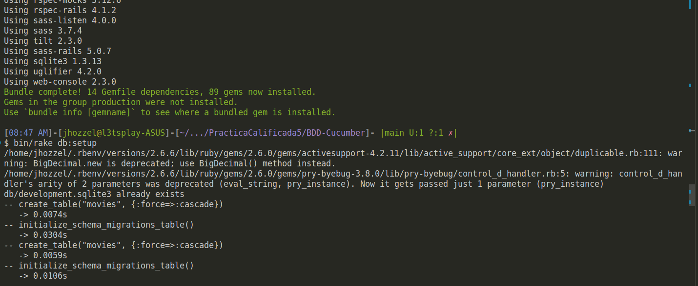

Ahora inicializamos el server usando `bin/rails server -b 0.0.0.0`, y vemos que todo esta marchando como se espera. Observamos además que ya se tiene algunas películas cargadas en la base de datos.
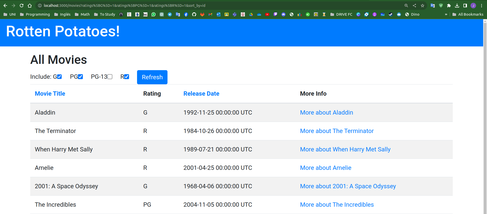


Antes de continuar verificamos que la aplicación esté configurada correctamente y sin errores: 
```bash
bundle exec cucumber
```

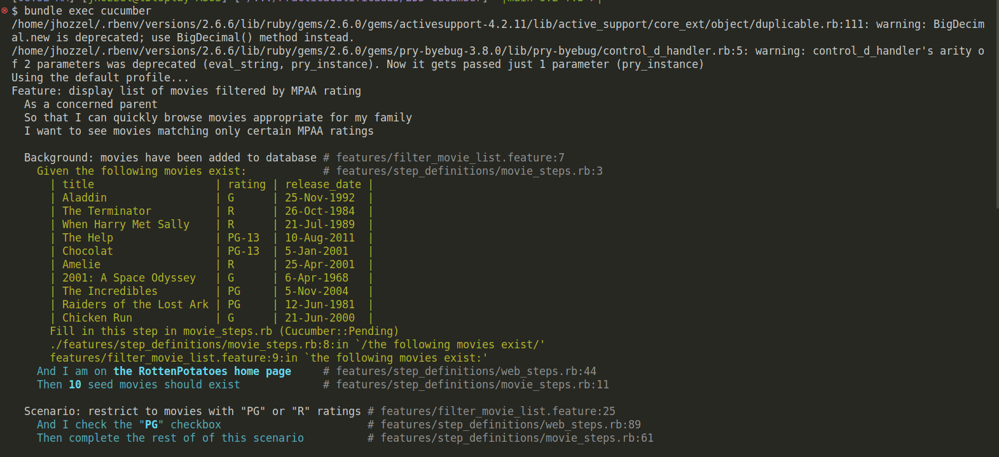
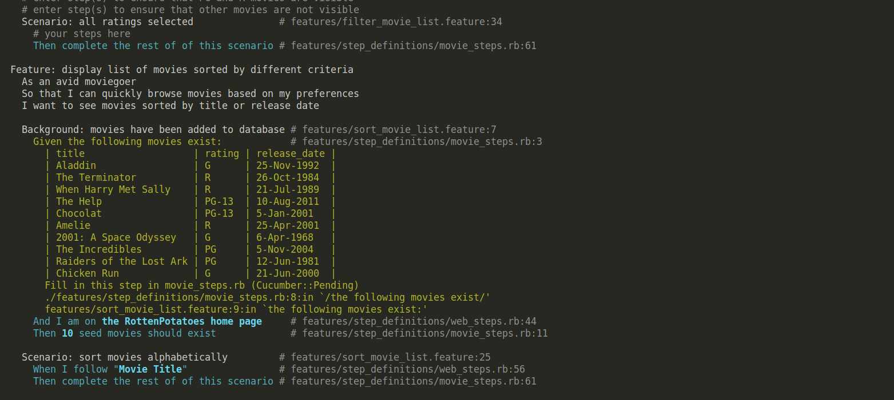
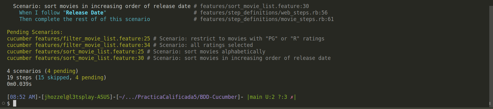


Observamos que se tiene 4 escenarios cargados que estan pendientes asi como 19 pasos que tendremos que probar.


### Preguntas:

**1. Completa el escenario restrict to movies with PG or R ratings in filter_movie_list.feature. Puedes utilizar las definiciones de pasos existentes en web_steps.rb para marcar y desmarcar las casillas correspondientes, enviar el formulario y comprobar si aparecen las películas correctas (y, lo que es igualmente importante, no aparecen las películas con clasificaciones no seleccionadas).**


Se ha utilizado el paso existente `When I check the "PG" checkbox` y se ha añadido `And I uncheck the following ratings: G, PG-13` para desmarcar las clasificaciones no seleccionadas.
```
Scenario: restrict to movies with "PG" or "R" ratings
Given I check the following ratings: PG, R
And I uncheck the following ratings: G, PG-13
When I submit the search form on the homepage
Then I should see the following movies:
    | title                   |
    | Aladdin                 |
    | The Terminator          |
    | When Harry Met Sally    |
    | The Help                |
    | Chocolat                |
    | Amelie                  |
    | The Incredibles         |
    | Raiders of the Lost Ark |
And I should not see the following movies:
    | title                 |
    | 2001: A Space Odyssey |
    | Chicken Run           |
```

**2. Dado que es tedioso repetir pasos como When I check the "PG" checkbox, And I check the "R" checkbox, etc., crea una definición de paso que coincida con un paso como, por ejemplo: Given I check the following ratings: G, PG, R. Esta definición de un solo paso solo debe marcar las casillas especificadas y dejar las demás 	casillas como estaban.**

Se ha creado la definición de paso `Given I check the following ratings: G, PG, R` en `movie_steps.rb`.
```ruby
# movie_steps.rb
    Given /^I check the following ratings: (.*)$/ do |rating_list|
        rating_list.split(', ').each do |rating|
            check("ratings_#{rating}")
        end
    end
```


**3.  Dado que es tedioso especificar un paso para cada película individual que deberíamos ver, agrega una definición de paso para que coincida con un paso como: “Then I should see the following movies".**

Se ha creado la definición de paso `Then I should see the following movies` en `movie_steps.rb` para evitar la repetición de pasos para cada película.
```ruby
     # movie_steps.rb
    Then /^I should see the following movies:$/ do |expected_movies_table|
        expected_movies_table.diff!(tableish('table#movies tbody tr', 'td,th'))
    end
```

**4. Para el escenario all ratings selected sería tedioso utilizar And I should see para nombrar cada una de las películas. Eso restaría valor al objetivo de BDD de transmitir la intención de comportamiento de la historia del usuario. Para solucionar este problema, completa la definición de paso que coincida con los pasos del formulario: Then I should see all the movies  en movie_steps.rb. Considera contar el número de filas en la tabla HTML para implementar estos pasos. Si ha 	calculado las filas como el número de filas de la tabla, puede usar la afirmación expect(rows).to 	eq value para fallar la prueba en caso de que los valores no coincidan**

Se ha creado la definición de paso `Then I should see all the movies` en `movie_steps.rb` para verificar todas las películas.
```ruby
# movie_steps.rb
    Then /^I should see all the movies$/ do
        expected_count = Movie.count
        actual_count = all('table#movies tbody tr').count
        expect(actual_count).to eq expected_count
    end
```


**5. Utiliza tus nuevas definiciones de pasos para completar el escenario con todas las calificaciones seleccionadas. Todo funciona bien si todos los escenarios en filter_movie_list.feature pasan con todos los pasos en verde.**

Se ha incorporado el uso de las nuevas definiciones de pasos en el escenario "all ratings selected" en `filter_movie_list.feature`.
```cucumber
    Scenario: all ratings selected
    Given I check the following ratings: G, PG, PG-13, R
    When I submit the search form on the homepage
    Then I should see all the movies
```

Finalmente nuestro código en el archivo `movie_steps.rb` se muestra de la siguiente manera:
```RB
# movie_steps.rb
# Add a declarative step here for populating the DB with movies.
Given /the following movies exist/ do |movies_table|
  movies_table.hashes.each do |movie|
    # each returned element will be a hash whose key is the table header.
    Movie.create!(movie)
    # you should arrange to add that movie to the database here.
  end
end

Then /(.*) seed movies should exist/ do |n_seeds|
  expect(Movie.count).to eq n_seeds.to_i
end

# Make sure that one string (regexp) occurs before or after another one
#   on the same page

Then /I should see "(.*)" before "(.*)"/ do |e1, e2|
  #  ensure that that e1 occurs before e2.
  #  page.body is the entire content of the page as a string.
  expect(page.body.index(e1) < page.body.index(e2)).to be_truthy
end

# Make it easier to express checking or unchecking several boxes at once
#  "When I uncheck the following ratings: PG, G, R"
#  "When I check the following ratings: G"

When /I (un)?check the following ratings: (.*)/ do |uncheck, rating_list|
  # HINT: use String#split to split up the rating_list, then
  #   iterate over the ratings and reuse the "When I check..." or
  #   "When I uncheck..." steps in lines 89-95 of web_steps.rb
  ratings = rating_list.split(', ')
  ratings.each do |rating|
    if uncheck.nil?
      check("ratings_#{rating}")
    else
      uncheck("ratings_#{rating}")
    end
  end
end

# Part 2, Step 3
Then /^I should (not )?see the following movies: (.*)$/ do |no, movie_list|
  # Take a look at web_steps.rb Then /^(?:|I )should see "([^"]*)"$/
  movies = movie_list.split(', ').map { |m| m.strip }
  movies.each do |movie|
    if no.nil?
      expect(page).to have_content(movie)
    else
      expect(page).not_to have_content(movie)
    end
  end
end

Then /I should see all the movies/ do
  # Make sure that all the movies in the app are visible in the table
  expect(page).to have_css('table#movies tbody tr', count: Movie.count)
end

### Utility Steps Just for this assignment.

Then /^debug$/ do
  # Use this to write "Then debug" in your scenario to open a console.
   require "byebug"; byebug
  1 # intentionally force debugger context in this method
end

Then /^debug javascript$/ do
  # Use this to write "Then debug" in your scenario to open a JS console
  page.driver.debugger
  1
end
```
`filter_movie_list.feauture`
```cucumber
# filter_movie_list.feature
Feature: display list of movies filtered by MPAA rating

  As a concerned parent
  So that I can quickly browse movies appropriate for my family
  I want to see movies matching only certain MPAA ratings

Background: movies have been added to the database

  Given the following movies exist:
    | title                   | rating | release_date |
    | Aladdin                 | G      | 25-Nov-1992  |
    | The Terminator          | R      | 26-Oct-1984  |
    | When Harry Met Sally    | R      | 21-Jul-1989  |
    | The Help                | PG-13  | 10-Aug-2011  |
    | Chocolat                | PG-13  | 5-Jan-2001   |
    | Amelie                  | R      | 25-Apr-2001  |
    | 2001: A Space Odyssey   | G      | 6-Apr-1968   |
    | The Incredibles         | PG     | 5-Nov-2004   |
    | Raiders of the Lost Ark | PG     | 12-Jun-1981  |
    | Chicken Run             | G      | 21-Jun-2000  |

  And I am on the RottenPotatoes home page
  Then 10 seed movies should exist

Scenario: restrict to movies with "PG" or "R" ratings
  Given I check the following ratings: PG, R
  When I submit the search form on the homepage
  Then I should see the following movies:
    | title                   |
    | Aladdin                 |
    | The Terminator          |
    | When Harry Met Sally    |
    | The Help                |
    | Chocolat                |
    | Amelie                  |
    | The Incredibles         |
    | Raiders of the Lost Ark |

  And I should not see the following movies:
    | title                 |
    | 2001: A Space Odyssey |
    | Chicken Run           |

Scenario: all ratings selected
  Given I check the following ratings: G, PG, PG-13, R
  When I submit the search form on the homepage
  Then I should see all the movies
```

`sort_movies_list.feature`
```cucumber
# sort_movie_list.feature
Feature: display list of movies sorted by different criteria

  As an avid moviegoer
  So that I can quickly browse movies based on my preferences
  I want to see movies sorted by title or release date

Background: movies have been added to the database

  Given the following movies exist:
    | title                   | rating | release_date |
    | Aladdin                 | G      | 25-Nov-1992  |
    | The Terminator          | R      | 26-Oct-1984  |
    | When Harry Met Sally    | R      | 21-Jul-1989  |
    | The Help                | PG-13  | 10-Aug-2011  |
    | Chocolat                | PG-13  | 5-Jan-2001   |
    | Amelie                  | R      | 25-Apr-2001  |
    | 2001: A Space Odyssey   | G      | 6-Apr-1968   |
    | The Incredibles         | PG     | 5-Nov-2004   |
    | Raiders of the Lost Ark | PG     | 12-Jun-1981  |
    | Chicken Run             | G      | 21-Jun-2000  |

  And I am on the RottenPotatoes home page
  Then 10 seed movies should exist

Scenario: sort movies alphabetically
  When I follow "Movie Title"
  Then I should see the following movies:
    | title                   |
    | 2001: A Space Odyssey   |
    | Aladdin                 |
    | Amelie                  |
    | Chicken Run             |
    | Chocolat                |
    | Raiders of the Lost Ark |
    | The Help                |
    | The Incredibles         |
    | The Terminator          |
    | When Harry Met Sally    |

Scenario: sort movies in increasing order of release date
  When I follow "Release Date"
  Then I should see the following movies:
    | title                   |
    | 2001: A Space Odyssey   |
    | Raiders of the Lost Ark |
    | The Terminator          |
    | When Harry Met Sally    |
    | Aladdin                 |
    | Chicken Run             |
    | Amelie                  |
    | Chocolat                |
    | The Incredibles         |
    | The Help                |
```

Ejecutamos el comando `bundle exec cucumber` para ver los cambios, pero existen algunas pasos que no estan definidas en nuestros archivos .rb, sin embargo logra superar exitosamente los primeros escenarios.

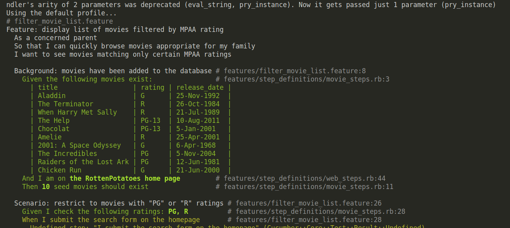
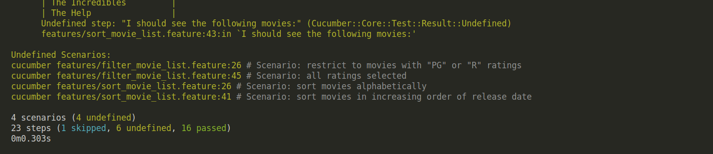

## Preguntas (Parte 03):
Para el siguiente ejercicio utiliza la lista de proyectos Rails de código abierto en Open Source Rails: https://github.com/gramantin/awesome-rails#open-source-rails-apps


**1.- Describa uno o más patrones de diseño que podrían ser aplicados al diseño del sistema.**

Podemos mencionar el patrón de diseño MVC (Modelo-Vista-Controlador) que hemos estudiado en clase. Por ejemplo, en un proyecto como "crowdAI," donde se manejan desafíos de ciencia de datos, el modelo podría representar los datos y la lógica subyacente, la vista podría ser la interfaz de usuario que muestra los desafíos y los resultados, y el controlador podría manejar la lógica de interacción entre el modelo y la vista.

Por otro lado podemos identificar  proyectos como "openFarm" o "granny," donde se gestionan datos extensos relacionados con la agricultura o el chat, un patrón de Repositorio podría ayudar a encapsular la lógica de acceso a la base de datos. Esto facilitaría el cambio de la capa de persistencia sin afectar otras partes del sistema.

**2.- Dado un sistema simple que responde a una historia de usuario concreta, analice y elija un paradigma de diseño adecuado**

Para este caso mencionaremos el paradigma de la Programación Orientada a Objetos el cual es un paradigma muy común y usado en proyectos de Rails. Por ejemplo, en "crowdtiltOpen," donde se trata de una plataforma de financiamiento colectivo, se podrían tener clases como `Project` que tienen propiedades y métodos para gestionar la financiación y la interacción con los usuarios.

**3.- Analice y elija una arquitectura software apropiada que se ajuste a una historia de usuario concreta de este sistema. ¿La implementación en el sistema de esa historia de usuario refleja su idea de arquitectura?**

Para proyectos como *openproject*, donde la aplicación proporciona una interfaz de usuario para interactuar con datos o gestionar proyectos, la arquitectura cliente-servidor es clave. El servidor manejaría la lógica de negocio y la persistencia de datos, mientras que el cliente (navegador web) mostraría la interfaz de usuario y facilitaría la interacción del usuario. La implementación de la historia de usuario en OpenProject sigue la arquitectura mencionada, donde la lógica del servidor gestiona la asignación de tareas y la presentación de la interfaz de usuario se realiza en el cliente. Este enfoque es coherente con la arquitectura típica de aplicaciones web basadas en Rails.