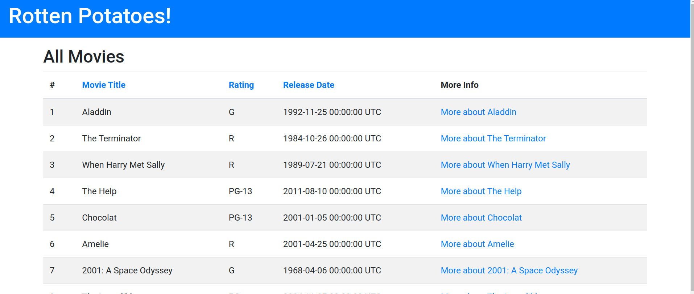
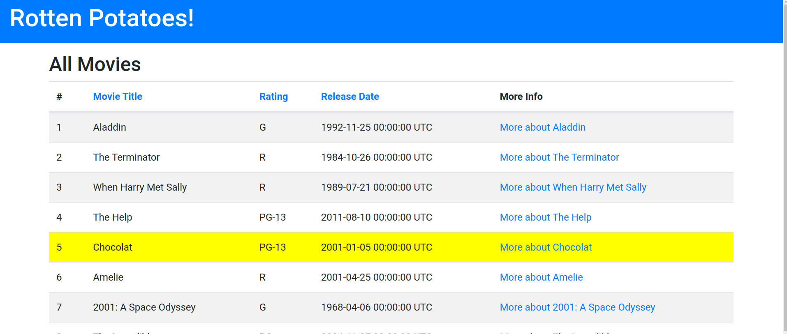
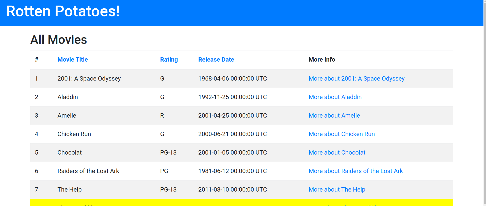

# PRACTICA CALIFICADA 04
- Chavez Chico Joel Jhotan 20210058J

## Parte 01 (grep.js)
-------------

## Parte 02 (Herencia y POO en js)
Se diseñaron las clases `Pokemon` y `Charizard` según las indicaciones dadas, el código se muestra a continuación.
```js
class Pokemon {
  constructor(HP, ataque, defensa) {
    this.HP = HP;
    this.ataque = ataque;
    this.defensa = defensa;
    this.movimiento = "";
    this.nivel = 1;
    this.tipo = "";
  }

  flight() {
    throw new Error("No se especificó ningún movimiento.");
  }

  canFly() {
    if (!this.tipo) {
      throw new Error("No se especificó ningún tipo.");
    }
    return this.tipo.includes("flying");
  }
}

class Charizard extends Pokemon {
  constructor(HP, ataque, defensa, movimiento) {
    super(HP, ataque, defensa);
    this.movimiento = movimiento;
    this.tipo = "disparar/volar";
  }

  fight() {
    if (this.movimiento) {
      console.log(`Se está utilizando el movimiento ${this.movimiento}.`);
      return this.ataque;
    } else {
      throw new Error("No se especificó ningún movimiento.");
    }
  }
}
```

## Parte 03 (Inversion de Dependencias) 
¿Qué sucede en JavaScript con el DIP en este ejemplo? (1 punto).

Dado el siguiente bloque de código proporcinado, observamos que si se desea probar el método `workday?` mediante una prueba unitaria, surge el inconveniente de que este depende directamente de la clase `Date`. Debido a que depende directamente de la fecha actual, se nos complica manejar adecuadamente las pruebas porque los resultados variaran ya que tomará la fecha actual tomada en diferentes tiempos.

```ruby
class CurrentDay
  def initialize
    @date = Date.today
    @schedule = MonthlySchedule.new(@date.year, @date.month)
  end

  def work_hours
    @schedule.work_hours_for(@date)
  end

  def workday?
    !@schedule.holidays.include?(@date)
  end
end
```
Se nos proporciona el siguiente codigo adicional el cual se ejecuta antes y luego de las pruebas para modificar temporalmente el comportamiento del método today de la clase Date. Durante las pruebas, redefine Date.today para que siempre devuelva una fecha específica (Date.new(2020, 12, 16)).

Esto se utiliza para simular una fecha específica en las pruebas y garantizar que el método workday? de la clase CurrentDay dé resultados predecibles y consistentes durante las pruebas, independientemente de la fecha real del sistema.

```rb
before do
 Date.singleton_class.class_eval do
 alias_method :_today, :today
 define_method(:today){Date.new(2020, 12, 16)}
 end
end

after do
 Date.singleton_class.class_eval do
 alias_method :today, :_today
 remove_method :_today
 end
end
```

Una vez teniendo esto claro podriamos realizar la siguiente implementación:

```ruby
class CurrentDay
  def initialize(date = Date.today)
    @date = date
    @schedule = MonthlySchedule.new(@date.year, @date.month)
  end

  def work_hours
    @schedule.work_hours_for(@date)
  end

  def workday?
    !@schedule.holidays.include?(@date)
  end
end
```
En este caso, la clase `CurrentDay` ahora acepta una instancia de `Date` como argumento en el constructor, y si no se proporciona ninguna instancia, se utiliza `Date.today` que manejaba por predeterminado. Ahora ya podemos pasar manualmente fechas específicas durante las pruebas para tener un control más preciso sobre el comportamiento del código. Es así que la inyección de dependencia mejora la flexibilidad y la testabilidad del código. Al permitir que la clase `CurrentDay` acepte una instancia de `Date` como argumento en lugar de depender directamente de `Date.today`, nos facilita la inyección de dependencia. .

## Preguntas relacionadas con las actividades

**Pregunta**: (Para responder esta pregunta utiliza el repositorio y las actividades que has desarrollado de Introducción a Rails)

Modifique la lista de películas de la siguiente manera. Cada modificación va a necesitar que
realice un cambio en una capa de abstracción diferente

a) Modifica la vista Index para incluir el número de fila de cada fila en la tabla de películas.

Para mostrar la enumeración de cada fila, podemos agregar una columna adicional que contenga el número de fila correspondiente, para ello usamos el método `each_with_index` para obtener tanto la película como su índice.

Este sería el codigo modificado del archivo `views/index.html.erb`:

```html
<!-- This file is app/views/movies/index.html.erb -->
<h2>All Movies</h2>

<%= form_tag movies_path, method: :get, id: 'ratings_form' do %>
  <!-- ... (tu formulario de filtrado por clasificación) ... -->
<% end %>

<table class="table table-striped col-md-12" id="movies">
  <thead>
    <tr>
      <th>#</th>
      <th class="<%= 'hilite' if @order_column == 'title' %>">
        <%= link_to "Movie Title", movies_path(order: { column: 'title', direction: 'asc' }, ratings: @ratings_to_show) %>
      </th>
      <th class="<%= 'hilite' if @order_column == 'rating' %>">
        <%= link_to "Rating", movies_path(order: { column: 'rating', direction: 'asc' }, ratings: @ratings_to_show) %>
      </th>
      <th class="<%= 'hilite' if @order_column == 'release_date' %>">
        <%= link_to "Release Date", movies_path(order: { column: 'release_date', direction: 'asc' }, ratings: @ratings_to_show) %>
      </th>
      <th>More Info</th>
    </tr>
  </thead>

  <tbody>
    <% @movies.each_with_index do |movie, index| %>
      <tr>
        <td>
          <%= index + 1 %>
        </td>
        <td>
          <%= movie.title %>
        </td>
        <td>
          <%= movie.rating %>
        </td>
        <td>
          <%= movie.release_date %>
        </td>
        <td>
          <%= link_to "More about #{movie.title}", movie_path(movie) %>
        </td>
      </tr>
    <% end %>
  </tbody>
</table>
<%= link_to 'Add new movie', new_movie_path, class: 'btn btn-primary' %>
```

Se agregó una nueva columna en la fila de encabezado (`<th>#</th>`) y en cada fila de datos (`<td><%= index + 1 %></td>`). La variable `index` es el índice de la iteración actual, y sumándole 1 se obtiene el número de fila.




b) Modifica la vista Index para que cuando se sitúe el ratón sobre una fila de la tabla, dicha fila cambie temporalmente su color de fondo a amarillo u otro color.

Para poder realizar el cambio de color temporal nos apoyaremos en JS y CSS, es así que dentro del codigo del `index.html.erb` agregaremos un script que me permitirá manejar el evento de cuando el mouse se situe sobre una fila. Luego una vez identificado el evento se procederá a realizar el cambio de tonalidad por cada fila.

```HTML
<script>
  document.addEventListener("DOMContentLoaded", function () {
    var rows = document.querySelectorAll('.movie-row');

    rows.forEach(function (row) {
      row.addEventListener('mouseover', function () {
        this.style.backgroundColor = 'yellow'; // Cambiamos el color a amarillo 
      });

      row.addEventListener('mouseout', function () {
        this.style.backgroundColor = ''; // Restauramos al color original
      });
    });
  });
</script>
```



c) Modifica la acción Index del controlador para que devuelva las películas ordenadas alfabéticamente por título, en vez de por fecha de lanzamiento. No intentes ordenar el resultado de la llamada que hace el controlador a la base de datos. Los gestores de
bases de datos ofrecen formas para especificar el orden en que se quiere una lista de resultados y, gracias al fuerte acoplamiento entre ActiveRecord y el sistema gestor de  bases de datos (RDBMS) que hay debajo, los métodos find y all de la biblioteca de ActiveRecord en Rails ofrece una manera de pedirle al RDBMS que haga esto.

Para ordenar alfabeticamente por el titulo bastaría hacer un par de moficaciones a nuestro controlador movies_controller.rb, notemos que si no se proporciona un parámetro de orden (`params[:order]`), entonces se ordenará por título de forma predeterminada a nivel de la base de datos utilizando `@movies = @movies.order('title')`. Esto debería de ordenar por el título directamente desde la base de datos. Asegúrate de probar y ajustar según sea necesario. El codigo del metodo index de clase `MoviesController` se muestra a continuacion.

```ruby
  def index
    @movies = Movie.all
    @ratings_to_show = params[:ratings] || session[:ratings] || []
    @all_ratings = Movie.all_ratings

    if params[:order].nil? && params[:ratings].nil?
      session[:ratings] = nil
      session[:order] = nil
    end

    if params[:order].nil? && !session[:order].nil?
      params[:order] = session[:order]
    elsif !params[:order].nil?
      @order_column = params[:order][:column]
      @order_direction = params[:order][:direction]
      @movies = @movies.order("#{@order_column} #{@order_direction}")
      session[:order] = params[:order]
    end
    
    @movies = @movies.order('title') if params[:order].nil?

    if params[:ratings].nil? && !session[:ratings].nil?
      params[:ratings] = session[:ratings]
    elsif !params[:ratings].nil?
      selected_ratings = params[:ratings].keys
      @movies = @movies.with_ratings(selected_ratings)
      session[:ratings] = params[:ratings]
    end
  end
```



d) Simula que no dispones de ese fuerte acoplamiento de ActiveRecord, y que no puedes asumir que el sistema de almacenamiento que hay por debajo pueda devolver la colección de ítems en un orden determinado. Modifique la acción Index del controlador para que devuelva las películas ordenadas alfabéticamente por título. Utiliza el método sort del módulo Enumerable de Ruby.

----------------------


**Pregunta**: (para responder esta pregunta utiliza el repositorio y las actividades que has realizado de Rails avanzado, en particular asociaciones)


a) Extienda el código del controlador del código siguiente dado con los métodos edit y update para las críticas. Usa un filtro de controlador para asegurarte de que un usuario sólo puede editar o actualizar sus propias críticas. Revisa el código dado en la evaluación y actualiza tus repositorios de actividades (no se admite nada nuevo aquí). Debes mostrar los resultados.


**Preguntas**: (estas preguntas son utilizando el repositorio de todas tus actividades relacionada a JavaScript, por lo tanto, no hay respuestas únicas)

1.- Un inconveniente de la herencia de prototipos es que todos los atributos (propiedades) de los objetos son públicos. Sin embargo, podemos aprovechar las clausuras para obtener atributos privados. Crea un sencillo constructor para los objetos User que acepte un nombre de usuario y una contraseña, y proporcione un método checkPassword que indique si la contraseña proporcionada es correcta, pero que deniegue la inspección de la contraseña en sí. Esta expresión de “sólo métodos de acceso” se usa ampliamente en jQuery. Sugerencia: El constructor debe devolver un objeto en el que una de sus propiedades es una función que aprovecha las clausuras de JavaScript para ‘recordar’ la contraseña proporcionada inicialmente al constructor. El objeto devuelto no debería tener ninguna propiedad que contenga la contraseña).

Cuando trabajamos con JavaScript, podemos usar clausuras para crear atributos privados. El siguiente codigo muestra la implementacion de un constructor para objetos `User` con una contraseña privada y un método para verificar la contraseña:

```javascript
function User(username, password) {
  var storedPassword = password;
  this.checkPassword = function (inputPassword) {
    return inputPassword === storedPassword;
  };
  this.getUsername = function () {
    return username;
  };
}


En este ejemplo, el constructor `User` devuelve un objeto con un método `checkPassword`, que puede utilizarse para verificar si una contraseña proporcionada coincide con la contraseña almacenada. Además, se utiliza una clausura para mantener la contraseña privada (`storedPassword`). No hay ninguna propiedad directa que contenga la contraseña en el objeto devuelto, y cualquier intento de acceder directamente a `storedPassword` desde fuera del constructor dará como resultado un error. .........