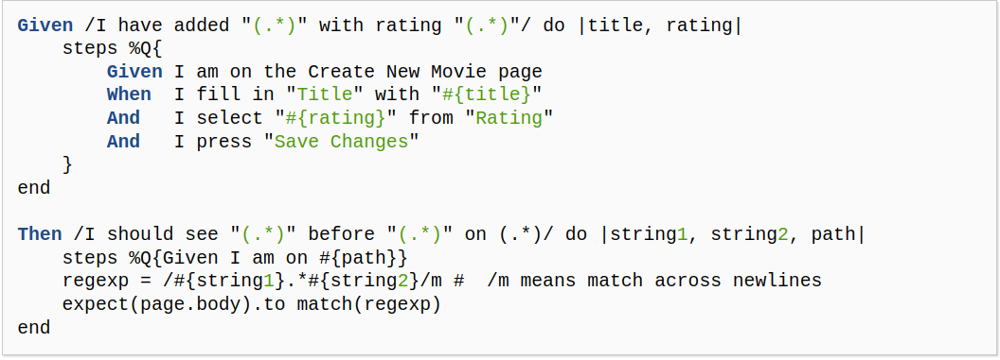

# Practica Calificada 05
- Chavez Chico Joel Jhotan 20210058J

## Preguntas (Parte 01):
1) En las actividades relacionados a la Introducción de Rails los métodos actuales del controlador no son muy robustos: si el usuario introduce de manera manual un URI para ver (Show) una película que no existe (por ejemplo /movies/99999), verás un mensaje de excepción horrible. Modifica el método show del controlador para que, si se pide una película que no existe, el usuario sea redirigido a la vista Index con un mensaje más amigable explicando que no existe ninguna película con ese

2) En las actividades relacionados a Rails Avanzado, si tenemos el siguiente ejemplo de código que muestra cómo se integra OmniAuth en una aplicación Rails:
```rb
class SessionsController < ApplicationController
    def create
        @user = User.find_or_create_from_auth_hash(auth_hash)
        self.current_user = @user
        redirect_to '/'
        end
    protected
    def auth_hash
        request.env['omniauth.auth']
        end
    end
```

3) En las actividades relacionados a JavaScript, Siguiendo la estrategia del ejemplo de jQuery utiliza JavaScript para implementar un conjunto de casillas de verificación (checkboxes) para la página que muestra la lista de películas, una por cada calificación (G, PG, etcétera), que permitan que las películas correspondientes permanezcan en la lista cuando están marcadas. Cuando se carga la página por primera vez, deben estar marcadas todas; desmarcar alguna de ellas debe esconder las películas con la clasificación a la que haga referencia la casilla desactivada.

4) De la actividad relacionada a BDD e historias de usuario crea definiciones de pasos que te permitan escribir los siguientes pasos en un escenario de RottenPotatoes:

```
Given the movie "Inception" exists
And it has 5 reviews
And its average review score is 3.5
```

5) De la actividad relacionadas a BDD e historias de usuario, supongamos que en RottenPotatoes, en lugar de utilizar seleccionar la calificación y la fecha de estreno, se opta por rellenar el formulario en blanco. Primero, realiza los cambios apropiados al escenario. Enumera las definiciones de pasos a partir que Cucumber invocaría al pasar las pruebas de estos nuevos pasos. (Recuerda: rails generate cucumber:install)

6) De la actividad relacionadas a BDD e historias de usuario indica una lista de pasos como los de la siguiente figura


Para implementar el siguiente paso:
```
When / I delete the movie: "(.*)"/ do |title|
```


7) Basándose en el siguiente fichero de especificaciones (specfile), ¿a qué métodos deberían responder las instancias de F1 para pasar las pruebas?
 
```rb
require 'f1'
	describe F1 do
        describe "a new f1" do
            before :each do ; @f1 = F1.new ; end
                it "should be a pain in the butt" do
                @f1.should be_a_pain_in_the_butt
                end
        it "should be awesome" do
            @f1.should be_awesome
        end
        it "should not be nil" do
            @f1.should_not  be_nil
        end
        it "should not be the empty string" do
            @f1.should_not == ""
        end
    end
end
```

## Preguntas: Utilizando historias de usuario y Cucumber (Parte 02):

1) 

## Preguntas (Parte 03):
Para el siguiente ejercicio utiliza la lista de proyectos Rails de código abierto en Open Source Rails: https://github.com/gramantin/awesome-rails#open-source-rails-apps

