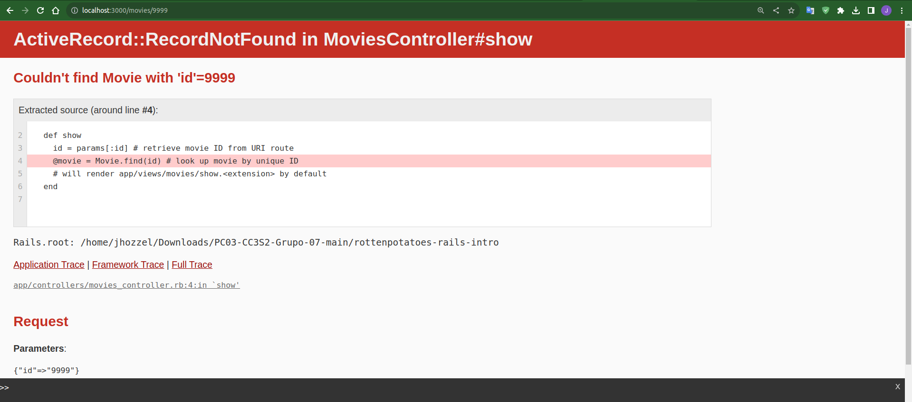
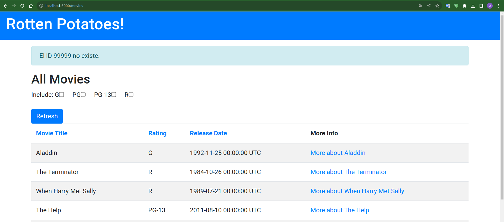
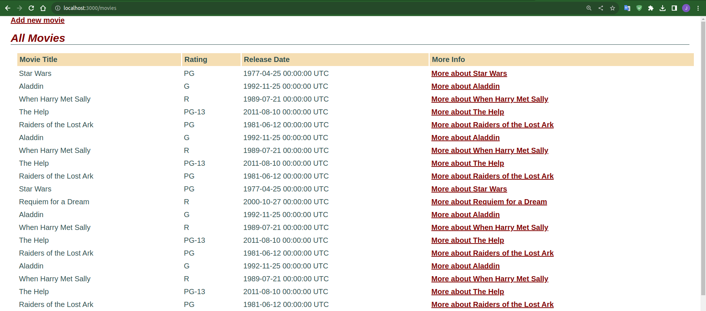

# Practica Calificada 05
- Chavez Chico Joel Jhotan 20210058J

## Preguntas (Parte 01):
1) En las actividades relacionados a la Introducción de Rails los métodos actuales del controlador no son muy robustos: si el usuario introduce de manera manual un URI para ver (Show) una película que no existe (por ejemplo /movies/99999), verás un mensaje de excepción horrible. Modifica el método show del controlador para que, si se pide una película que no existe, el usuario sea redirigido a la vista Index con un mensaje más amigable explicando que no existe ninguna película con ese

Primero identifiquemos el error accediendo a `http://localhost:3000/movies/9999`, para poder ver analizar el mensaje que nos proporciona:



Bien lo que haremos será modificar el método Show para poder capturar dicha excepción en el que el `find()` no logra encontrar dicho ID y luego redirigirnos a la vista Index. Para ello añadiremos el siguiente codigo:

```rb
 def show
    id = params[:id]
    begin
      @movie = Movie.find(id) 
    rescue ActiveRecord::RecordNotFound
      redirect_to movies_path, :notice => "El ID #{id} no existe."
    end
 end
```

De este modo podemos ver ahora el siguiente mensaje



2) En las actividades relacionados a Rails Avanzado, si tenemos el siguiente ejemplo de código que muestra cómo se integra OmniAuth en una aplicación Rails:
```rb
class SessionsController < ApplicationController
    def create
        @user = User.find_or_create_from_auth_hash(auth_hash)
        self.current_user = @user
        redirect_to '/'
        end
    protected
    def auth_hash
        request.env['omniauth.auth']
        end
    end
```

**El método auth_hash  tiene la sencilla tarea de devolver lo que devuelva OmniAuth como resultado de intentar autenticar a un usuario. ¿Por qué piensa que se colocó esta funcionalidad  en su propio método en vez de simplemente referenciar request.env[’omniauth.auth’] directamente? Muestra el uso del script.**

Desde mi punto de vista me parece que el fin del porqué se halla decidido colocar dicha funcionalidad es por que se busca mantener un código mas limpio y legible, ya que no sería necesario escribir toda la sentencia `request.env['omniauth.auth']` sino con un simple `auth_hash` podemos obtener lo mismo. Por otro lado ahora que ya se tiene el método `auth_hash` creado, podriamos hacer ciertas modificaciones si es que se necesitarán, como podria ser el caso de hacer ligeras variaciones de código por motivos de trabajo.

Al hacer las modificaciones en nuestro proyecto de "Rails Avanzado" notamos que la app funciona correctamente sin ningún tipo de error como se esperaba.




3) En las actividades relacionados a JavaScript, Siguiendo la estrategia del ejemplo de jQuery utiliza JavaScript para implementar un conjunto de casillas de verificación (checkboxes) para la página que muestra la lista de películas, una por cada calificación (G, PG, etcétera), que permitan que las películas correspondientes permanezcan en la lista cuando están marcadas. Cuando se carga la página por primera vez, deben estar marcadas todas; desmarcar alguna de ellas debe esconder las películas con la clasificación a la que haga referencia la casilla desactivada.


4) De la actividad relacionada a BDD e historias de usuario crea definiciones de pasos que te permitan escribir los siguientes pasos en un escenario de RottenPotatoes:

```
Given the movie "Inception" exists
And it has 5 reviews
And its average review score is 3.5
```

5) De la actividad relacionadas a BDD e historias de usuario, supongamos que en RottenPotatoes, en lugar de utilizar seleccionar la calificación y la fecha de estreno, se opta por rellenar el formulario en blanco. Primero, realiza los cambios apropiados al escenario. Enumera las definiciones de pasos a partir que Cucumber invocaría al pasar las pruebas de estos nuevos pasos. (Recuerda: rails generate cucumber:install)

6) De la actividad relacionadas a BDD e historias de usuario indica una lista de pasos como los de la siguiente figura


Para implementar el siguiente paso:
```
When / I delete the movie: "(.*)"/ do |title|
```


7) Basándose en el siguiente fichero de especificaciones (specfile), ¿a qué métodos deberían responder las instancias de F1 para pasar las pruebas?
 
```rb
require 'f1'
	describe F1 do
        describe "a new f1" do
            before :each do ; @f1 = F1.new ; end
                it "should be a pain in the butt" do
                @f1.should be_a_pain_in_the_butt
                end
        it "should be awesome" do
            @f1.should be_awesome
        end
        it "should not be nil" do
            @f1.should_not  be_nil
        end
        it "should not be the empty string" do
            @f1.should_not == ""
        end
    end
end
```

## Preguntas: Utilizando historias de usuario y Cucumber (Parte 02):
1) 


## Preguntas (Parte 03):
Para el siguiente ejercicio utiliza la lista de proyectos Rails de código abierto en Open Source Rails: https://github.com/gramantin/awesome-rails#open-source-rails-apps


**1.- Describa uno o más patrones de diseño que podrían ser aplicados al diseño del sistema.**

Podemos mencionar el patrón de diseño MVC (Modelo-Vista-Controlador) que hemos estudiado en clase. Por ejemplo, en un proyecto como "crowdAI," donde se manejan desafíos de ciencia de datos, el modelo podría representar los datos y la lógica subyacente, la vista podría ser la interfaz de usuario que muestra los desafíos y los resultados, y el controlador podría manejar la lógica de interacción entre el modelo y la vista.

Por otro lado podemos identificar  proyectos como "openFarm" o "granny," donde se gestionan datos extensos relacionados con la agricultura o el chat, un patrón de Repositorio podría ayudar a encapsular la lógica de acceso a la base de datos. Esto facilitaría el cambio de la capa de persistencia sin afectar otras partes del sistema.

**2.- Dado un sistema simple que responde a una historia de usuario concreta, analice y elija un paradigma de diseño adecuado**

Para este caso mencionaremos el paradigma de la Programación Orientada a Objetos el cual es un paradigma muy común y usado en proyectos de Rails. Por ejemplo, en "crowdtiltOpen," donde se trata de una plataforma de financiamiento colectivo, se podrían tener clases como `Project` que tienen propiedades y métodos para gestionar la financiación y la interacción con los usuarios.

**3.- Analice y elija una arquitectura software apropiada que se ajuste a una historia de usuario concreta de este sistema. ¿La implementación en el sistema de esa historia de usuario refleja su idea de arquitectura?**

Para proyectos como *openproject*, donde la aplicación proporciona una interfaz de usuario para interactuar con datos o gestionar proyectos, la arquitectura cliente-servidor es clave. El servidor manejaría la lógica de negocio y la persistencia de datos, mientras que el cliente (navegador web) mostraría la interfaz de usuario y facilitaría la interacción del usuario.

A
- **Lado del Servidor (Backend):** La lógica empresarial, la gestión de datos y las operaciones de base de datos se manejan en el servidor. El controlador en el servidor (`TasksController`) se encarga de recibir las solicitudes relacionadas con la asignación de tareas, interactuar con el modelo (`Task`) y realizar las operaciones necesarias.

- **Lado del Cliente (Frontend):** La interfaz de usuario y la interacción del usuario se manejan en el cliente, que en este caso podría ser un navegador web. Se utilizarían tecnologías frontend (HTML, JavaScript, etc.) para permitir a los usuarios realizar acciones como asignar tareas de manera eficiente.

En resumen, la implementación hipotética de la historia de usuario en OpenProject parece seguir la arquitectura cliente-servidor, donde la lógica del servidor gestiona la asignación de tareas y la presentación de la interfaz de usuario se realiza en el cliente. Este enfoque es coherente con la arquitectura típica de aplicaciones web basadas en Rails.

La historia de usuario hipotética en OpenProject se refiere a la asignación de tareas en un proyecto. La implementación sugerida sigue la arquitectura cliente-servidor típica de las aplicaciones web basadas en Ruby on Rails.


En el lado del servidor, un controlador (`TasksController`) manejaría las solicitudes relacionadas con la asignación de tareas y se comunicaría con el modelo (`Task`) para realizar operaciones en la base de datos. Por otro lado, en el lado del cliente (navegador web), se utilizarían tecnologías frontend para proporcionar una interfaz de usuario interactiva que permita a los usuarios asignar tareas de manera eficiente.

En resumen, la implementación de la historia de usuario refleja la arquitectura cliente-servidor, donde la lógica empresarial se gestiona en el servidor, mientras que la interfaz de usuario y la interacción del usuario se llevan a cabo en el cliente. Este enfoque es coherente con la estructura común de aplicaciones web basadas en Ruby on Rails.