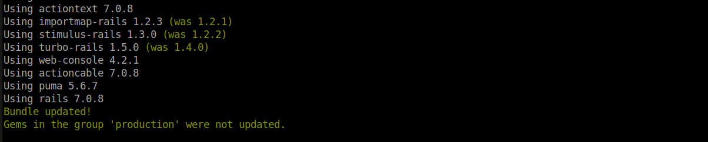

# Testing Java Script y Ajax
- Chavez Chico Joel Jhotan 20210058J

Primero lo que vamos a realizar, será instalar la gema `Jasmine`, para ello vamos a añadir en nuestro archivo `Gemfile` la siguiente línea de código:

```
gem jasmine
```
Luego, realizamos un `bundle update` para poder actualizar nuestras gemas junto con sus dependencias



