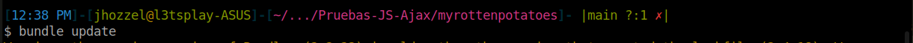

# Testing Java Script y Ajax
- Chavez Chico Joel Jhotan 20210058J

Primero lo que vamos a realizar, será instalar la gema `Jasmine`, para ello vamos a añadir en nuestro archivo `Gemfile` la siguiente línea de código:

```
gem jasmine
```
Luego, realizamos un `bundle update` para poder actualizar nuestras gemas junto con sus dependencias



Luego vamos a proceder a ejecutar la línea de código `rails generate jasmine_rails:install`, la cual instala y configura la herramienta de pruebas Jasmine en nuestro proyecto Ruby on Rails. Esta instalación incluye la creación de la estructura necesaria para las pruebas Jasmine, como directorios y archivos. El propósito principal de esta acción es habilitar la escritura y ejecución de pruebas de JavaScript, especialmente útiles para validar funciones Ajax y otros aspectos interactivos de la aplicación web.


A continuación se nos solicita crear la carpeta `spec/javascripts/fixtures`, para la cual usamos la siguiente linea de codigo:


Posteriormente, procedemos a ejecutar `git add spec/javascripts`, lo que agrega el directorio `spec/javascripts` al control de versiones de Git. Esta acción asegura que los archivos de prueba de Jasmine sean rastreados y gestionados por Git, permitiendo un seguimiento y control efectivo de los cambios realizados en las pruebas de JavaScript durante el desarrollo del proyecto.


Se menciona mas adelante que no podemos ejecutar un conjunto de pruebas Jasmine completamente vacío, así que crearemos el fichero `spec/javascripts/basic_check_spec.js` con el siguiente código:

```js
describe ('Jasmine basic check', function() { 
    it('works', function() { expect(true).toBe(true); }); 
}); 
```

**Pregunta**: ¿Cuáles son los problemas que se tiene cuando se debe probar Ajax?. Explica tu respuesta.

**Respuesta:**
Los problemas al probar Ajax incluyen la asincronía de las solicitudes, lo que puede conducir a ejecuciones de prueba inconsistentes. Las pruebas pueden completarse antes de que se reciba la respuesta Ajax, resultando en afirmaciones incorrectas. Es esencial manejar la asincronía en las pruebas para garantizar que esperen la respuesta antes de evaluar los resultados. Además, las pruebas deben abordar el desafío de realizar solicitudes Ajax sin afectar el entorno de prueba y sin depender de la infraestructura del servidor en sí, lo que podría no estar disponible durante las pruebas.

**Pregunta**: ¿Qué son los stubs, espias y fixture en Jasmine para realizar pruebas de Ajax?

**Respuesta:**
- **Stubs (Falsos):** En el contexto de pruebas en Jasmine, los stubs son funciones falsas que reemplazan funciones reales. Se utilizan para simular el comportamiento de funciones, como las funciones Ajax, durante las pruebas. Al stubear una función Ajax, podemos controlar su comportamiento y respuesta para simular diferentes escenarios, como respuestas exitosas o fallidas.

- **Espías:** Los espías (`spyOn` en Jasmine) se utilizan para rastrear y espiar el comportamiento de funciones existentes. Al espiar una función Ajax, podemos realizar un seguimiento de sus llamadas, verificar los argumentos que recibe y controlar su ejecución. Los espías son útiles para determinar si una función Ajax se ha llamado y con qué argumentos.

- **Fixture (Elemento de Prueba):** En el contexto de pruebas Ajax, un fixture es un conjunto de datos de prueba que se carga antes de ejecutar las pruebas. En Jasmine, Jasmine-jQuery proporciona la funcionalidad de fixture para cargar HTML simulado en el DOM durante las pruebas. Los fixtures son útiles para simular el entorno en el que se realizarán las solicitudes Ajax y garantizar que las pruebas se ejecuten en un contexto controlado.


**Pregunta**: Experimenta el siguiente código de especificaciones (specs) de Jasmine del camino feliz del código AJAX llamado `movie_popup_spec.js`.
