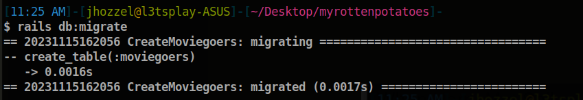
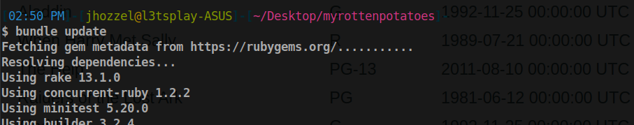
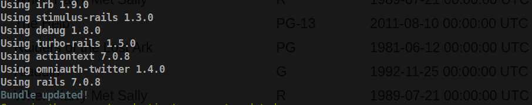

# Ruby en Rails avanzado

## Vistas parciales, validaciones y filtros

Una vista parcial es el nombre de Rails para una parte reutilizable de una vista. Para nuestro caso lo que se busca hacer es crear una vista parcial llamada `movie-html.erb`. Asi que vamos a crear dicho archivo en el directorio `app/views/movies/` y lo compeltamos con el sisguiente código proporcionado.
```html
<div class="row">
    <div class="col-8"> <%= link_to movie.title, movie_path(movie) %> </div>
    <div class="col-2"> <%= movie.rating %> </div>
    <div class="col-2"> <%= movie.release_date.strftime('%F') %> </div>
</div>

```
La validación de modelos busca que al ingresar nuevos datos estos cumplan los criterios que nosotros vamos a establecer y puedan ser añadidos exitosamente. Para poder hacer esto nos dirigimos a `app/models/movie.rb`, y completamos el código con los criterios que deseemos.
```rb
class Movie < ActiveRecord::Base
    def self.all_ratings ; %w[G PG PG-13 R NC-17] ; end #  shortcut: array of strings
    validates :title, :presence => true
    validates :release_date, :presence => true
    validate :released_1930_or_later # uses custom validator below
    validates :rating, :inclusion => {:in => Movie.all_ratings},
        :unless => :grandfathered?
    def released_1930_or_later
        errors.add(:release_date, 'must be 1930 or later') if
        release_date && release_date < Date.parse('1 Jan 1930')
    end
    @@grandfathered_date = Date.parse('1 Nov 1968')
    def grandfathered?
        release_date && release_date < @@grandfathered_date
    end
end

class Movie < ActiveRecord::Base
    before_save :capitalize_title
    def capitalize_title
        self.title = self.title.split(/\s+/).map(&:downcase).
        map(&:capitalize).join(' ')
    end
end
```
Ahora bien antes de comprobar nuestros resultados en la consola, vamos a generar el archivo de migración para la tabla *moviegoers* con el comando `rails generate migration CreateMoviegoers`. 


Visualizamos el archivo creado
```rb
class CreateMoviegoers < ActiveRecord::Migration[6.0]
  def change
    create_table :moviegoers do |t|
      
      t.timestamps
    end
  end
end
```
Y ahora ejecutaremos la migración, como ya lo hicimos en actividades pasadas.


Una vez hecho esto vamos a proceder con hacer las siguientes validaciones para una nueva película en el que hemos alterado sus datos para poder verificar si la validación se está realizando correctamente.


Nos dirigimos ahora a `app/controllers/movies_controller.rb` y explicaremos el código proporcionado.
```rb
class MoviesController < ApplicationController
  def index
    @movies = Movie.all
  end
  def show
    id = params[:id] # retrieve movie ID from URI route
    @movie = Movie.find(id) # look up movie by unique ID
    # will render render app/views/movies/show.html.haml by default
  end
  def new
    @movie = Movie.new
  end 
  def create
    if (@movie = Movie.create(movie_params))
      redirect_to movies_path, :notice => "#{@movie.title} created."
    else
      flash[:alert] = "Movie #{@movie.title} could not be created: " +
        @movie.errors.full_messages.join(",")
      render 'new'
    end
  end
  def edit
    @movie = Movie.find params[:id]
  end
  def update
    @movie = Movie.find params[:id]
    if (@movie.update_attributes(movie_params))
      redirect_to movie_path(@movie), :notice => "#{@movie.title} updated."
    else
      flash[:alert] = "#{@movie.title} could not be updated: " +
        @movie.errors.full_messages.join(",")
      render 'edit'
    end
  end
  def destroy
    @movie = Movie.find(params[:id])
    @movie.destroy
    redirect_to movies_path, :notice => "#{@movie.title} deleted."
  end
  private
  def movie_params
    params.require(:movie)
    params[:movie].permit(:title,:rating,:release_date)
  end
end
```

Este código establece métodos para llevar a cabo las operaciones CRUD asociadas con las películas. Estos métodos se emplean en las vistas 'new', 'edit' y 'show'. Además, el método 'movie_params' actúa como una precaución de seguridad al filtrar los parámetros permitidos antes de asignarlos a un modelo. Esta medida es esencial para salvaguardar nuestra aplicación contra posibles ataques de asignación masiva. A continuación se muestra una breve descripción de la funcionalidad de cada método.

1. **`index`**: Este método recupera todos los registros de la tabla `Movie` y los asigna a la variable de instancia `@movies`. Esta variable se utiliza para mostrar la lista de películas en la vista correspondiente (`app/views/movies/index.html.erb`).

2. **`show`**: Este método recupera una película específica según el ID proporcionado en la ruta y la asigna a la variable de instancia `@movie`. Esto se utiliza para mostrar los detalles de una película en la vista (`app/views/movies/show.html.erb`).

3. **`new`**: Este método inicializa una nueva instancia de la clase `Movie` y la asigna a la variable de instancia `@movie`. Se utiliza para mostrar el formulario de creación de una nueva película (`app/views/movies/new.html.erb`).

4. **`create`**: Este método intenta crear una nueva película con los parámetros proporcionados en el formulario. Si la película se crea con éxito, redirige a la lista de películas con un mensaje de éxito. Si hay errores en la creación, muestra un mensaje de error y vuelve a renderizar el formulario de creación.

5. **`edit`**: Este método recupera una película existente según el ID proporcionado en la ruta y la asigna a la variable de instancia `@movie`. Se utiliza para mostrar el formulario de edición de una película (`app/views/movies/edit.html.erb`).

6. **`update`**: Este método actualiza una película existente con los parámetros proporcionados en el formulario de edición. Si la actualización tiene éxito, redirige a la página de detalles de la película con un mensaje de éxito. Si hay errores en la actualización, muestra un mensaje de error y vuelve a renderizar el formulario de edición.

7. **`destroy`**: Este método elimina una película existente según el ID proporcionado en la ruta y redirige a la lista de películas con un mensaje de éxito.

8. **`movie_params` (método privado)**: Este método se utiliza para encapsular los parámetros permitidos para la creación y actualización de películas. Solo permite los parámetros `:title`, `:rating` y `:release_date` en los parámetros de película.

Para el archivo `movie.rb` que vimos anteriormente, vamos a comprobar el mecanismo de *canonicalizar* los campos antes de guardar el modelo. Para ello abrimos la consola nuevamente y creamos una nueva película con el título "STAR Wars", lo que espera es que se pueda adapatar el formato antes de guardarlo, así que a continuación haremos la prueba.


Observemos que el título ha sido modificado exitosamente a "Star Wars" y no como estaba ingresado "STAR Wars".

Avazamos al apartado de filtros de Ruby on Rails el cual es un método del controlador que verifica condiciones antes de ejecutar una acción. Puede interrumpir la presentación si las condiciones no se cumplen o permitir que la acción continúe, dejando la respuesta a cargo de la acción. A continuación se muestra el códgio proporcionado y una breve explicación de su funcionamiento.

```rb
class ApplicationController < ActionController::Base
    before_filter :set_current_user
    protected # prevents method from being invoked by a route
    def set_current_user
        # we exploit the fact that the below query may return nil
        @current_user ||= Moviegoer.where(:id => session[:user_id])
        redirect_to login_path and return unless @current_user
    end
end
```

Notemos que en dicho códgio se tiene filtro llamado `set_current_user` y se ejecuta antes de cualquier acción en el controlador. Su propósito es asegurarse de que haya un usuario actual autenticado antes de que se realice cualquier acción en el controlador.

El filtro utiliza una consulta a la base de datos para obtener el usuario actual (`@current_user`) basándose en el `:id` almacenado en la sesión del usuario. Si no hay un usuario actual, redirige la solicitud a la página de inicio de sesión (`login_path`).

## SSO y autenticación a través de terceros
Vamos a crear a continuación un modelo y una migración básicos siguiendo las instrucciones de la actividad.

a) Creamos el modelo `moviegoers` y una migración usando el siguiente comando, y luego hacemos un `rails db:migrate` para aplicar la migración.


b) Editamos el código de `app/models/moviegoer.rb` como se muestra a continuación.
```rb
class Moviegoer < ActiveRecord::Base
    def self.create_with_omniauth(auth)
        Moviegoer.create!(
        :provider => auth["provider"],
        :uid => auth["uid"],
        :name => auth["info"]["name"])
    end
end
```


Vamos a realizar la autenticación de usuario utilizando la gema OmniAuth que proporciona una API uniforme para muchos proveedores de SSO diferentes. Dado que estamos trabajando con esta nueva gema, tendremos que especificarla sobre nuestro archivo `Gemfile` y ejecutar el comando `bundle update` para que pueda instalarse asi como sus demas dependencias.

```rb
gem 'omniauth-twitter'
```




Luego, vamos a agregar nuevas líneas en nuestro archivo `config/routes.rb` ya que necesitamos se hace cambios necesarios en sus rutas, controladores y vistas para usar OmniAuth.
```rb
Myrottenpotatoes::Application.routes.draw do
  resources :movies
  resources :sessions, only: [:new, :create, :destroy]

  get  'auth/:provider/callback' => 'sessions#create'
  get  'auth/failure' => 'sessions#failure'
  get  'auth/twitter', :as => 'login'
  post 'logout' => 'sessions#destroy'

  root :to => redirect('/movies')
end
```
Adicionalmente vamos a crear el controlador para que pueda manejar las sesiones, este se creará en el archivo `sessions_controller.rb` que tendrá el siguiente contenido.

```rb
class SessionsController < ApplicationController
  # login & logout actions should not require user to be logged in
  skip_before_filter :set_current_user  # check you version
  def create
    auth = request.env["omniauth.auth"]
    user =
      Moviegoer.where(provider: auth["provider"], uid: auth["uid"]) ||
      Moviegoer.create_with_omniauth(auth)
    session[:user_id] = user.id
    redirect_to movies_path
  end
  def destroy
    session.delete(:user_id)
    flash[:notice] = 'Logged out successfully.'
    redirect_to movies_path
  end
end
```

Finalmente solo nos falta configurar la autenticación usando la gema en el archivo `config/initializers/omniauth.rb`, sin embargo necesitamos de un "API_KEY" y "API_SECRET" que se genera al crear una app en nuestra cuenta de desarrollador de Twitter, así que haremos primero nos dirigimos al Dashboard de Twitter Developers y generamos nuevas llaves.


Copiamos ambas llaves y en el archivo mencionado anteriormente vamos a guardarlas. Así quedaría nuestro archivo luego de realizar el cambio.

```rb
Rails.application.config.middleware.use OmniAuth::Builder do
  provider :twitter, 'Au94PsKWJjqYmPN7dIpTuqHbd', 'EBIHrBwGNbtLo8otYru6a98OgbhCyTGksP1OPRno2WREQdDeje'
end
```

**Pregunta**: Debes tener cuidado para evitar crear una vulnerabilidad de seguridad. ¿Qué sucede si un atacante malintencionado crea un envío de formulario que intenta modificar params[:moviegoer][:uid] o params[:moviegoer][:provider] (campos que solo deben modificarse mediante la lógica de autenticación) publicando campos de formulario ocultos denominados params[moviegoer][uid] y así sucesivamente?.

**Respuesta:**
Si un atacante malintencionado crea un envío de formulario intentando modificar `params[:moviegoer][:uid]` o `params[:moviegoer][:provider]`, y estos campos no están protegidos adecuadamente, podría llevarse a cabo un ataque de asignación masiva. Esto significa que el atacante podría alterar información crítica de los usuarios, a través del formulario.

## Asociaciones y claves foráneas

Una asociación es una relación lógica entre dos tipos de entidades de una arquitectura software. Por ejemplo, podemos añadir a RottenPotatoes las clases Review (crítica) y Moviegoer (espectador o usuario) para permitir que los usuarios escriban críticas sobre sus películas favoritas; podríamos hacer esto añadiendo una asociación de uno a muchos (one-to-many) entre las críticas y las películas (cada crítica es acerca de una película) y entre críticas y usuarios (cada crítica está escrita por exactamente un usuario).

Explica la siguientes líneas de SQL:

```sql
SELECT reviews.*
    FROM movies JOIN reviews ON movies.id=reviews.movie_id
    WHERE movies.id = 41;
```

> Esta consulta SQL está seleccionando todas las columnas de la tabla `reviews` para aquellas filas donde existe una correspondencia entre las tablas `movies` y `reviews` en base a la condición `movies.id = reviews.movie_id`. Además, se filtra el resultado para incluir solo las críticas asociadas a la película con `movies.id = 41`.


Comprueba la implementación sencilla de asociaciones de hacer referencia directamente a objetos asociados, aunque estén almacenados en diferentes tablas de bases de datos. ¿Por que se puede hacer esto?

```rb
# it would be nice if we could do this:
inception = Movie.where(:title => 'Inception')
alice,bob = Moviegoer.find(alice_id, bob_id)
# alice likes Inception, bob less so
alice_review = Review.new(:potatoes => 5)
bob_review   = Review.new(:potatoes => 3)
# a movie has many reviews:
inception.reviews = [alice_review, bob_review]
# a moviegoer has many reviews:
alice.reviews << alice_review
bob.reviews << bob_review
# can we find out who wrote each review?
inception.reviews.map { |r| r.moviegoer.name } # => ['alice','bob']
```


> En Rails, el código proporcionado es posible gracias a la implementación de las asociaciones entre modelos y la funcionalidad de ActiveRecord ya que las asociaciones permiten establecer relaciones lógicas entre diferentes modelos en una aplicación Rails.


a): Crea y aplica esta migración para crear la tabla Reviews. Las claves foraneas del nuevo modelo están relacionadas con las tablas movies y moviegoers existentes por convención sobre la configuración.


Ahora editaremos `db/migrate/*_create_reviews.rb` de la siguiente forma, pero añadiremos la versión de nuestro Active Record para evitar posibles errores de compatibilidad durante la migración:
```rb
class CreateReviews < ActiveRecord::Migration[6.0]
    def change
        create_table 'reviews' do |t|
        t.integer    'potatoes'
        t.text       'comments'
        t.references 'moviegoer'
        t.references 'movie'
        end
    end
end
```

b) Colocaremos este nuevo modelo de revisión en `app/models/review.rb`.

```rb
class Review < ActiveRecord::Base
    belongs_to :movie
    belongs_to :moviegoer
end
```

c) Colocaremos una copia de la siguiente línea en cualquier lugar dentro de la clase Movie Y dentro de la clase Moviegoer (idiomáticamente, debería ir justo después de 'class Movie' o 'class Moviegoer'), es decir realiza este cambio de una línea en cada uno de los archivos existentes movie.rb y moviegoer.rb.
```rb
has_many :reviews
```
Agregas la línea previa en nuestros archivos, los cuales quedarían ahora de la siguiente manera:

```rb
class Movie < ActiveRecord::Base
    has_many :reviews
    
    def self.all_ratings ; %w[G PG PG-13 R NC-17] ; end #  shortcut: array of strings
    validates :title, :presence => true
    validates :release_date, :presence => true
    validate :released_1930_or_later # uses custom validator below
    validates :rating, :inclusion => {:in => Movie.all_ratings},
        :unless => :grandfathered?
    def released_1930_or_later
        errors.add(:release_date, 'must be 1930 or later') if
        release_date && release_date < Date.parse('1 Jan 1930')
    end
    @@grandfathered_date = Date.parse('1 Nov 1968')
    def grandfathered?
        release_date && release_date < @@grandfathered_date
    end
end

class Movie < ActiveRecord::Base
    before_save :capitalize_title
    def capitalize_title
        self.title = self.title.split(/\s+/).map(&:downcase).
        map(&:capitalize).join(' ')
    end
end
```

```rb
class Moviegoer < ActiveRecord::Base
    has_many :reviews

    def self.create_with_omniauth(auth)
        Moviegoer.create!(
        :provider => auth["provider"],
        :uid => auth["uid"],
        :name => auth["info"]["name"])
    end
end

```

Una vez realizado esto, vamos a realizar la migración en nuestro terminal como se muestra a continuación.


## Asociaciones Indirectas
Para empezar vamos a modificar nuestro modelo `movie.rb` y agregar la siguiente línea
```rb
has_many :reviews
has_many :moviegoers, through: :reviews
```
Esto con el fin de estableecr una conexión indirecta a traves de `reviews`.

```rb
class Movie < ActiveRecord::Base
    has_many :reviews
    has_many :reviews

    def self.all_ratings ; %w[G PG PG-13 R NC-17] ; end #  shortcut: array of strings
    validates :title, :presence => true
    validates :release_date, :presence => true
    validate :released_1930_or_later # uses custom validator below
    validates :rating, :inclusion => {:in => Movie.all_ratings},
        :unless => :grandfathered?
    def released_1930_or_later
        errors.add(:release_date, 'must be 1930 or later') if
        release_date && release_date < Date.parse('1 Jan 1930')
    end
    @@grandfathered_date = Date.parse('1 Nov 1968')
    def grandfathered?
        release_date && release_date < @@grandfathered_date
    end
end

class Movie < ActiveRecord::Base
    before_save :capitalize_title
    def capitalize_title
        self.title = self.title.split(/\s+/).map(&:downcase).
        map(&:capitalize).join(' ')
    end
end
```

¿Qué indica el siguiente código SQL ?
```sql
SELECT movies .*
    FROM movies JOIN reviews ON movies.id = reviews.movie_id
    JOIN moviegoers ON moviegoers.id = reviews.moviegoer_id
    WHERE moviegoers.id = 1;
```
> Esta consulta SQL selecciona todas las columnas de la tabla `movies` tales que tras hacer un `JOIN` de la tabla `movies` con la tabla `reviews` utilizando la condición `movies.id = reviews.movie_id` y volver a hacer un `JOIN` con la tabla `moviegoers` utilizando la condición `moviegoers.id = reviews.moviegoer_id` cumplan que `moviegoer.id` es igual a 1.

Finalmete se menciona la funcionalidad de las asociaciones en Rails, lo cual ha ampliado mi comprensión sobre cómo modelar y estructurar las relaciones entre diferentes entidades en una aplicación. Asimismo es importante mencionar el uso de hooks específicos de ActiveRecord para intervenir en eventos asociados a las asociaciones y a aplicar validaciones tanto en el modelo principal como en los modelos asociados.

En adición, es importante considerar las operaciones de guardado y destrucción en objetos con asociaciones, ya que afectan a los objetos asociados. Esto proporciona una visión más completa sobre el ciclo de vida de los objetos y cómo las acciones en un modelo pueden repercutir en otros modelos relacionados.

La opción `:dependent` en las asociaciones ha sido otro aspecto clave, que permite controlar el comportamiento de los objetos asociados al destruir el objeto principal. 